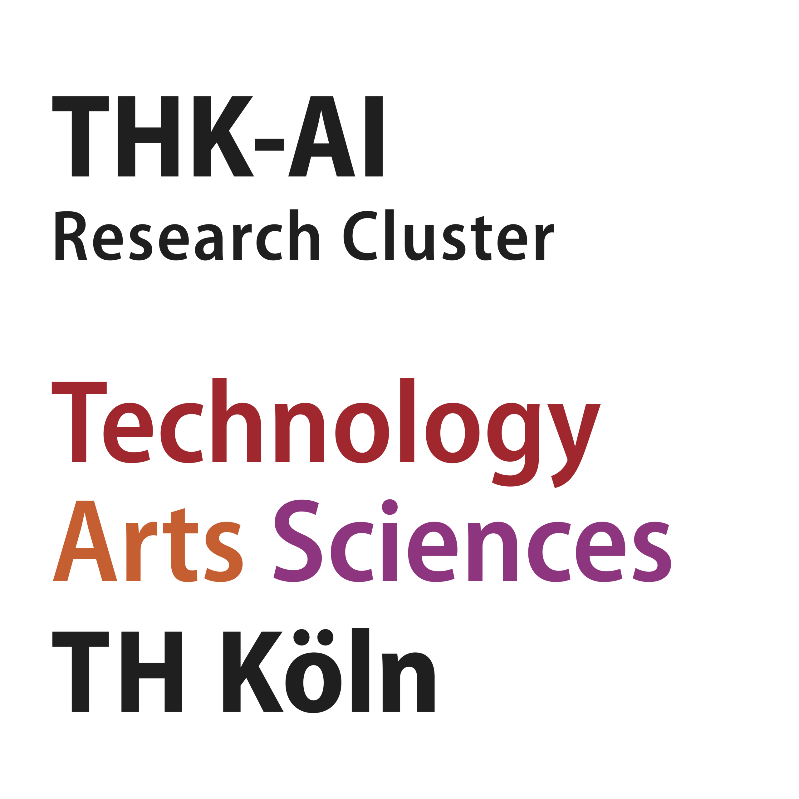

Das THK-AI Forschungscluster wurde Anfang 2023 ins Leben gerufen und am 31.01.2024 vom Präsidium der TH Köln als offizieller Forschungscluster für die Laufzeit von 2024 bis 2028 anerkannt. Unter dem Leitgedanken "Mit KI soziale Innovation gestalten" fungiert das THK-AI Forschungscluster als zentraler Ansprechpartner rund um das Thema Künstliche Intelligenz an der Hochschule. Es fördert und unterstützt kooperative Projekte zwischen Verbänden, Industriepartnern, Professorinnen und Professoren sowie Studierenden.

{fig-alt="THK-AI Absenderkennung" width=150px}

## Statuten und Aufnahmeantrag

Die [Statuten des THK-AI Forschungsclusters vom 19. September 2025](https://www.th-koeln.de/mam/downloads/deutsch/hochschule/amtlichemitteilungen/2025/endfassung_82_2025.pdf) wurden am 6. Oktober 2025 in den Amtlichen Mitteilungen der TH Köln veröffentlicht. Der Aufnahmeantrag kann [[hier](https://www.gm.fh-koeln.de/~bartz/thk-ai/Aufnahmeantrag.pdf)] heruntergeladen werden (PDF, 52kB). Bitte senden Sie das ausgefüllte Dokument an die Sprecher des Forschungsclusters.
