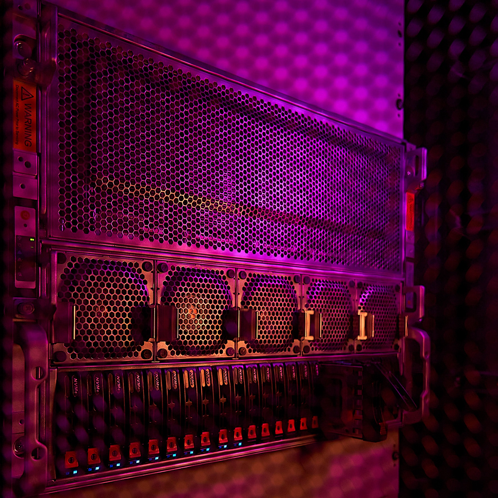
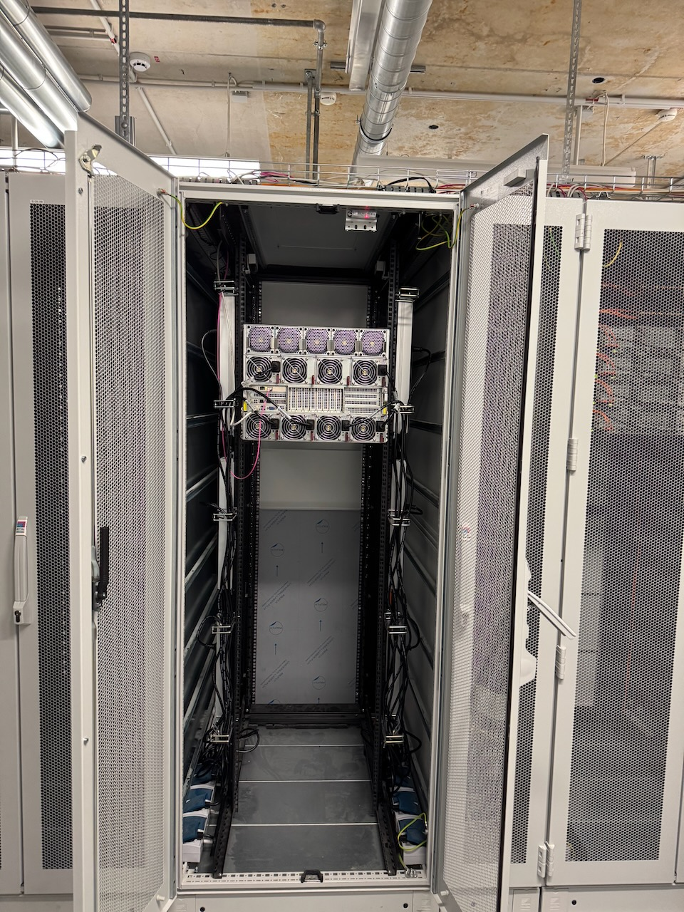
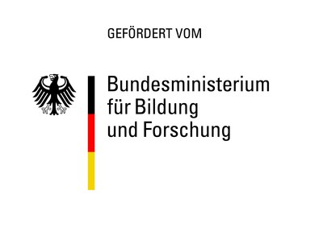

## Zusammenfassung

Mit dem Projekt THK-KIplus (TH Köln - Künstliche Intelligenz plus) hat die Technische Hochschule Köln ihre Kompetenzen im Bereich der anwendungs- und transferorientieren KI-Forschung zur Förderung des wissenschaftlichen Nachwuchses erheblich verbessert. Das Projekt hat außerdem zu neuen Forschungskooperationen und zu einem Transfer der Erkenntnisse in die Gesellschaft beigetragen. Geleitet wurde es von Prof. Dr. Thomas Bartz-Beielstein und Prof. Dr. Anja Richert.

{fig-alt="THK-AI HPC Cluster" width=50%}

## Herausforderung

Die Künstliche Intelligenz ist vermutlich eines der beherrschenden Themen in diesem Jahrhundert und wohl auch eines der umstrittensten. Künstliche Intelligenz ermöglicht es, das menschliche Lernvermögen komplexer Zusammenhänge mit mathematisch-programmiertechnischen Methoden nachzuahmen und sogar zu übertreffen. Dafür werden Neuronale Netze eingesetzt, die in der Lage sind, hochgradig nichtlineare Zusammenhänge abzubilden. Dies kann zur Steuerung von Robotern in der Industrie, zum autonomen Fahren oder auch für Deepfakes in den sozialen Medien genutzt werden. An der TH Köln ist Künstliche Intelligenz ein fester Bestandteil der Lehre und ist in Forschungsprojekten vor allem im Bereich Image Processing und KI-basierten Controllern für Maschinen und Prozessen integriert.

## Ziele und Vorgehen

Im Mittelpunkt des Projekts THK-KIplus stand die flexible Bereitstellung eines hochschulweiten KI-Rechenclusters inklusive Datenspeicher. Zudem wurden die Professuren "Data Science mit Schwerpunkt Datenmanagement" und "Big Data Analytics" etabliert. Die Bedeutung und das Potenzial des Vorhabens wurden daraus ersichtlich, dass acht von den zwölf Fakultäten der TH Köln unmittelbar an der Antragstellung beteiligt waren. An der Hochschule wurde somit ein "Forschungscluster KI" aufgebaut, um den Transfer- und auch die Kooperationsmöglichkeiten zu forcieren. Dies ermöglicht eine Strukturierung und Fokussierung der KI-Forschung in den interdisziplinären Use-Cases "Remote Sensing", "Autonome Systeme", "Menschenzentrierte KI", "Biometrie", "Industrielle KI" und "KI-Algorithmenentwicklung".

## Innovationen und Perspektiven

Mit dem Projekt hat die TH Köln nachhaltige KI-Strukturen geschaffen, die dauerhaft mit hoher Flexibilität von allen Hochschulangehörigen genutzt werden können. Dadurch eröffnen sich auch neue Themenfelder für Bachelor- und Masterarbeiten sowie Promotionen. Mit dem hochschulweiten KI-Rechencluster werden neuartige KI-Verfahren erforscht und entwickelt, die von der studentischen Hilfskraft bis zu promovierten wissenschaftlichen Mitarbeitenden zur Aus- und Weiterbildung genutzt werden können und sollen. Zentral ist dabei die Zusammenarbeit mit Partnern aus Wirtschaft, Wissenschaft und Gesellschaft.

## Beschreibung des KI-Rechenclusters

Die TH Köln verfügt über ein hochmodernes High-Performance-Computing (HPC) Cluster, das speziell für anspruchsvolle Aufgaben in der Künstlichen Intelligenz, dem Maschinellen Lernen und Data Science konzipiert wurde. Der Cluster steht an zwei Standorten, in Gummersbach und in Leverkusen, so dass die Ausfallsicherheit erhöht wird.

Am Standort Gummersbach steht folgende Hardware zur Verfügung:

- Storage: 28TB; Read/Write: 7000MB/s
- Arbeitsspeicher: 2,25TB
- GPU: 8x NVIDIA H100 80GB HBN3
- CPU: 2x AMD EPYC mit insges. 192 Kernen

Am Standort Leverkusen steht die folgende Hardware zur Verfügung:

- Storage: 750 TB; Read: 7000MB/s u. Write: 3700MB/s
- 8x GPU-Node mit jeweils:
- 1,5TB Arbeitsspeicher
- GPU: 4x NVIDIA L40S 48GB
- CPU: 2x AMD EPYC 32 Kerne
- Technologie: NVMe-Flash für extreme Geschwindigkeiten (über 14 GB/s Datendurchsatz), damit die Grafikkarten nicht auf Daten warten müssen. Alle Systeme sind über ein 100 GBit/s Hochgeschwindigkeits-Netzwerk (RoCE) verbunden, was eine verzögerungsfreie Zusammenarbeit aller Knoten ermöglicht.

## Beispiele für Projekte, die mit den THK-AI Rechencluster umgesetzt wurden

### Virtuelle Sensoren für autonome Fahrzeuge

Im Rahmen des internationalen Kooperationsprojekts "ShapeFuture" haben zwei Doktoranden im THK-AI Research Cluster, Jens Brandt und Noah Pütz, unter der Leitung von Professor Bartz-Beielstein und in Zusammenarbeit mit Toyota Gazoo Racing Europe und dem VAIL Institute der Stanford University, an der Entwicklung zuverlässiger, KI-basierter virtueller Sensoren für Hochleistungsfahrzeuge geforscht. Ziel ist es, autonome Fahrsysteme robuster zu machen - auch unter kritischen Bedingungen. Autonome Fahrzeuge wurden dabei an ihre Grenzen gebracht, was zu spektakulären Fahrmanövern führte und teilweise den Eingriff eines menschlichen Fahrers erforderte. Dieses Forschungsprojekt zeigt eindrucksvoll, wie der THK-AI Rechencluster genutzt werden kann, um langfristig Innovationen für den Straßenverkehr zu ermöglichen.

**Kontakt:** Prof. Dr. Thomas Bartz-Beielstein

### Autonomes Fahren

Prof. Dr. Edwin Kamau betreut eine Masterarbeit, die untersucht, wie sich die Integration mehrerer spezialisierter KI-Modelle zu einem Gesamtmodell auf einem Jetson Orion Nano auf die Präzision, Zuverlässigkeit und Performance eines Fahrerassistenzsystems in einem RC-Modellfahrzeug auswirkt. Dazu werden KI-Modelle zur Erkennung von Verkehrsschildern, Personen und Fahrzeugen trainiert, in eine ROS2-basierte Systemarchitektur integriert und unter Echtzeitbedingungen (<= 60 ms Inferenzzeit, >= 10 FPS) auf dem Gesamtsystem getestet. Die Ergebnisse werden anhand von Performance-Messungen, visueller Auswertung mit OpenCV/TensorBoard sowie durch einen Demonstrator mit Fahrzeug, Kamera, LEDs und realitätsnaher Testumgebung dokumentiert und präsentiert.

**Kontakt:** Prof. Dr. Edwin Kamau

### Quantencomputing

Die AI4Science Group der TH Köln hat unter Leitung von Prof. Dr. Pascal Cerfontaine im Rahmen des KI-Clusters ML-basierte Digital Twins für zentrale Hardwarekomponenten von Quantencomputern trainiert. Diese Modelle sollen künftig dazu beitragen, den Betrieb der Komponenten durch optimierte Regelungsstrategien zu verbessern und darüber hinaus gezielt Vorschläge für neue, leistungsfähigere Hardwaredesigns zu generieren.

**Kontakt:** Prof. Dr. Pascal Cerfontaine

### Künstliche Intelligenz schreibt Programmcode für SAP Unternehmenssoftware

Ein Team um Prof. Dr. Hartmut Westenberger, Mitglied des THK-AI Research Clusters an der Technischen Hochschule Köln, untersucht gemeinsam mit einem Industriepartner, wie Künstliche Intelligenz Programmcode für Unternehmenssoftware generieren kann. Im Mittelpunkt steht ABAP, die von SAP entwickelte Programmiersprache, die weltweit zur Automatisierung und Steuerung von Geschäftsprozessen in SAP-Systemen eingesetzt wird.

Large Language Models (LLMs) - leistungsfähige KI-Systeme wie ChatGPT - versprechen, Programmierer bei ihrer Arbeit zu unterstützen, indem sie automatisch Code generieren. Doch wie gut funktioniert das in der Praxis bei einer spezialisierten Sprache wie ABAP?

Das Team begann vor zwei Jahren damit, verschiedene KI-Modelle auf ihre Fähigkeit zu testen, funktionsfähigen ABAP-Code zu schreiben. In der zweiten Phase des Projekts erweitern die Forschenden den international etablierten HumanEval-Testdatensatz um praxisnahe Szenarien aus dem ABAP-Umfeld, um die KI-Systeme noch realitätsnäher bewerten zu können. Für den umfangreichen Benchmark-Test nutzte das Team unter anderem die Recheninfrastruktur des THK-AI Research Clusters ([thk-ai.de](https://thk-ai.de/)). Zum Einsatz kam dabei eine von Pascal Cerfontaine (ebenfalls Mitglied des THK-AI Research Clusters) bereitgestellte Schnittstelle zu verschiedenen KI-Modellen. Über 10.000 Code-Generierungen wurden durchgeführt und systematisch ausgewertet.

LinkedIn-Post zum Projekt: [https://www.linkedin.com/posts/hartmut-westenberger-8b2a21102_llm-codegeneration-benchmarking-activity-7331350438849495041-muEd](https://www.linkedin.com/posts/hartmut-westenberger-8b2a21102_llm-codegeneration-benchmarking-activity-7331350438849495041-muEd)

**Kontakt:** Prof. Dr. Hartmut Westenberger

### Autonomous Driving Challenge

Mit Hilfe der leistungsstarken Recheninfrastruktur trainierte das studentische Rennteam Escuderia Colonia unter Leitung von Prof. Dr. Elena Algorri und Prof. Mohieddine Jelali, die KI-Modelle für ihr autonomes Fahrzeug - und erreichte bei der Autonomous Driving Challenge (ADC) des Vereins Deutscher Ingenieure (VDI) den dritten Platz.

Autonome Fahrzeuge benötigen ausgefeilte künstliche Intelligenz, um komplexe Fahraufgaben zu meistern. Das Training dieser KI-Modelle erfordert enorme Rechenleistung: Tausende Simulationen und Testläufe müssen durchgeführt werden, bevor das System zuverlässig funktioniert. Genau hier kam der THK-AI HPC-Cluster zum Einsatz, der speziell für rechenintensive KI-Anwendungen konzipiert wurde.

Die fünf Studierenden Sebastian Pütz, Martin Cavazos de la Garza, Simon Boes, Ali Aydin und Falk Borgards nutzten den THK-AI HPC-Cluster intensiv für das Training ihrer neuronalen Netze. Der Hochleistungsrechner ermöglichte es ihnen, verschiedene KI-Architekturen parallel zu testen und ihre Modelle mit großen Datenmengen zu optimieren.

Weitere Infos: [https://www.th-koeln.de/hochschule/escuderia-colonia-campus-gummersbach-3-platz-adc-vdi-2025_130239.php](https://www.th-koeln.de/hochschule/escuderia-colonia-campus-gummersbach-3-platz-adc-vdi-2025_130239.php)

**Kontakt:** Prof. Dr. Elena Algorri

### Transformer-basierte Objekterkennung

Prof. Dr. Mohieddine Jelali betreute eine Masterarbeit, die die Integration verschiedener Vision-Transformer-Backbones in die YOLOv8-Architektur untersucht, um deren Eignung zur Steigerung der Erkennungsleistung bei Pflanzenerkrankungen zu analysieren.

Es werden zwei Integrationsstrategien betrachtet: der vollständige Austausch des ursprünglichen Backbones durch den jeweiligen Vision Transformer sowie die modulare Integration von Transformer-Blöcken in den YOLOv8-Backbone unter Beibehaltung des Großteils der ursprünglichen Architektur. Alle Modelle werden dreimal auf verschiedenen Datensatzaufteilungen trainiert, um robuste Leistungsschätzungen zu gewährleisten, und anschließend auf dem festen PlantDoc-Testdatensatz evaluiert. Zur Analyse der Auswirkungen der Transformer-Integration auf interne Merkmalsrepräsentationen und Modellvorhersagen werden Methoden des Explainable AI eingesetzt.

Pflanzenkrankheiten stellen eine erhebliche Bedrohung für die weltweite Ernährungssicherheit und die langfristige Nachhaltigkeit der Landwirtschaft dar. Die rechtzeitige und genaue Erkennung von Pflanzenkrankheiten ist daher von großer Bedeutung für die Landwirtschaft. Die Masterarbeit wurde von Prof. Jelali für den "AALE Student Award" für die beste Masterarbeit auf der Konferenz der angewandten Automatisierungstechnik (AALE) 2026 vorgeschlagen. Die Ergebnisse der Arbeit werden in zwei Open-Access-Journal-Beiträgen zur Veröffentlichung eingereicht.

**Kontakt:** Prof. Dr. Mohieddine Jelali

### Nachhaltige Entwicklung der Kaffeeindustrie, Schutz der Regenwälder und Bewältigung der Klimakrise

Im Forschungsprojekt AI4SusCo entwickelt Prof. Dr. Gernot Heisenberg und sein Team gemeinsam mit der GRAS Global Risk Assessment Services GmbH innovative Technologien, die die Zertifizierung von Kaffee entlang globaler Lieferketten effizienter, präziser und transparenter machen. Damit leistet das Projekt einen wichtigen Beitrag zur nachhaltigen Entwicklung der Kaffeeindustrie, zum Schutz der Regenwälder und letztlich zur Bewältigung der globalen Klimakrise.

Der Ansatz von AI4SusCo kombiniert multitemporale Fernerkundungsdaten mit modernen Deep-Learning-Architekturen wie Transformern und großen 3D-U-Net-Modellen. Durch das Vortrainieren und anschließende Feintuning dieser Modelle auf umfangreichen Satellitendatensätzen mittels des THK-AI Rechenclusters wird eine hochgenaue räumliche und zeitliche Identifikation von Kaffeeanbauflächen möglich - einschließlich der Erkennung potenzieller Expansionen in zuvor entwaldete Gebiete.

Zentraler Anwendungsfall des Projekts ist die Zertifizierung von entwaldungsfreiem Kaffee gemäß der EU-Deforestation-Verordnung (EUDR). Durch die Analyse räumlich-zeitlicher Satellitendaten unterstützt AI4SusCo Produzenten, Händler und Zertifizierungsorganisationen dabei, regulatorische Anforderungen einzuhalten und nachhaltige Lieferketten sicherzustellen.

Das Projekt zeigt wie praxisnahe Forschung und technologische Innovation Hand in Hand zu einer nachhaltigeren globalen Landwirtschaft beitragen können.

**Kontakt:** Prof. Dr. Gernot Heisenberg

## Infobox

{width=400px}

**Förderlinie:** KI-Nachwuchs@FH

**Förderkennzeichen:** 13FH007KI2

**Zuwendungssumme:** 1.263.276,54 Euro

**Projektlaufzeit:** Juni 2023 - November 2025

**Zuwendungsempfänger:** Technische Hochschule Köln

**Ansprechpartner:**  
TH Köln: Prof. Dr. Thomas Bartz-Beielstein und Prof. Dr. Anja Richert  
VDI: Sarah Zerres, VDI Technologiezentrum GmbH

**Projektwebsite / weiterführende Infos:** [https://thk-ai.de](https://thk-ai.de)

