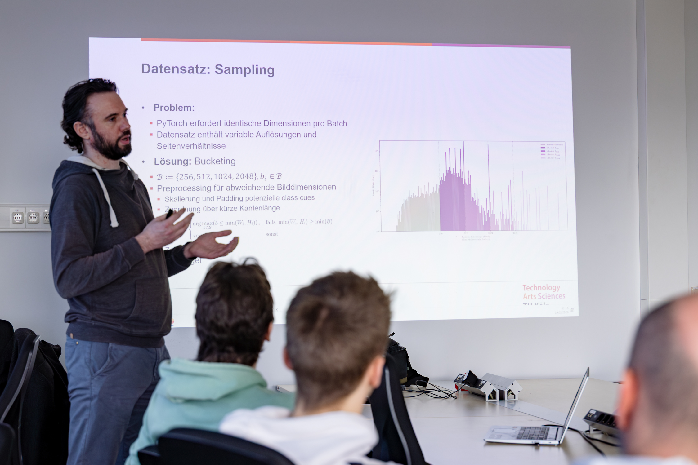
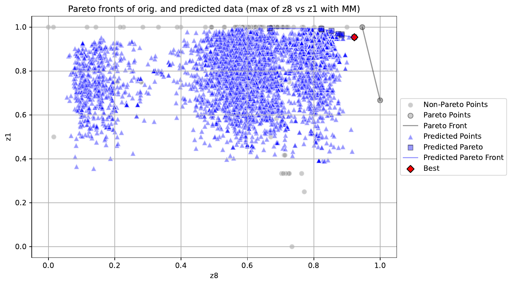

[Deutsche Version](index.qmd){.btn .btn-outline-primary .hero-btn}

:::{.landing-hero}
{.hero-logo}

## The central contact point for AI at TH Köln

:::

## Latest News

:::{.feature-grid}
:::{.feature-card}
{.feature-card-image fig-alt="Kai Altwicker presenting his master's thesis Tribraide"}

### Master's thesis "Tribraide": Kai Altwicker develops a fusion-based detector for AI-generated images

`2026-04-29` -- With "Tribraide", Kai Altwicker has developed a detector for AI-generated images in his master's thesis at the Institute of Media and Imaging Technology at TH Köln. The method combines spatial-domain, frequency, and reconstruction analyses; through the fusion of complementary feature spaces it remains reliable even under compression and noise. The thesis was supervised by [Prof. Dr. Jan Salmen](https://www.th-koeln.de/personen/jan.salmen/) and [Prof. Dr. Gregor Fischer](https://www.th-koeln.de/personen/gregor.fischer/).

[Read more](news/salm26a/salm26a-tribraide-en.md){.btn .btn-outline-primary}
:::

:::{.feature-card}
{.feature-card-image fig-alt="Pareto front of two objectives from the compressor case study"}

### Contribution "Multi-Objective Optimization with Desirability and Morris-Mitchell Criterion" accepted at MCDM 2026

`2026-04-28` -- The Programme Committee of MCDM 2026 has accepted the contribution by [Prof. Dr. Thomas Bartz-Beielstein](https://www.th-koeln.de/personen/thomas.bartz-beielstein/) (TH Köln), Eva Bartz, Alexander Hinterleitner (Bartz & Bartz GmbH), and Christoph Leitenmeier and Ihab Abd El Hussein (Everllence SE) for presentation. The work combines desirability functions with the Morris-Mitchell criterion and is demonstrated on a compressor-development case study.

[Read more](news/mcdm/bart26c-mcdm-en.md){.btn .btn-outline-primary}
:::

:::

[All news in the THK-AI Newsroom](news.qmd){.btn .btn-outline-primary}

## Members

{.team-mosaic fig-alt="Founding members of the THK-AI Cluster"}

::: {.callout-note appearance="simple"}
### Collaboration
With more than 20 professors from TH Köln, the THK-AI Research Cluster is one of the largest AI research collaborations at a German university of applied sciences.
:::

## Why THK-AI?

:::{.feature-grid}
:::{.feature-card}
### Applied AI at scale

THK-AI combines powerful compute infrastructure with interdisciplinary expertise to bring AI from idea to deployable prototype.
:::

:::{.feature-card}
### Open for collaboration

The cluster supports joint projects between associations, companies, professors, and students from different disciplines.
:::

:::

## THK-AI Example Project

{.hero-image fig-alt="THK-AI research context"}

::: {.callout-note appearance="simple"}
The THK-KIplus project (TH Köln – Künstliche Intelligenz plus) was funded from June 2023 to November 2025 under the KI-Nachwuchs@FH programme by the German Federal Ministry for Research, Technology and Space. The initiative received *around EUR 1.3 million* in funding and has built one of the most powerful AI-oriented research infrastructures at German universities of applied sciences.
:::

## Focus areas

:::{.feature-grid}
:::{.feature-card}
### Critical infrastructure

Robust AI methods for autonomous and safety-critical systems.
:::

:::{.feature-card}
### Socially interactive AI agents

Socio-empathic AI-based dialogue and hybrid avatars for social innovation.
:::

:::

## CAIRNE Gold Member

{fig-alt="CAIRNE logo" width="80%"}

::: {.callout-tip appearance="simple"}
The THK-AI Research Cluster is a **Gold Member** of the **CAIRNE Research Network** (Confederation of Laboratories for Artificial Intelligence Research in Europe).

CAIRNE is a European non-profit AI community with a human-centred focus. The network connects research institutions, industry, and policy stakeholders to strengthen European AI excellence, collaboration, and digital sovereignty.
:::

[Learn more about CAIRNE](https://cairne.eu){.btn .btn-outline-primary}
[Read more about THK-AI](about.qmd){.btn .btn-outline-light}

## Join and connect

If you are looking for collaboration, student projects, or partnerships in applied AI, THK-AI is your central contact point at TH Köln.

[Contact and About](about.qmd){.btn .btn-success}
[Teaching and offerings](lehre.qmd){.btn .btn-outline-primary}
