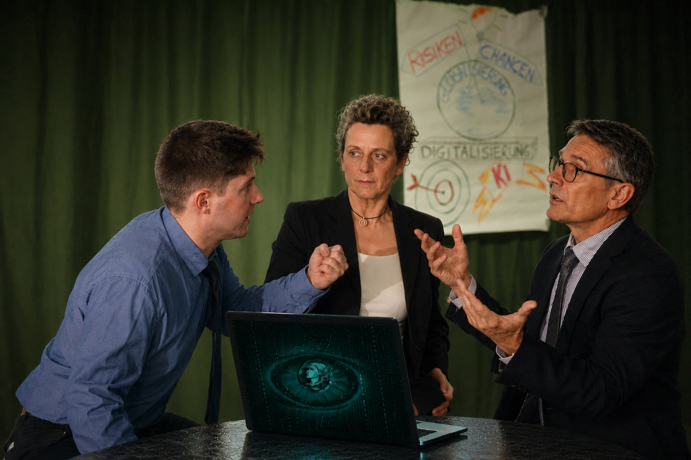

[Deutsche Version](index.qmd){.btn .btn-outline-primary .hero-btn}

:::{.landing-hero}
{.hero-logo}

## The central contact point for AI at TH Köln

:::

## Latest News

:::{.feature-grid}
:::{.feature-card}
{.feature-card-image fig-alt="GECCO 2026 logo"}

### ECiP @ GECCO 2026: Program complete – three international speakers from industrial practice

`2026-07-03` -- The program of the *Evolutionary Computation in Practice* (ECiP) track at GECCO 2026 in Costa Rica is complete: Nicolás Álvarez Gil (ArcelorMittal Global R&D, Spain), Ryoki Hamano (CyberAgent AI Lab, Japan), and Alberto Tonda (INRAE / Université Paris-Saclay, France) will speak on 16 July 2026 about evolutionary optimization in industrial practice. [Prof. Dr. Thomas Bartz-Beielstein](https://www.th-koeln.de/personen/thomas.bartz-beielstein/) organizes the track together with Daniel Hernández and Francisco Fernandez de Vega.

[Read more](news/ecip-gecco-2026-program/ecip-gecco-2026-program-en.md){.btn .btn-outline-primary}
:::

:::{.feature-card}
{.feature-card-image fig-alt="Three actors in an office setting around a laptop, with a flip chart in the background listing the keywords risks, opportunities, globalization, digitalization, and AI"}

### World premiere of "Minervas Schatten": Hartmut Westenberger brings AI and the world of work to the stage

`2026-06-29` -- On 18 July 2026 the Freie Theatergruppe Wiehl will give the world premiere of "Minervas Schatten" (Minerva's Shadow) in Nümbrecht-Bierenbachtal. The play opens a discussion of how artificial intelligence, digitalization, and globalization affect the individual and the world of work. It was written by [Prof. Dr. rer. nat. Hartmut Westenberger](https://www.th-koeln.de/personen/hartmut.westenberger/), a member of the THK-AI Research Cluster.

[Read more](news/west26a/west26a-minervas-schatten-en.md){.btn .btn-outline-primary}
:::

:::

[All news in the THK-AI Newsroom](news.qmd){.btn .btn-outline-primary}

## Members

{.team-mosaic fig-alt="Founding members of the THK-AI Cluster"}

::: {.callout-note appearance="simple"}
### Collaboration
With more than 20 professors from TH Köln, the THK-AI Research Cluster is one of the largest AI research collaborations at a German university of applied sciences.
:::

## Why THK-AI?

:::{.feature-grid}
:::{.feature-card}
### Applied AI at scale

THK-AI combines powerful compute infrastructure with interdisciplinary expertise to bring AI from idea to deployable prototype.
:::

:::{.feature-card}
### Open for collaboration

The cluster supports joint projects between associations, companies, professors, and students from different disciplines.
:::

:::

## THK-AI Example Project

{.hero-image fig-alt="THK-AI research context"}

::: {.callout-note appearance="simple"}
The THK-KIplus project (TH Köln – Künstliche Intelligenz plus) was funded from June 2023 to November 2025 under the KI-Nachwuchs@FH programme by the German Federal Ministry for Research, Technology and Space. The initiative received *around EUR 1.3 million* in funding and has built one of the most powerful AI-oriented research infrastructures at German universities of applied sciences.
:::

## Focus areas

:::{.feature-grid}
:::{.feature-card}
### Critical infrastructure

Robust AI methods for autonomous and safety-critical systems.
:::

:::{.feature-card}
### Socially interactive AI agents

Socio-empathic AI-based dialogue and hybrid avatars for social innovation.
:::

:::

## CAIRNE Gold Member

{fig-alt="CAIRNE logo" width="80%"}

::: {.callout-tip appearance="simple"}
The THK-AI Research Cluster is a **Gold Member** of the **CAIRNE Research Network** (Confederation of Laboratories for Artificial Intelligence Research in Europe).

CAIRNE is a European non-profit AI community with a human-centred focus. The network connects research institutions, industry, and policy stakeholders to strengthen European AI excellence, collaboration, and digital sovereignty.
:::

[Learn more about CAIRNE](https://cairne.eu){.btn .btn-outline-primary}
[Read more about THK-AI](about.qmd){.btn .btn-outline-light}

## Join and connect

If you are looking for collaboration, student projects, or partnerships in applied AI, THK-AI is your central contact point at TH Köln.

[Contact and About](about.qmd){.btn .btn-success}
[Teaching and offerings](lehre.qmd){.btn .btn-outline-primary}
