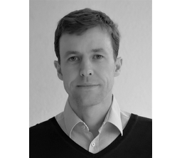
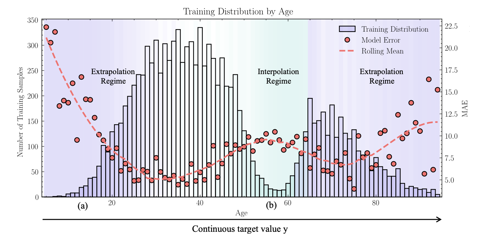

[English Version](index-en.qmd){.btn .btn-outline-primary .hero-btn}

:::{.landing-hero}
{.hero-logo}

## Der zentrale Ansprechpartner für KI an der TH Köln

:::

## Aktuelle Meldungen

:::{.feature-grid}
:::{.feature-card}
{.feature-card-image fig-alt="Prof. Dr. Claus Peter Gwiggner"}

### Willkommen Prof. Dr. Claus Peter Gwiggner im THK-AI Forschungscluster

`28. April 2026` -- Das THK-AI Forschungscluster begrüßt [Prof. Dr. Claus Peter Gwiggner](https://www.th-koeln.de/personen/claus.gwiggner/) (Institut für Data Science, Engineering, and Analytics) als neues Mitglied. Mit seinem Beitritt wächst das Cluster auf 26 Mitglieder; seine Schwerpunkte liegen in Supply-Chain-Analytik, stochastischer Optimierung und Decision Intelligence.

[Zum Beitrag](news/welcome_gwiggner/welcome-prof-claus-gwiggner.md){.btn .btn-outline-primary}
:::

:::{.feature-card}
{.feature-card-image fig-alt="AgeDB-Verteilung mit Extrapolations- und Interpolationsregimen sowie Modellfehler"}

### Paper „Deconstructing Deep Imbalance Regression" in Artificial Intelligence Review erschienen

`28. April 2026` -- Noah C. Puetz, Jens U. Brandt, Marc Hilbert, Elena Raponi, Thomas Bäck und [Prof. Dr. Thomas Bartz-Beielstein](https://www.th-koeln.de/personen/thomas.bartz-beielstein/) liefern in *Artificial Intelligence Review* die erste umfassende Übersicht zu Deep Imbalanced Regression. Eine zweiachsige Taxonomie ordnet 19 Verfahren ein, zwölf werden unter identischen Bedingungen reevaluiert, und drei neue Protokolle decken bislang verborgene Fehlerregime auf. DOI: [10.1007/s10462-026-11570-1](https://doi.org/10.1007/s10462-026-11570-1).

[Zum Beitrag](news/puet26a/puet26a-deep-imbalance-regression.md){.btn .btn-outline-primary}
:::

:::

[Alle Meldungen im THK-AI Newsroom](news.qmd){.btn .btn-outline-primary}

## Mitglieder

{.team-mosaic fig-alt="Gründungsmitglieder des THK-AI Clusters"}

::: {.callout-note appearance="simple"}
### Kooperation
Mit mehr als 20 Professorinnen und Professoren der TH Köln ist das THK-AI Forschungscluster eine der größten KI-Forschungskooperationen an einer Hochschule für angewandte Wissenschaften in Deutschland.
:::

## Warum THK-AI?

:::{.feature-grid}
:::{.feature-card}
### Angewandte KI mit Skalierung

THK-AI verbindet leistungsfähige Recheninfrastruktur mit interdisziplinärer Expertise, um KI von der Idee bis zum einsatzfähigen Prototypen zu bringen.
:::

:::{.feature-card}
### Offen für Kooperation

Das Cluster unterstützt gemeinsame Projekte zwischen Verbänden, Unternehmen, Professorinnen und Professoren sowie Studierenden aus unterschiedlichen Fachrichtungen.
:::

:::

## THK-AI Beispielprojekt

{.hero-image fig-alt="Forschungskontext THK-AI"}

::: {.callout-note appearance="simple"}
Das Projekt THK-KIplus (TH Köln - Künstliche Intelligenz plus) wurde von Juni 2023 bis November 2025 im Programm KI-Nachwuchs@FH durch das Bundesministerium für Forschung, Technologie und Raumfahrt gefördert.
Die Initiative wurde mit *rund 1,3 Mio. EUR* gefördert und hat eine der leistungsstärksten KI-orientierten Forschungsinfrastrukturen an Hochschulen für angewandte Wissenschaften in Deutschland aufgebaut.
:::

## Thematische Schwerpunkte

:::{.feature-grid}
:::{.feature-card}
### Kritische Infrastruktur

Robuste KI-Methoden für autonome und sicherheitskritische Systeme.
:::

:::{.feature-card}
### Sozial-interaktive KI-Agenten

Sozioempathische KI-basierte Dialoge und hybride Avatare für soziale Innovationen.
:::

:::

## CAIRNE Gold Member

{fig-alt="CAIRNE Logo" width="80%"}

::: {.callout-tip appearance="simple"}
Das THK-AI Forschungscluster ist **Gold Member** im **CAIRNE Research Network** (Confederation of Laboratories for Artificial Intelligence Research in Europe).

CAIRNE ist eine europäische, gemeinnützige AI-Gemeinschaft mit human-centered Fokus. Das Netzwerk vernetzt Forschungseinrichtungen, Industrie und Politik, um europäische KI-Exzellenz, Zusammenarbeit und digitale Souveränität zu stärken.
:::

[Mehr zu CAIRNE](https://cairne.eu){.btn .btn-outline-primary}
[Mehr über THK-AI](about.qmd){.btn .btn-outline-light}

## Mitmachen und vernetzen

Wenn Sie Kooperationen, studentische Projekte oder Partnerschaften in der angewandten KI suchen, ist THK-AI Ihr zentraler Ansprechpartner an der TH Köln.

[Kontakt und Über uns](about.qmd){.btn .btn-success}
[Lehre und Angebote](lehre.qmd){.btn .btn-outline-primary}

