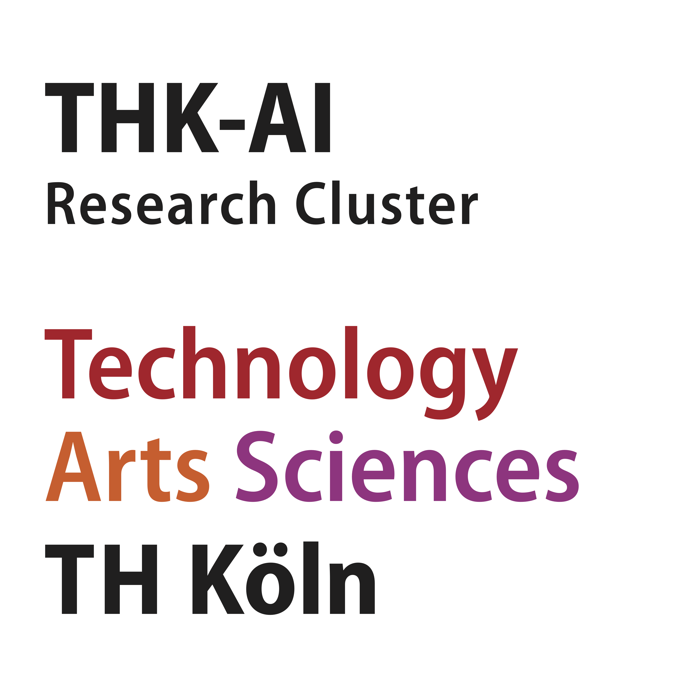
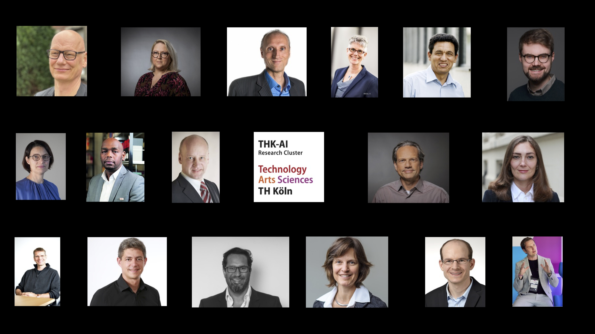

[English Version](index-en.qmd){.btn .btn-outline-primary .hero-btn}

:::{.landing-hero}
:::{.columns .v-center}
:::{.column width="48%"}
{.hero-logo}

## Der zentrale Ansprechpartner für KI an der TH Köln

Das THK-AI Forschungscluster fördert und unterstützt kooperative Projekte zwischen Verbänden, Industriepartnern, Professorinnen und Professoren sowie Studierenden.

[Forschung entdecken](forschung.qmd){.btn .btn-primary .hero-btn}
[Team kennenlernen](members.qmd){.btn .btn-outline-light .hero-btn}
:::

:::{.column width="52%"}
{.hero-image fig-alt="Forschungskontext THK-AI"}
:::
:::
:::

## Mitglieder

:::{.columns .v-center}
:::{.column width="60%"}
::: {.callout-note appearance="simple"}
### Kooperation
Mit mehr als 20 Professorinnen und Professoren aus allen Fakultäten der TH Köln ist das THK-AI Forschungscluster eine der größten KI-Forschungskooperationen an einer Hochschule für angewandte Wissenschaften in Deutschland.
:::
:::

:::{.column width="40%"}

{.team-mosaic fig-alt="Gründungsmitglieder des THK-AI Clusters"}
:::
:::

## Warum THK-AI?

:::{.feature-grid}
:::{.feature-card}
### Angewandte KI mit Skalierung

THK-AI verbindet leistungsfähige Recheninfrastruktur mit interdisziplinärer Expertise, um KI von der Idee bis zum einsatzfähigen Prototypen zu bringen.
:::

:::{.feature-card}
### Offen für Kooperation

Das Cluster unterstützt gemeinsame Projekte zwischen Verbänden, Unternehmen, Professorinnen und Professoren sowie Studierenden aus unterschiedlichen Fachrichtungen.
:::

:::{.feature-card}
### Starke Infrastruktur

Die verteilte Infrastruktur in Gummersbach und Leverkusen ermöglicht robuste Forschungsprozesse und webbasierten Zugriff rund um die Uhr.
:::
:::

## THK-AI Beispielprojekt

::: {.callout-note appearance="simple"}
Das Projekt THK-KIplus (TH Köln - Künstliche Intelligenz plus) wurde von Juni 2023 bis November 2025 im Programm KI-Nachwuchs@FH durch das Bundesministerium für Forschung, Technologie und Raumfahrt gefördert.
Die Initiative wurde mit *rund 1,3 Mio. EUR* gefördert und hat eine der leistungsstärksten KI-orientierten Forschungsinfrastrukturen an Hochschulen für angewandte Wissenschaften in Deutschland aufgebaut.
:::

## Thematische Schwerpunkte

:::{.columns}
:::{.column width="33%"}
### Mobilität

Robuste KI-Methoden für autonome und sicherheitskritische Systeme.
:::

:::{.column width="33%"}
### Nachhaltigkeit

Datengetriebene Umweltbeobachtung und fundierte Entscheidungsunterstützung.
:::

:::{.column width="33%"}
### Gesellschaft und Transfer

Verantwortungsvolle KI für Bildung, soziale Kontexte und Kooperation mit der Praxis.
:::
:::

## CAIRNE Gold Member

:::{.columns .v-center}
:::{.column width="36%"}
{fig-alt="CAIRNE Logo" width="100%"}
:::
:::{.column width="64%"}
::: {.callout-tip appearance="simple"}
Das THK-AI Forschungscluster ist **Gold Member** im **CAIRNE Research Network** (Confederation of Laboratories for Artificial Intelligence Research in Europe).
:::

CAIRNE ist eine europäische, gemeinnützige AI-Gemeinschaft mit human-centered Fokus. Das Netzwerk vernetzt Forschungseinrichtungen, Industrie und Politik, um europäische KI-Exzellenz, Zusammenarbeit und digitale Souveränität zu stärken.

[Mehr zu CAIRNE](https://cairne.eu){.btn .btn-outline-primary}
[Mehr über THK-AI](about.qmd){.btn .btn-outline-light}
:::
:::

## Mitmachen und vernetzen

Wenn Sie Kooperationen, studentische Projekte oder Partnerschaften in der angewandten KI suchen, ist THK-AI Ihr zentraler Ansprechpartner an der TH Köln.

[Kontakt und Über uns](about.qmd){.btn .btn-success}
[Lehre und Angebote](lehre.qmd){.btn .btn-outline-primary}

