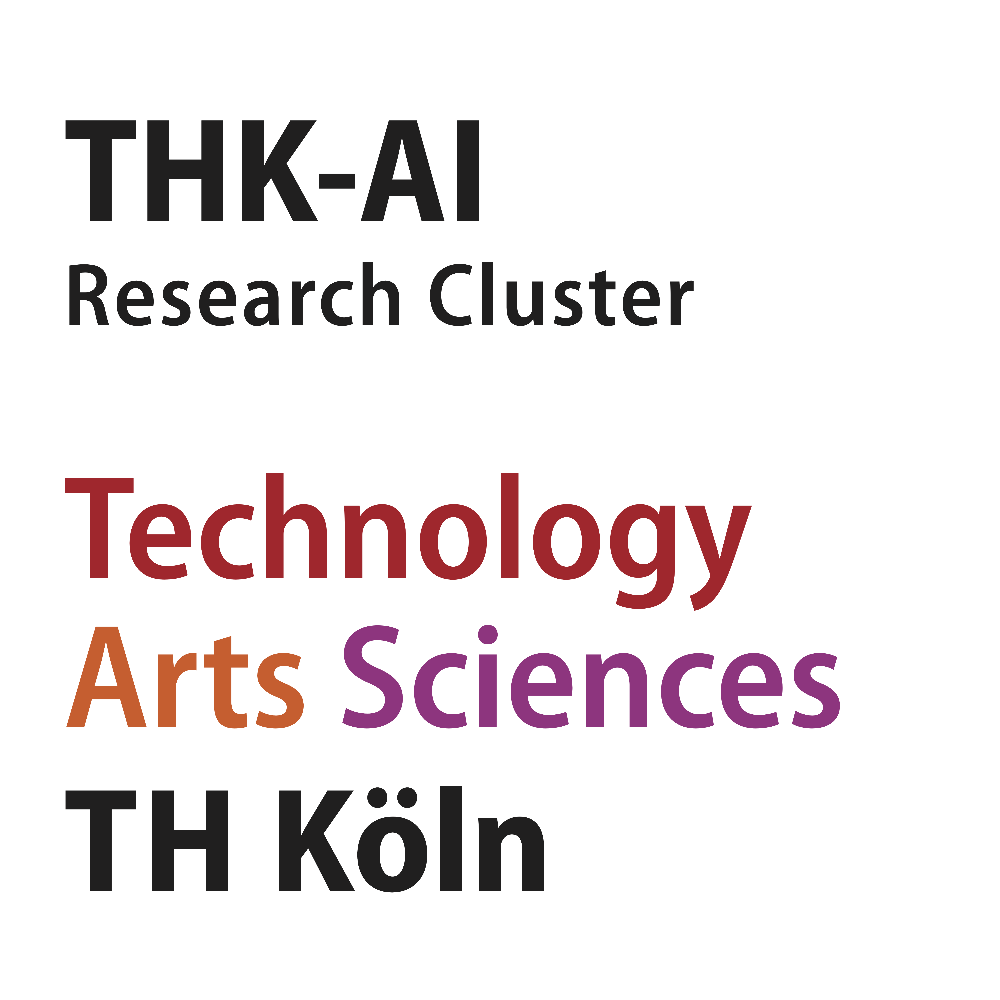
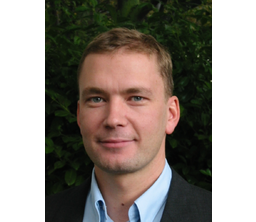
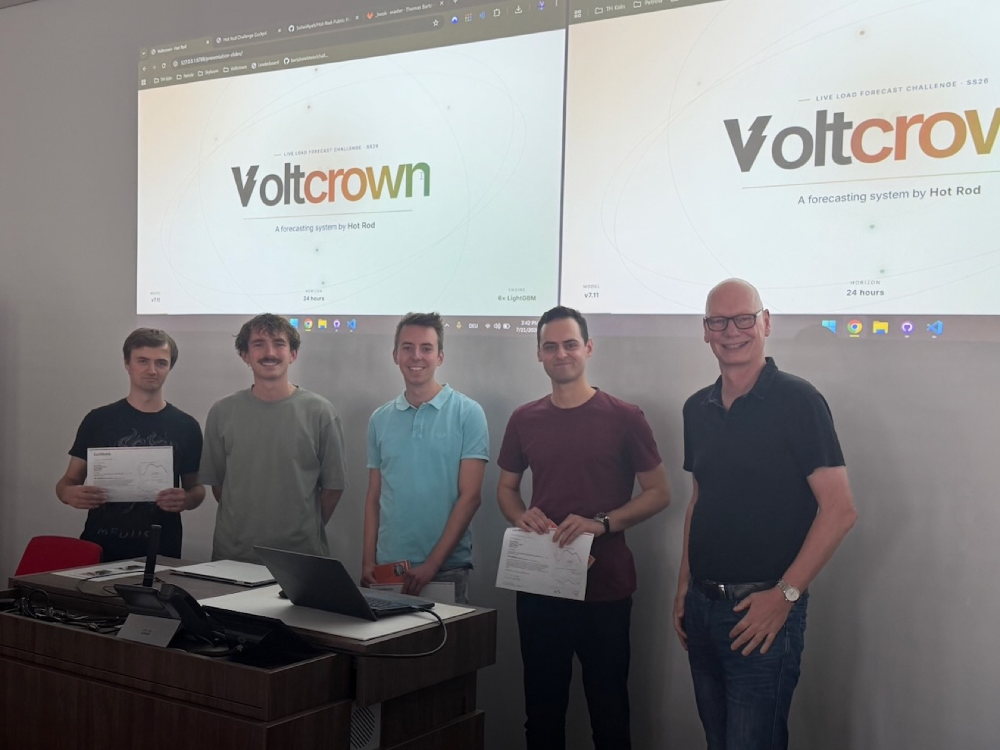
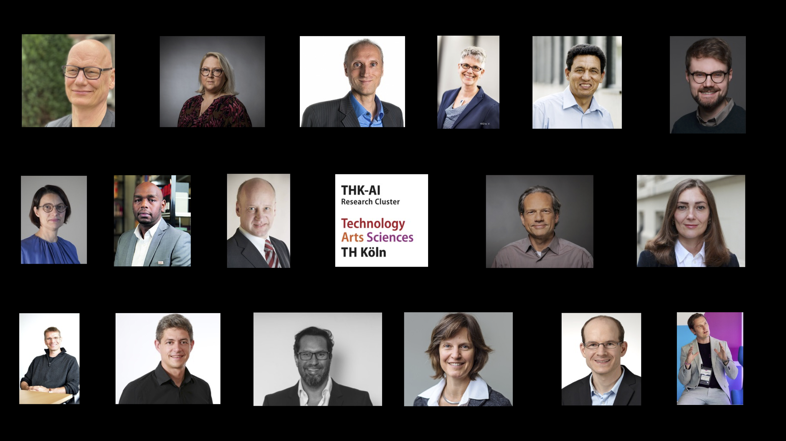
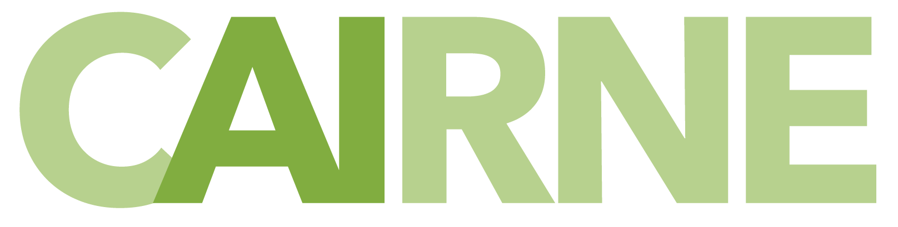

[English Version](index-en.qmd){.btn .btn-outline-primary .hero-btn}

:::{.landing-hero}
{.hero-logo}

## Der zentrale Ansprechpartner für KI an der TH Köln

:::

## Aktuelle Meldungen

:::{.feature-grid}
:::{.feature-card}
{.feature-card-image fig-alt="Prof. Dr. Jochen Müller"}

### Willkommen Prof. Dr. Jochen Müller im THK-AI Forschungscluster

`1. August 2026` -- Das THK-AI Forschungscluster begrüßt [Prof. Dr. Jochen Müller](https://www.th-koeln.de/personen/jochen.mueller/) (Institut für Technische Gebäudeausrüstung, TGA) als neues Mitglied. Sein Schwerpunkt liegt auf KI-Methoden für die Gebäudeautomation: Mit NLP und großen Sprachmodellen werden Betriebsdaten auf das Informationsmodell der Industrie-4.0-Verwaltungsschale übertragen und in den Projekten OptGA4.0 und EcoTwin als digitale Zwillinge nutzbar gemacht.

[Zum Beitrag](news/welcome_mueller/welcome-prof-jochen-mueller.md){.btn .btn-outline-primary}
:::

:::{.feature-card}
{.feature-card-image fig-alt="Das Siegerteam Hot Rod mit Prof. Bartz-Beielstein vor den Folien seines Prognosesystems Voltcrown"}

### Lastprognose-Challenge 2026: Zertifikatsübergabe und Prognosen auf Spitzenniveau

`27. Juli 2026` -- Mit der Zertifikatsübergabe an die Teams beider Lehrveranstaltungen ist die Live-Lastprognose-Challenge 2026 an der TH Köln offiziell zu Ende gegangen. Zehn der elf studentischen Teams unterboten die offizielle Day-Ahead-Prognose der ENTSO-E, alle elf schlugen die naiven Vergleichsmodelle. Bestes studentisches Team war Hot Rod. Die Gruppensiege gingen an Das A Team und Hot Rod.

[Zum Beitrag](news/lastprognose-challenge-2026-abschluss/lastprognose-challenge-2026-abschluss.md){.btn .btn-outline-primary}
:::

:::

[Alle Meldungen im THK-AI Newsroom](news.qmd){.btn .btn-outline-primary}

## Mitglieder

{.team-mosaic fig-alt="Gründungsmitglieder des THK-AI Clusters"}

::: {.callout-note appearance="simple"}
### Kooperation
Mit mehr als 20 Professorinnen und Professoren der TH Köln ist das THK-AI Forschungscluster eine der größten KI-Forschungskooperationen an einer Hochschule für angewandte Wissenschaften in Deutschland.
:::

## Warum THK-AI?

:::{.feature-grid}
:::{.feature-card}
### Angewandte KI mit Skalierung

THK-AI verbindet leistungsfähige Recheninfrastruktur mit interdisziplinärer Expertise, um KI von der Idee bis zum einsatzfähigen Prototypen zu bringen.
:::

:::{.feature-card}
### Offen für Kooperation

Das Cluster unterstützt gemeinsame Projekte zwischen Verbänden, Unternehmen, Professorinnen und Professoren sowie Studierenden aus unterschiedlichen Fachrichtungen.
:::

:::

## THK-AI Beispielprojekt

{.hero-image fig-alt="Forschungskontext THK-AI"}

::: {.callout-note appearance="simple"}
Das Projekt THK-KIplus (TH Köln - Künstliche Intelligenz plus) wurde von Juni 2023 bis November 2025 im Programm KI-Nachwuchs@FH durch das Bundesministerium für Forschung, Technologie und Raumfahrt gefördert.
Die Initiative wurde mit *rund 1,3 Mio. EUR* gefördert und hat eine der leistungsstärksten KI-orientierten Forschungsinfrastrukturen an Hochschulen für angewandte Wissenschaften in Deutschland aufgebaut.
:::

## Thematische Schwerpunkte

:::{.feature-grid}
:::{.feature-card}
### Kritische Infrastruktur

Robuste KI-Methoden für autonome und sicherheitskritische Systeme.
:::

:::{.feature-card}
### Sozial-interaktive KI-Agenten

Sozioempathische KI-basierte Dialoge und hybride Avatare für soziale Innovationen.
:::

:::

## CAIRNE Gold Member

{fig-alt="CAIRNE Logo" width="80%"}

::: {.callout-tip appearance="simple"}
Das THK-AI Forschungscluster ist **Gold Member** im **CAIRNE Research Network** (Confederation of Laboratories for Artificial Intelligence Research in Europe).

CAIRNE ist eine europäische, gemeinnützige AI-Gemeinschaft mit human-centered Fokus. Das Netzwerk vernetzt Forschungseinrichtungen, Industrie und Politik, um europäische KI-Exzellenz, Zusammenarbeit und digitale Souveränität zu stärken.
:::

[Mehr zu CAIRNE](https://cairne.eu){.btn .btn-outline-primary}
[Mehr über THK-AI](about.qmd){.btn .btn-outline-light}

## Mitmachen und vernetzen

Wenn Sie Kooperationen, studentische Projekte oder Partnerschaften in der angewandten KI suchen, ist THK-AI Ihr zentraler Ansprechpartner an der TH Köln.

[Kontakt und Über uns](about.qmd){.btn .btn-success}
[Lehre und Angebote](lehre.qmd){.btn .btn-outline-primary}

