## Sprecher

| Bild | Name |
|---|---|
| 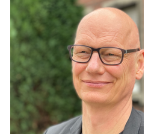 | Thomas Bartz-Beielstein  Informatik und Ingenieurwissenschaften Institut fuer Data Science, Engineering, and Analytics (IDE+A) |
| 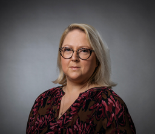 | Anja Richert  Anlagen, Energie- und Maschinensysteme Institut fuer Produktentwicklung und Konstruktionstechnik (IPK) |

## Gründungsmitglieder

| Bild | Name |
|---|---|
| 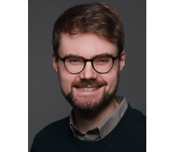 | Pascal Cerfontaine  Informations-, Medien- und Elektrotechnik Institute of Computer and Communication Technology (ICCT) |
| 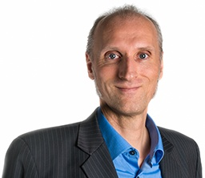 | Arnulph Fuhrmann  Fakultät für Informations-, Medien- und Elektrotechnik Institut für Medien- und Phototechnik (IMP) |
| 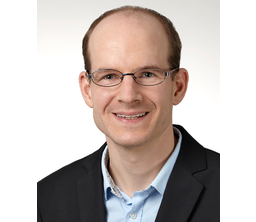 | Daniel Gaida  Informatik und Ingenieurwissenschaften Institut fuer Informatik (INF) |
| 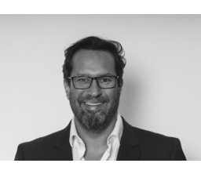 | Gernot Heisenberg  Informations- und Kommunikationswissenschaften Institut fuer Informationswissenschaft (IWS) |
| 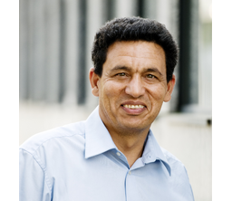 | Mohieddine Jelalie  Anlagen, Energie- und Maschinensysteme Institut fuer Produktentwicklung und Konstruktionstechnik (IPK) |
| 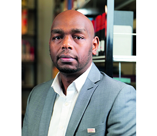 | Edwin Kamau  Fahrzeugsysteme und Produktion Institut fuer Fahrzeugtechnik (IFK) |
| 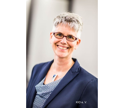 | Simone Lake  Informatik und Ingenieurwissenschaften Institut fuer Allgemeinen Maschinenbau (IAM) |
| 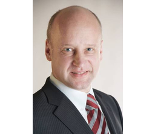 | Jörg Luderich  Anlagen, Energie- und Maschinensysteme Institut für Produktentwicklung und Konstruktionstechnik (IPK) |
| 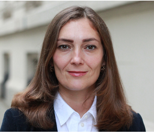 | Lilia Pasch  Fakultät für Wirtschafts- und Rechtswissenschaften Schmalenbach Institut für Wirtschaftswissenschaften (WI) |
| 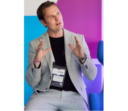 | Eike Permin  Informatik und Ingenieurwissenschaften Institut fuer Allgemeinen Maschinenbau (IAM) |
| 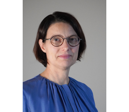 | Beate Rhein  Informations-, Medien- und Elektrotechnik Institute of Computer and Communication Technology (ICCT) |
| 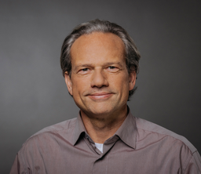 | Lars Ribbe  Raumentwicklung und Infrastruktursysteme Institute for Natural Resources Technology and Management (ITT) |
| 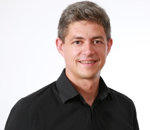 | Jan Salmen  Informations-, Medien- und Elektrotechnik Institut fuer Medien- und Phototechnik (IMP) |
| 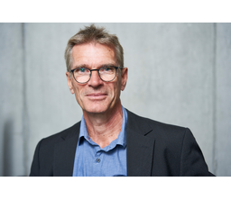 | Hartmut Westenberger  Fakultät für Informatik und Ingenieurwissenschaften Cologne Institute for Digital Ecosystems (CIDE) |
| 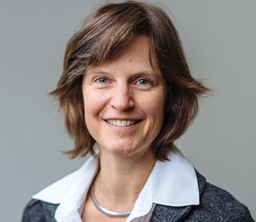 | Isabel Zorn  Angewandte Sozialwissenschaften Institut für Medienforschung und Medienpädagogik (IMM) |

## Mitglieder

| Bild | Name |
|---|---|
| 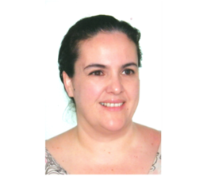 | Maria Elena Algorri  Informatik und Ingenieurwissenschaften Institut fuer Automation & Industrial IT (AIT) |
| 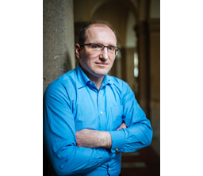 | Roman Bartnik  [Fakultät für Informatik und Ingenieurwissenschaften](https://www.th-koeln.de/informatik-und-ingenieurwissenschaften/) Institute for Business Administration and Leadership (IBAL) |
| 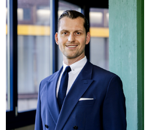 | Nicolas Bennerscheid  [Fakultät für Informations-, Medien- und Elektrotechnik](https://www.th-koeln.de/informations-medien-und-elektrotechnik/) [Institut für Automatisierungstechnik (IA)](https://www.th-koeln.de/informations-medien-und-elektrotechnik/institut-fuer-automatisierungstechnik-ia_14805.php) |
| 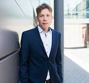 | Peter Kern  Fakultät für Informatik und Ingenieurwissenschaften Institut für Automation & Industrial IT (AIT) |
| 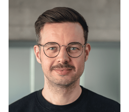 | Richard Sieg  [Fakultät für Informations- und Kommunikationswissenschaften](https://www.th-koeln.de/informations-und-kommunikationswissenschaften/) [Institut für Informationswissenschaft (IWS)](https://www.th-koeln.de/informations-und-kommunikationswissenschaften/institut-fuer-informationswissenschaft_4134.php) |
|  | [Prof. Dr. Ingo Stadler](https://www.th-koeln.de/personen/ingo.stadler/)  Fakultät für Informations-, Medien- und Elektrotechnik Institut für Elektrische Energietechnik (IET) / Cologne Institute for Renewable Energy (CIRE) |
| 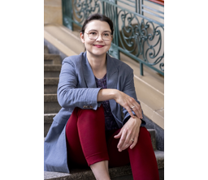 | Karolina Suchowolek  Informations-, und Kommunikationswissenschaften Institut fuer Translation und Mehrsprachige Kommunikation |

