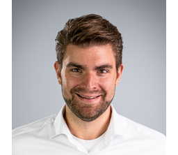

## Sprecher

| Bild | Name |
|---|---|
|  | [Prof. Dr. rer. nat. Thomas Bartz-Beielstein](https://www.th-koeln.de/personen/thomas.bartz-beielstein/)  [Informatik und Ingenieurwissenschaften](https://www.th-koeln.de/informatik-und-ingenieurwissenschaften/) [Institut für Data Science, Engineering, and Analytics (IDE+A)](https://www.th-koeln.de/informatik-und-ingenieurwissenschaften/institut-fuer-data-science-engineering-and-analytics_54523.php) |
|  | [Prof. Dr. Anja Richert](https://www.th-koeln.de/personen/anja.richert/)  [Anlagen, Energie- und Maschinensysteme](https://www.th-koeln.de/anlagen-energie-und-maschinensysteme/) [Institut für Produktentwicklung und Konstruktionstechnik (IPK)](https://www.th-koeln.de/anlagen-energie-und-maschinensysteme/institut-fuer-produktentwicklung-und-konstruktionstechnik_14562.php) |

## Gründungsmitglieder

| Bild | Name |
|---|---|
|  | [Prof. Dr. rer. nat. Pascal Cerfontaine](https://www.th-koeln.de/personen/pascal.cerfontaine/)  [Informations-, Medien- und Elektrotechnik](https://www.th-koeln.de/informations-medien-und-elektrotechnik/) [Institute of Computer and Communication Technology (ICCT)](https://www.th-koeln.de/informations-medien-und-elektrotechnik/institute-of-computer-and-communication-technology_101470.php) |
|  | [Prof. Dr.-Ing. Arnulph Fuhrmann](https://www.th-koeln.de/personen/arnulph.fuhrmann/)  [Fakultät für Informations-, Medien- und Elektrotechnik](https://www.th-koeln.de/informations-medien-und-elektrotechnik/) [Institut für Medien- und Phototechnik (IMP)](https://www.th-koeln.de/informations-medien-und-elektrotechnik/institut-fuer-medien--und-phototechnik-imp_14807.php) |
|  | [Prof. Dr. Daniel Gaida](https://www.th-koeln.de/personen/daniel.gaida/)  [Informatik und Ingenieurwissenschaften](https://www.th-koeln.de/informatik-und-ingenieurwissenschaften/) [Institut für Informatik (INF)](https://www.th-koeln.de/informatik-und-ingenieurwissenschaften/institut-fuer-informatik_29538.php) |
|  | [Prof. Dr. Gernot Heisenberg](https://www.th-koeln.de/personen/gernot.heisenberg/)  [Informations- und Kommunikationswissenschaften](https://www.th-koeln.de/informations-und-kommunikationswissenschaften/) [Institut für Informationswissenschaft (IWS)](https://www.th-koeln.de/informations-und-kommunikationswissenschaften/institut-fuer-informationswissenschaft_4134.php) |
|  | [Prof. Dr.-Ing. habil. Mohieddine Jelali](https://www.th-koeln.de/personen/mohieddine.jelali/)  [Anlagen, Energie- und Maschinensysteme](https://www.th-koeln.de/anlagen-energie-und-maschinensysteme/) [Institut für Produktentwicklung und Konstruktionstechnik (IPK)](https://www.th-koeln.de/anlagen-energie-und-maschinensysteme/institut-fuer-produktentwicklung-und-konstruktionstechnik_14562.php) |
|  | [Prof. Dr. rer. nat. Edwin Kamau](https://www.th-koeln.de/personen/edwin.kamau/)  [Fahrzeugsysteme und Produktion](https://www.th-koeln.de/fahrzeugsysteme-und-produktion/) Institut für Fahrzeugtechnik (IFK) |
|  | [Prof. Dr.-Ing. Simone Lake](https://www.th-koeln.de/personen/simone.lake/)  [Informatik und Ingenieurwissenschaften](https://www.th-koeln.de/informatik-und-ingenieurwissenschaften/) [Institut für Allgemeinen Maschinenbau (IAM)](https://www.th-koeln.de/informatik-und-ingenieurwissenschaften/institut-fuer-allgemeinen-maschinenbau_73074.php) |
|  | [Prof. Dr.-Ing. Jörg Luderich](https://www.th-koeln.de/personen/joerg.luderich/)  [Anlagen, Energie- und Maschinensysteme](https://www.th-koeln.de/anlagen-energie-und-maschinensysteme/) [Institut für Produktentwicklung und Konstruktionstechnik (IPK)](https://www.th-koeln.de/anlagen-energie-und-maschinensysteme/institut-fuer-produktentwicklung-und-konstruktionstechnik_14562.php) |
|  | [Prof. Dr. rer. oec. Lilia Pasch](https://www.th-koeln.de/personen/lilia.pasch/)  [Fakultät für Wirtschafts- und Rechtswissenschaften](https://www.th-koeln.de/wirtschafts-und-rechtswissenschaften/) [Schmalenbach Institut für Wirtschaftswissenschaften (WI)](https://www.th-koeln.de/wirtschafts-und-rechtswissenschaften/schmalenbach-institut-fuer-wirtschaftswissenschaften_8527.php) |
|  | [Prof. Dr.-Ing. Eike Permin](https://www.th-koeln.de/personen/eike.permin/)  [Informatik und Ingenieurwissenschaften](https://www.th-koeln.de/informatik-und-ingenieurwissenschaften/) [Institut für Allgemeinen Maschinenbau (IAM)](https://www.th-koeln.de/informatik-und-ingenieurwissenschaften/institut-fuer-allgemeinen-maschinenbau_73074.php) |
|  | [Prof. Dr. rer. nat. Beate Rhein](https://www.th-koeln.de/personen/beate.rhein/)  [Informations-, Medien- und Elektrotechnik](https://www.th-koeln.de/informations-medien-und-elektrotechnik/) [Institute of Computer and Communication Technology (ICCT)](https://www.th-koeln.de/informations-medien-und-elektrotechnik/institute-of-computer-and-communication-technology_101470.php) |
|  | [Prof. Dr. rer. nat. Lars Ribbe](https://www.th-koeln.de/personen/lars.ribbe/)  [Raumentwicklung und Infrastruktursysteme](https://www.th-koeln.de/raumentwicklung-und-infrastruktursysteme/) [Institute for Natural Resources Technology and Management (ITT)](https://www.th-koeln.de/institut-fuer-technologie-und-ressourcenmanagement-in-den-tropen-und-subtropen/institut-fuer-technologie-und-ressourcenmanagement-in-den-tropen-und-subtropen_2468.php) |
|  | [Prof. Dr.-Ing. Jan Salmen](https://www.th-koeln.de/personen/jan.salmen/)  [Informations-, Medien- und Elektrotechnik](https://www.th-koeln.de/informations-medien-und-elektrotechnik/) [Institut für Medien- und Phototechnik (IMP)](https://www.th-koeln.de/informations-medien-und-elektrotechnik/institut-fuer-medien--und-phototechnik-imp_14807.php) |
|  | [Prof. Dr. rer. nat. Hartmut Westenberger](https://www.th-koeln.de/personen/hartmut.westenberger/)  [Fakultät für Informatik und Ingenieurwissenschaften](https://www.th-koeln.de/informatik-und-ingenieurwissenschaften/) [Cologne Institute for Digital Ecosystems (CIDE)](https://www.th-koeln.de/informatik-und-ingenieurwissenschaften/cologne-institute-for-digital-ecosystems_62255.php) |
|  | [Prof. Dr. Isabel Zorn](https://www.th-koeln.de/personen/isabel.zorn/)  [Angewandte Sozialwissenschaften](https://www.th-koeln.de/angewandte-sozialwissenschaften/) [Institut für Medienforschung und Medienpädagogik (IMM)](https://www.th-koeln.de/angewandte-sozialwissenschaften/institut-fuer-medienforschung-und-medienpaedagogik-imm_11557.php) |

## Mitglieder

| Bild | Name |
|---|---|
|  | [Prof. Dr. Maria Elena Algorri](https://www.th-koeln.de/personen/elena.algorri/)  [Informatik und Ingenieurwissenschaften](https://www.th-koeln.de/informatik-und-ingenieurwissenschaften/) [Institut für Automation & Industrial IT (AIT)](https://www.th-koeln.de/informatik-und-ingenieurwissenschaften/institut-fuer-automation--industrial-it_29081.php) |
|  | [Prof. Dr. rer. oec. Roman Bartnik](https://www.th-koeln.de/personen/roman.bartnik/)  [Fakultät für Informatik und Ingenieurwissenschaften](https://www.th-koeln.de/informatik-und-ingenieurwissenschaften/) [Institute for Business Administration and Leadership (IBAL)](https://www.th-koeln.de/informatik-und-ingenieurwissenschaften/institute-for-business-administration-and-leadership_56873.php) |
|  | [Prof. Dr. Nicolas Bennerscheid](https://www.th-koeln.de/personen/nicolas.bennerscheid/)  [Fakultät für Informations-, Medien- und Elektrotechnik](https://www.th-koeln.de/informations-medien-und-elektrotechnik/) [Institut für Automatisierungstechnik (IA)](https://www.th-koeln.de/informations-medien-und-elektrotechnik/institut-fuer-automatisierungstechnik-ia_14805.php) |
|  | [Prof. Dr. Claus Peter Gwiggner](https://www.th-koeln.de/personen/claus.gwiggner/)  [Informatik und Ingenieurwissenschaften](https://www.th-koeln.de/informatik-und-ingenieurwissenschaften/) [Institut für Data Science, Engineering, and Analytics (IDE+A)](https://www.th-koeln.de/informatik-und-ingenieurwissenschaften/institut-fuer-data-science-engineering-and-analytics_54523.php) |
|  | [Prof. Dr. Peter Kern](https://www.th-koeln.de/personen/peter.kern/)  [Fakultät für Informatik und Ingenieurwissenschaften](https://www.th-koeln.de/informatik-und-ingenieurwissenschaften/) [Institut für Automation & Industrial IT (AIT)](https://www.th-koeln.de/informatik-und-ingenieurwissenschaften/institut-fuer-automation--industrial-it_29081.php) |
|  | [Prof. Dr. Kai Kreisköther](https://www.th-koeln.de/personen/kai.kreiskoether/)  [Informations-, Medien- und Elektrotechnik](https://www.th-koeln.de/informations-medien-und-elektrotechnik/) [Institute of Computer and Communication Technology (ICCT)](https://www.th-koeln.de/informations-medien-und-elektrotechnik/institute-of-computer-and-communication-technology_101470.php) |
|  | [Prof. Dr. Richard Sieg](https://www.th-koeln.de/personen/richard.sieg/)  [Fakultät für Informations- und Kommunikationswissenschaften](https://www.th-koeln.de/informations-und-kommunikationswissenschaften/) [Institut für Informationswissenschaft (IWS)](https://www.th-koeln.de/informations-und-kommunikationswissenschaften/institut-fuer-informationswissenschaft_4134.php) |
|  | [Prof. Dr.-Ing. habil. Ingo Stadler](https://www.th-koeln.de/personen/ingo.stadler/)  [Fakultät für Informations-, Medien- und Elektrotechnik](https://www.th-koeln.de/informations-medien-und-elektrotechnik/) Institut für Elektrische Energietechnik (IET) / Cologne Institute for Renewable Energy (CIRE) |
|  | [Prof. Dr. phil. Karolina Suchowolek](https://www.th-koeln.de/personen/karolina.suchowolek/)  [Informations- und Kommunikationswissenschaften](https://www.th-koeln.de/informations-und-kommunikationswissenschaften/) [Institut für Translation und Mehrsprachige Kommunikation](https://www.th-koeln.de/informations-und-kommunikationswissenschaften/institut-fuer-translation-und-mehrsprachige-kommunikation_7473.php) |
