:::{.news-hero}
# THK-AI Newsroom

Aktuelle Meldungen aus Forschung, Lehre, Community und Transfer. 
:::

:::{.news-grid}
:::{.news-card}
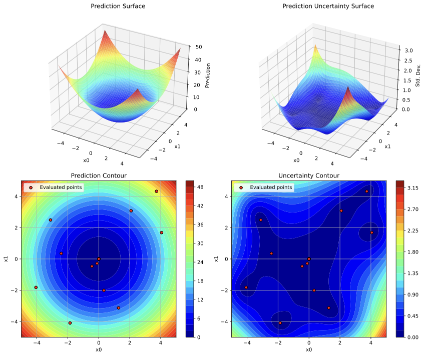{.news-card-image fig-alt="Surrogatmodell-Visualisierung aus dem SpotOptim-Paper"}
[Paper „Optimization with SpotOptim" auf arXiv erschienen](news/bart26g-spotoptim/bart26g-spotoptim.md)
`16. April 2026`

Prof. Dr. Thomas Bartz-Beielstein stellt das Python-Paket `spotoptim` für surrogat-modellbasierte Optimierung teurer Black-Box-Funktionen vor. Der Report beschreibt Architektur, Anwendungsbeispiele und einen Vergleich mit BoTorch, Optuna, Ray Tune, BOHB, SMAC und Hyperopt. Das Paket baut auf zwei Jahrzehnten Sequential Parameter Optimization (SPO) auf und ist Open Source.

[Zum Beitrag](news/bart26g-spotoptim/bart26g-spotoptim.md){.btn .btn-outline-primary}
:::

:::{.news-card}
{.news-card-image fig-alt="Team GM-Force Cologne beim RoboCup German Open 2026"}
[RoboCup German Open 2026: Team GM-Force Cologne gewinnt die Smart Manufacturing League](news/robocup-german-open-2026-sieg-gm-force-cologne.md)
`11. April 2026`

Das Team GM-Force Cologne unter Leitung von [Prof. Dr. Maria Elena Algorri](https://www.th-koeln.de/personen/elena.algorri/) hat beim RoboCup German Open 2026 den Gesamtsieg in der Smart Manufacturing League und zusätzlich die Kategorie „Assembly" geholt. Das Training der eingesetzten KI-Modelle wurde vollständig auf dem im Rahmen von THK-KIplus beschafften HPC-Cluster des THK-AI Forschungsclusters durchgeführt.

[Zum Beitrag](news/robocup-german-open-2026-sieg-gm-force-cologne.md){.btn .btn-outline-primary}
:::

:::{.news-card}
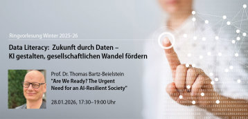{.news-card-image fig-alt="DaLI-Ringvorlesung: Are We Ready? The Urgent Need for an AI-Resilient Society"}
[Vortrag „Are We Ready? The Urgent Need for an AI-Resilient Society" jetzt online](news/dali-are-we-ready-vortrag-online.md)
`11. April 2026`

Der Vortrag von Prof. Dr. Thomas Bartz-Beielstein aus der DaLI-Ringvorlesung „Zukunft durch Daten – KI gestalten, gesellschaftlichen Wandel fördern" ist nun als [Aufzeichnung auf Vimeo](https://vimeo.com/1161035076) verfügbar. Der Vortrag diskutiert die systemische Erosion menschlicher Kompetenz durch unzuverlässige KI-Systeme und skizziert ein Drei-Säulen-Framework für KI-Resilienz, dessen wissenschaftliche Grundlage auch als [Report auf arXiv](https://arxiv.org/abs/1912.08786v2) vorliegt.

[Zum Beitrag](news/dali-are-we-ready-vortrag-online.md){.btn .btn-outline-primary}
:::

:::{.news-card}
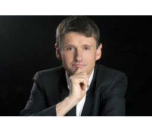{.news-card-image fig-alt="Prof. Dr. Ingo Stadler"}
[Willkommen Prof. Dr. Ingo Stadler im THK-AI Forschungscluster](news/welcome-prof-ingo-stadler.md)
`11. April 2026`

Das THK-AI Forschungscluster begrüßt [Prof. Dr. Ingo Stadler](https://www.th-koeln.de/personen/ingo.stadler/) (Institut für Elektrische Energietechnik / Cologne Institute for Renewable Energy) als neues Mitglied. Mit seinem Beitritt wächst das Cluster auf 24 Mitglieder. Seine Expertise zu erneuerbaren Energien, Energiespeichern und Smart Grids ergänzt das Cluster ideal im Bereich KI-gestützter Energiesysteme.

[Zum Beitrag](news/welcome-prof-ingo-stadler.md){.btn .btn-outline-primary}
:::

:::{.news-card}
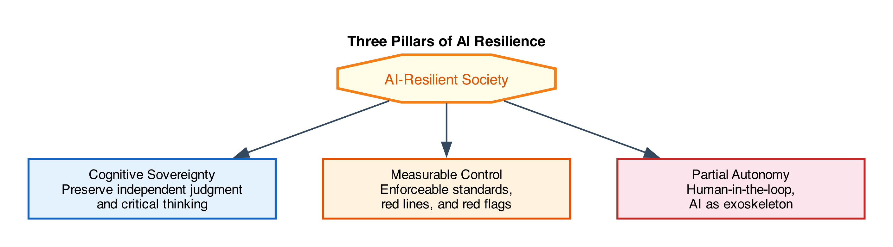{.news-card-image fig-alt="Three Pillars of AI Resilience"}
[Why We Need an AI-Resilient Society -- Updated Report on arXiv](news/why-we-need-an-ai-resilient-society.md)
`10. April 2026`

Eine aktualisierte Version des 2019 erschienenen Reports „Why we need an AI-resilient society" ist [auf arXiv veröffentlicht worden](https://arxiv.org/abs/1912.08786v2). Der Report erstellt ein „forensisches Profil" für KI anhand von neun dokumentierten Eigenschaften und schlägt ein Drei-Säulen-Framework für KI-Resilienz vor: Kognitive Souveränität, Messbare Kontrolle und Partielle Autonomie.

[Zum Beitrag](news/why-we-need-an-ai-resilient-society.md){.btn .btn-outline-primary}
:::

:::{.news-card}
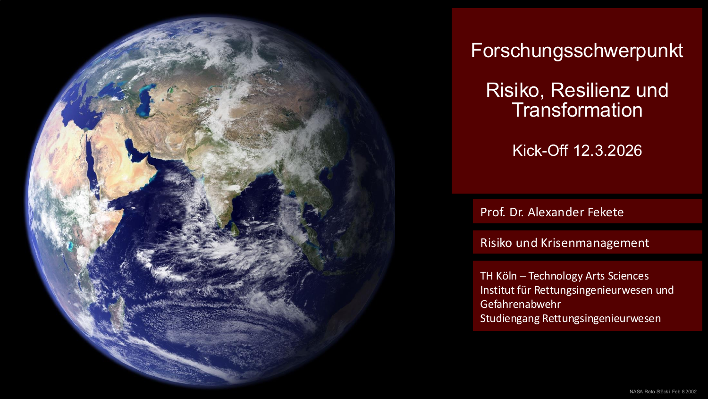{.news-card-image fig-alt="FSP Risiko, Resilienz und Transformation Kick-Off"}
[Kick-Off: Forschungsschwerpunkt Risiko, Resilienz und Transformation](news/fsp-risiko-resilienz-transformation-kick-off-2026.md)
`12. März 2026`

Neuer interdisziplinärer Forschungsschwerpunkt der TH Köln: mit über 35 Professorinnen und Professoren aus 11 Fakultäten bündelt der FSP Risiko, Resilienz und Transformation Kompetenzen von Katastrophenschutz bis digitaler Infrastrukturresilienz.

[Zum Beitrag](news/fsp-risiko-resilienz-transformation-kick-off-2026.md){.btn .btn-outline-primary}
:::

:::{.news-card}
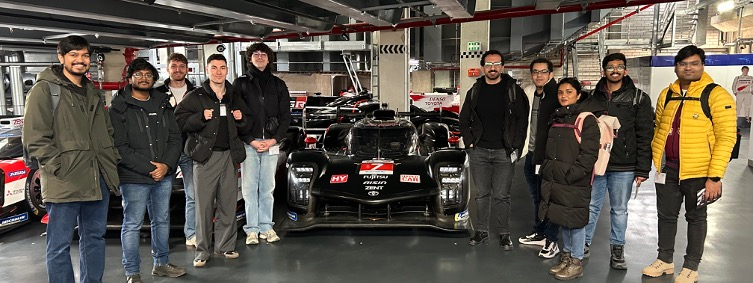{.news-card-image fig-alt="AI x Motorsport mit TOYOTA RACING"}
[Master's Case Study: AI R&D trifft auf Motorsport mit TOYOTA RACING](news/case-study-sensing-the-drift.md)
`10. März 2026`

Im THK-AI Forschungscluster zeigt sich erneut, wie praxisnah KI-Forschung sein kann: Unter der Betreuung von **Prof. Dr. Thomas Bartz-Beielstein** und seinem Doktoranden **Noah C. Pütz** arbeiteten Studierende der Master-Studiengänge Automation & IT und Digital Sciences in Kooperation mit **TOYOTA RACING** an einer realen Herausforderung.
[Zum Beitrag](news/case-study-sensing-the-drift.md){.btn .btn-outline-primary}
:::

:::{.news-card}
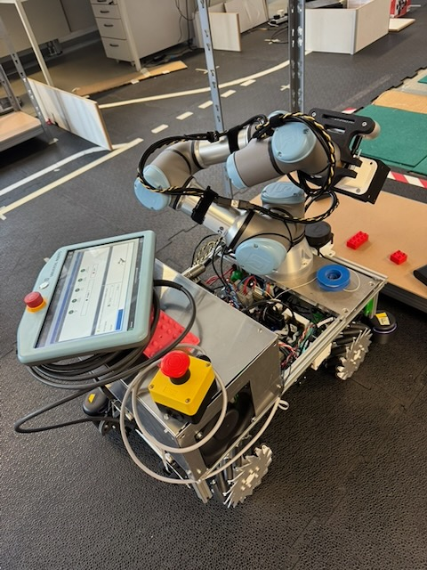{.news-card-image fig-alt="RoboCup Challenge Vorbereitung"}
[RoboCup 2026: Prof. Dr. Elena Algorri startet mit Team in die Challenge](news/robocup-challenge-elena-algorri-thk-ai.md)
`9. März 2026`

Prof. Dr. Elena Algorri und ihr Team vom THK-AI Forschungscluster stehen in den finalen Vorbereitungen fuer die diesjaehrige RoboCup Challenge - mit starkem Fokus auf Robotik, maschinelles Sehen und KI in realen Wettbewerbsszenarien.

[Zum Beitrag](news/robocup-challenge-elena-algorri-thk-ai.md){.btn .btn-outline-primary}
:::

:::{.news-card}
{.news-card-image fig-alt="GI Veranstaltung"}
[GI-Veranstaltung: Berufsbild Informatik - Braucht man noch Entwickler?](news/gi-veranstaltung-berufsbild-informatik-braucht-man-noch-entwickler.md)
`23. Februar 2026`

Datum und Uhrzeit 24.02.2026, 18:00 - 20:00 Uhr. Es erwarten Sie drei Vortraege aus unterschiedlichen Blickwinkeln.

[Zum Beitrag](news/gi-veranstaltung-berufsbild-informatik-braucht-man-noch-entwickler.md){.btn .btn-outline-primary}
:::

:::{.news-card}
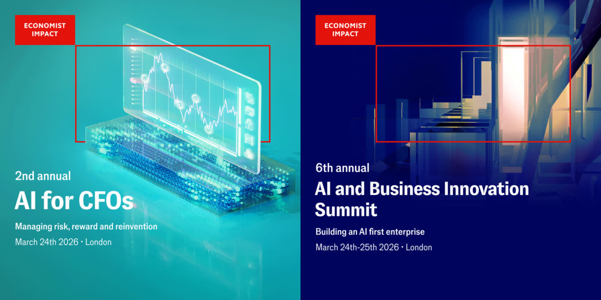{.news-card-image fig-alt="CAIRNE Summit"}
[CAIRNE News: AI for CFOs and AI & Business Innovation Summits](news/cairne-news-ai-for-cfos-and-ai-business-innovation-summits-to-convene-global-leaders-in-london-to-accelerate-enterprise-transformation.md)
`20. Februar 2026`

Two back-to-back events in London on March 24-25, hosted by Economist Impact, bring together senior global leaders.

[Zum Beitrag](news/cairne-news-ai-for-cfos-and-ai-business-innovation-summits-to-convene-global-leaders-in-london-to-accelerate-enterprise-transformation.md){.btn .btn-outline-primary}
:::

:::{.news-card}
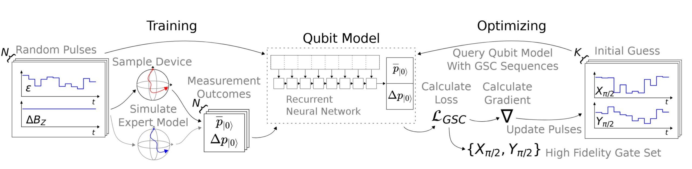{.news-card-image fig-alt="Qubit paper"}
[Paper: Data-Driven Qubit Characterization and Optimal Control using Deep Learning](news/paper-data-driven-qubit-characterization-and-optimal-control-using-deep-learning-auf-arxiv-erschienen.md)
`30. Januar 2026`

Kollaboration zwischen RWTH Aachen Quantum Technology Group und der AI4Science Group von Prof. Dr. Pascal Cerfontaine.

[Zum Beitrag](news/paper-data-driven-qubit-characterization-and-optimal-control-using-deep-learning-auf-arxiv-erschienen.md){.btn .btn-outline-primary}
:::

:::{.news-card}
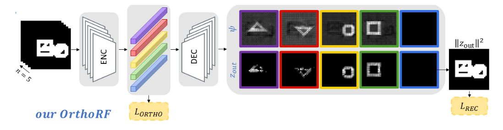{.news-card-image fig-alt="OrthoRF paper"}
[Paper: OrthoRF auf der ICLR angenommen](news/paper-orthorf-exploring-orthogonality-in-object-centric-representations-zur-veroeffentlichung-auf-der-iclr-angenommen.md)
`30. Januar 2026`

Kollaboration mit ASML, ARCNL, University of Amsterdam und der AI4Science Group von Prof. Cerfontaine.

[Zum Beitrag](news/paper-orthorf-exploring-orthogonality-in-object-centric-representations-zur-veroeffentlichung-auf-der-iclr-angenommen.md){.btn .btn-outline-primary}
:::

:::{.news-card}
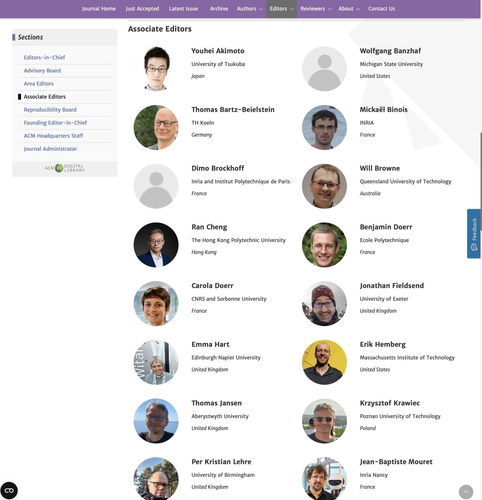{.news-card-image fig-alt="ACM TELO"}
[Prof. Bartz-Beielstein Invited as Associate Editor for ACM TELO](news/prof-bartz-beielstein-invited-as-associate-editor-for-acm-telo.md)
`12. Januar 2026`

Prof. Dr. Thomas Bartz-Beielstein setzt sein Engagement als Associate Editor fuer ACM Transactions fort.

[Zum Beitrag](news/prof-bartz-beielstein-invited-as-associate-editor-for-acm-telo.md){.btn .btn-outline-primary}
:::

:::{.news-card}
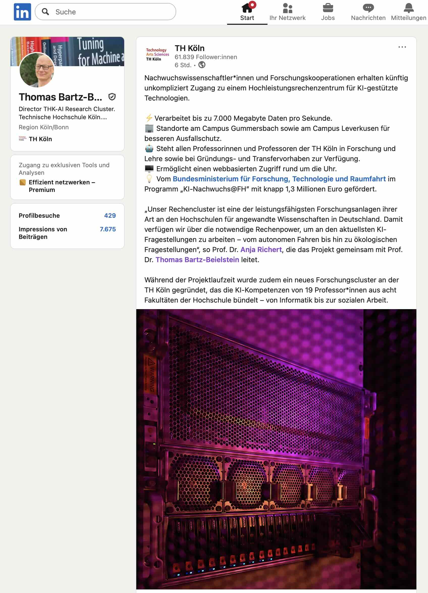{.news-card-image fig-alt="LinkedIn Beitrag"}
[LinkedIn Beitrag der TH Koeln](news/linkedin-beitrag-der-th-koeln.md)
`12. Dezember 2025`

Die TH Koeln berichtet auf LinkedIn ueber den HPC-Rechencluster des THK-AI Forschungsclusters.

[Zum Beitrag](news/linkedin-beitrag-der-th-koeln.md){.btn .btn-outline-primary}
:::

:::{.news-card}
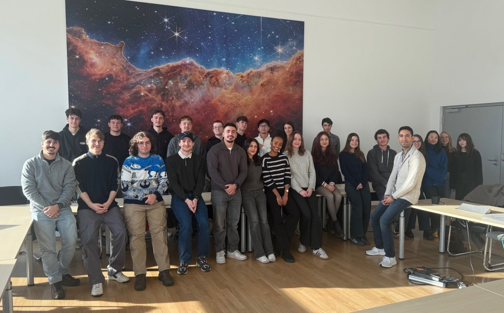{.news-card-image fig-alt="DLR Exkursion"}
[Exkursion zum DLR: Studierende erleben Deep Learning in der Praxis](news/exkursion-zum-dlr-th-koeln-studierende-erleben-deep-learning-in-der-praxis.md)
`10. Dezember 2025`

Studierende der TH Koeln besuchten das DLR im Rahmen der Big-Data-Lehrveranstaltung und erhielten Einblicke in KI-Anwendungen.

[Zum Beitrag](news/exkursion-zum-dlr-th-koeln-studierende-erleben-deep-learning-in-der-praxis.md){.btn .btn-outline-primary}
:::

:::{.news-card}
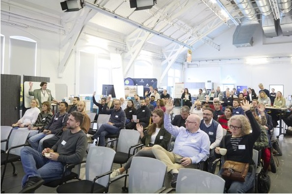{.news-card-image fig-alt="KI Brunch"}
[KI-Brunch im AI Village: Wissens-Haeppchen rund um KI](news/ki-brunch-im-ai-village-wissens-haeppchen-rund-um-ki.md)
`10. Dezember 2025`

Unternehmen, Wissenschaft und Interessierte trafen sich im AI Village zum Austausch ueber KI in der Praxis.

[Zum Beitrag](news/ki-brunch-im-ai-village-wissens-haeppchen-rund-um-ki.md){.btn .btn-outline-primary}
:::

:::{.news-card}
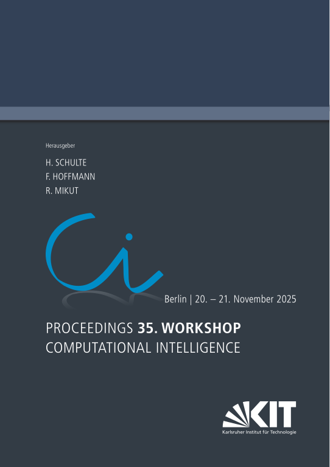{.news-card-image fig-alt="KDIR Award"}
[Best Student Paper Award auf der KDIR 2025 fuer Natasha Randall](news/best-student-paper-award-auf-der-kdir-2025-fuer-natasha-randall.md)
`10. Dezember 2025`

Natasha Randall wurde auf der KDIR 2025 mit dem Best Student Paper Award ausgezeichnet.

[Zum Beitrag](news/best-student-paper-award-auf-der-kdir-2025-fuer-natasha-randall.md){.btn .btn-outline-primary}
:::

:::{.news-card}
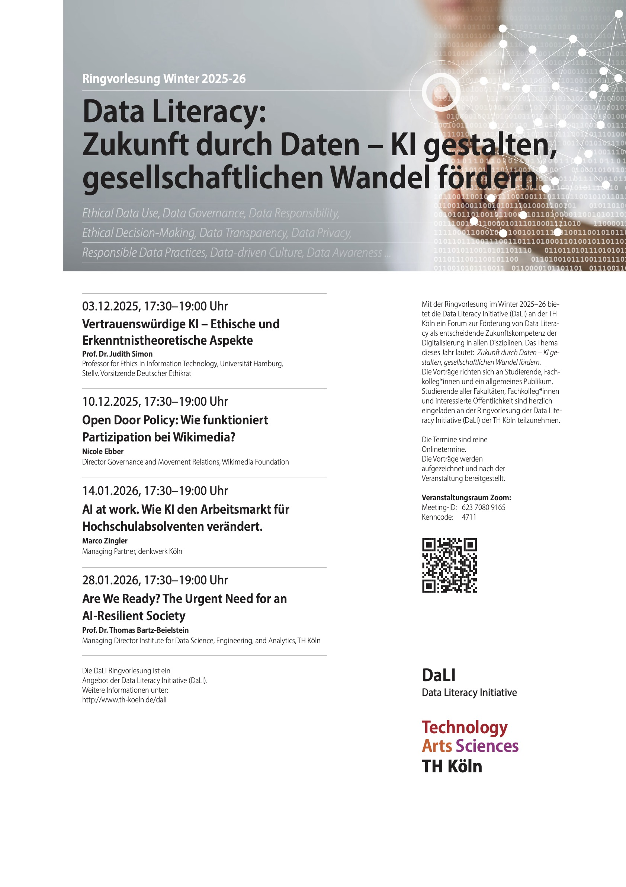{.news-card-image fig-alt="DaLI Ringvorlesung"}
[Zukunft durch Daten - KI gestalten: DaLI-Ringvorlesung](news/zukunft-durch-daten-ki-gestalten-die-laufende-dali-ringvorlesung-im-winter-2025-26-an-der-th-koeln.md)
`9. Dezember 2025`

Die Ringvorlesung beleuchtet die gesellschaftlichen Auswirkungen von Digitalisierung und KI aus interdisziplinaerer Perspektive.

[Zum Beitrag](news/zukunft-durch-daten-ki-gestalten-die-laufende-dali-ringvorlesung-im-winter-2025-26-an-der-th-koeln.md){.btn .btn-outline-primary}
:::

:::{.news-card}
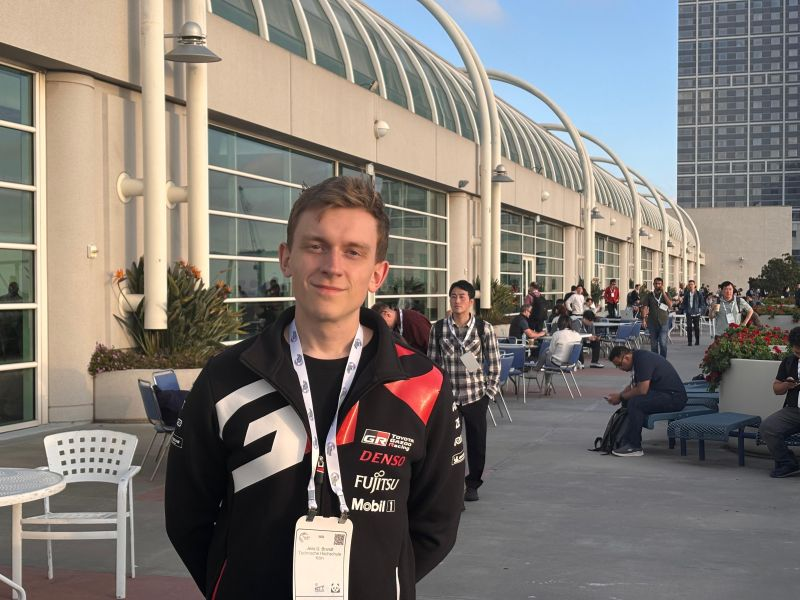{.news-card-image fig-alt="NeurIPS presentation"}
[THK-AI PhD Student presents research at NeurIPS 2025](news/thk-ai-phd-student-jens-brandt-presents-groundbreaking-ai-research-at-neurips-2025.md)
`3. Dezember 2025`

Jens Brandt praesentiert Forschungsergebnisse auf der NeurIPS 2025 und staerkt die internationale Sichtbarkeit des Clusters.

[Zum Beitrag](news/thk-ai-phd-student-jens-brandt-presents-groundbreaking-ai-research-at-neurips-2025.md){.btn .btn-outline-primary}
:::

:::{.news-card}
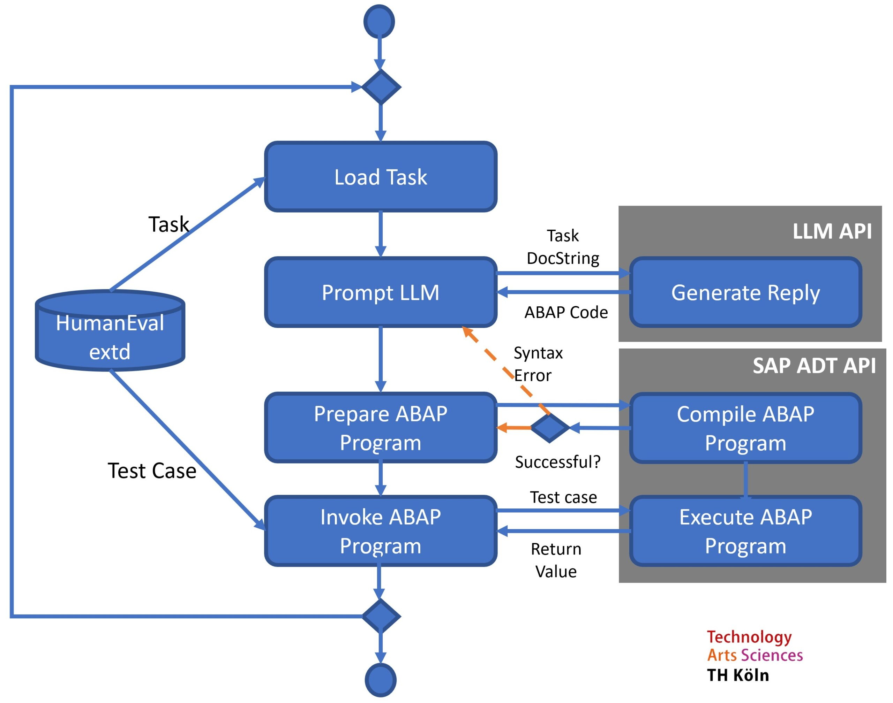{.news-card-image fig-alt="SAP coding benchmark"}
[KI schreibt Programmcode fuer SAP Unternehmenssoftware](news/kuenstliche-intelligenz-schreibt-programmcode-fuer-sap-unternehmenssoftware.md)
`3. Dezember 2025`

Ein THK-AI Team untersucht gemeinsam mit Industriepartnern KI-gestuetzte Entwicklung fuer SAP-Umgebungen.

[Zum Beitrag](news/kuenstliche-intelligenz-schreibt-programmcode-fuer-sap-unternehmenssoftware.md){.btn .btn-outline-primary}
:::

:::{.news-card}
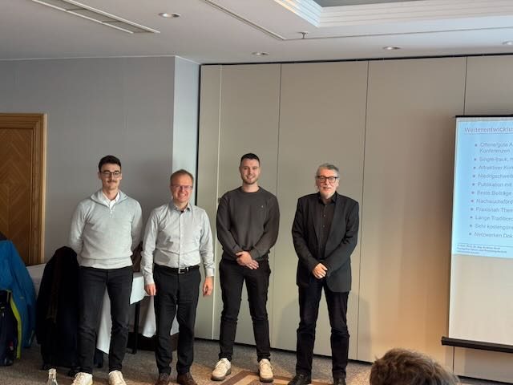{.news-card-image fig-alt="Young Author Award"}
[Young Author Award 2025 in Berlin](news/young-author-award-2025-thk-ai-doctoral-candidate-honored-at-ci-workshop-berlin.md)
`24. November 2025`

Alexander Hinterleitner wurde beim CI Workshop in Berlin fuer seinen wissenschaftlichen Beitrag ausgezeichnet.

[Zum Beitrag](news/young-author-award-2025-thk-ai-doctoral-candidate-honored-at-ci-workshop-berlin.md){.btn .btn-outline-primary}
:::

:::{.news-card}
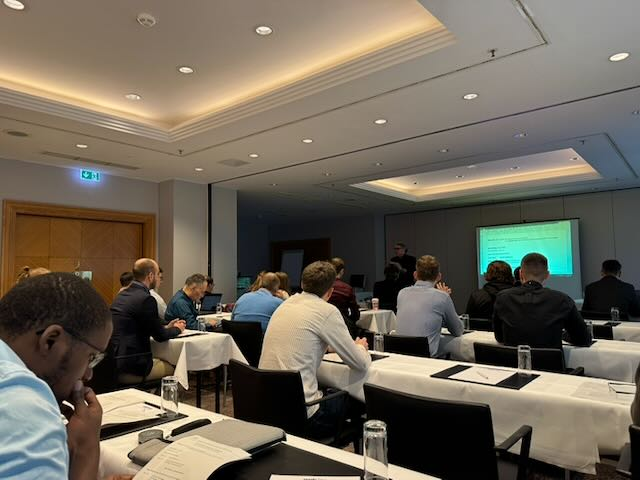{.news-card-image fig-alt="CI workshop impressions"}
[Impressions from the 35th Workshop Computational Intelligence](news/impressions-from-the-35th-workshop-computational-intelligence-in-berlin-2025.md)
`21. November 2025`

Eindruecke, Poster und Talks vom Workshop Computational Intelligence in Berlin 2025.

[Zum Beitrag](news/impressions-from-the-35th-workshop-computational-intelligence-in-berlin-2025.md){.btn .btn-outline-primary}
:::

:::{.news-card}
{.news-card-image fig-alt="CI workshop contributions"}
[THK-AI Contributions at the 35th Workshop Computational Intelligence](news/research-cluster-thk-ai-contributions-at-the-35th-workshop-computational-intelligence.md)
`20. November 2025`

Mehrere Forschungsbeitraege aus dem THK-AI Umfeld wurden beim Workshop Computational Intelligence vorgestellt.

[Zum Beitrag](news/research-cluster-thk-ai-contributions-at-the-35th-workshop-computational-intelligence.md){.btn .btn-outline-primary}
:::

:::{.news-card}
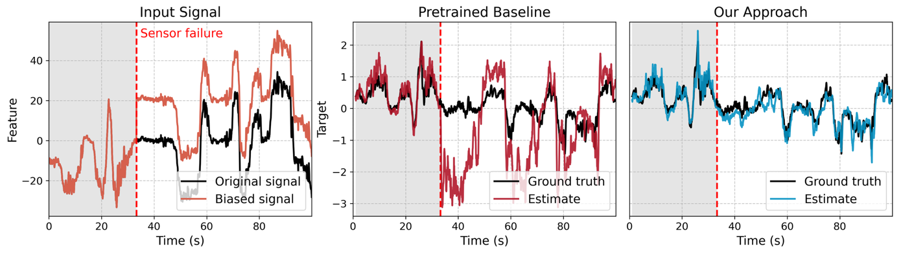{.news-card-image fig-alt="NeurIPS paper"}
[PhD Student publishes at NeurIPS 2025](news/phd-student-from-thk-ai-research-cluster-at-th-koeln-publishes-paper-at-prestigious-ai-conference-neurips-2025.md)
`14. November 2025`

Ein THK-AI Doktorand publiziert auf einer der weltweit fuehrenden KI-Konferenzen.

[Zum Beitrag](news/phd-student-from-thk-ai-research-cluster-at-th-koeln-publishes-paper-at-prestigious-ai-conference-neurips-2025.md){.btn .btn-outline-primary}
:::

:::{.news-card}
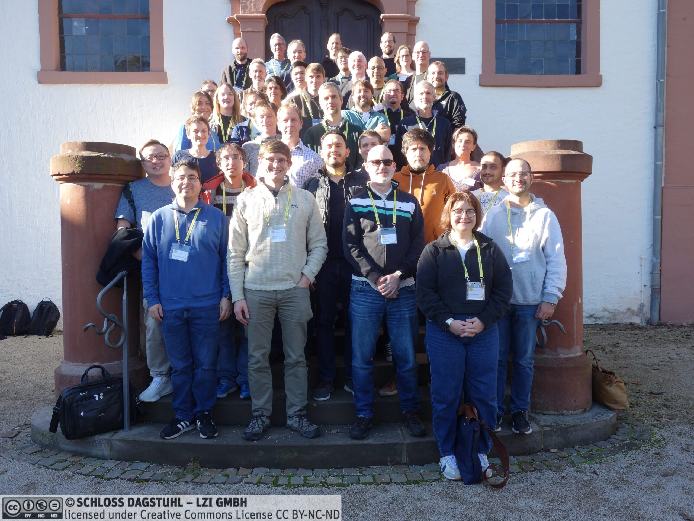{.news-card-image fig-alt="Dagstuhl seminar"}
[Dagstuhl Seminar 25451 on Bayesian Optimisation](news/dagstuhl-seminar-25451-on-bayesian-optimisation.md)
`5. November 2025`

Beteiligung des THK-AI Forschungsclusters am internationalen Dagstuhl-Seminar zu Bayesian Optimisation.

[Zum Beitrag](news/dagstuhl-seminar-25451-on-bayesian-optimisation.md){.btn .btn-outline-primary}
:::

:::{.news-card}
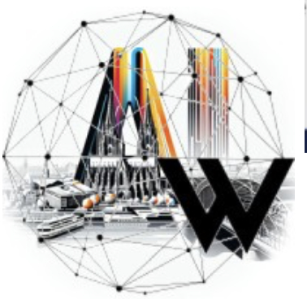{.news-card-image fig-alt="Women in AI Cologne"}
[Women in AI Cologne - Netzwerk fuer Frauen in der KI](news/women-in-ai-cologne-netzwerk-fuer-frauen-in-der-kuenstlichen-intelligenz.md)
`5. November 2025`

Das Cologne Chapter von Women in AI startet als Plattform fuer Austausch, Sichtbarkeit und Vernetzung.

[Zum Beitrag](news/women-in-ai-cologne-netzwerk-fuer-frauen-in-der-kuenstlichen-intelligenz.md){.btn .btn-outline-primary}
:::

:::{.news-card}
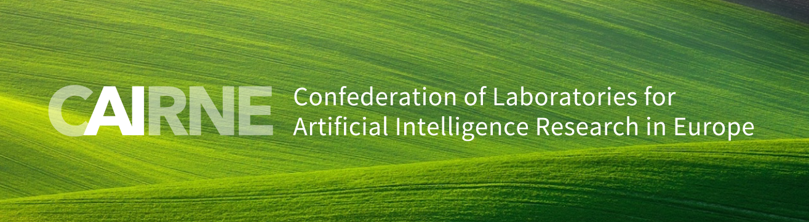{.news-card-image fig-alt="CAIRNE newsletter"}
[THK-AI featured in CAIRNE October 2025 Newsletter](news/thk-ai-research-cluster-featured-in-cairne-october-2025-newsletter.md)
`1. November 2025`

Das THK-AI Forschungscluster wird im CAIRNE Newsletter als Gold Member sichtbar praesentiert.

[Zum Beitrag](news/thk-ai-research-cluster-featured-in-cairne-october-2025-newsletter.md){.btn .btn-outline-primary}
:::

:::{.news-card}
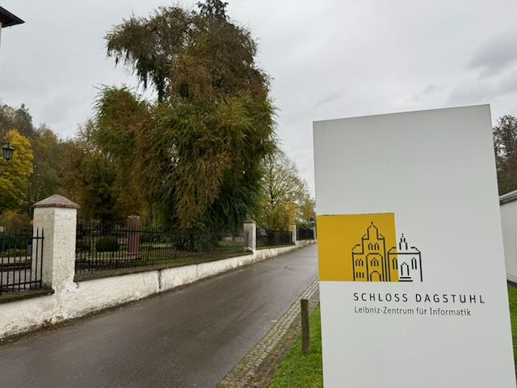{.news-card-image fig-alt="Dagstuhl hospitality"}
[Grateful to the Dagstuhl team for their warm hospitality](news/grateful-to-the-dagstuhl-leibniz-zentrum-fuer-informatik-team-for-their-warm-hospitality.md)
`1. November 2025`

Nach dem Dagstuhl Research Meeting bedankt sich THK-AI fuer den fachlichen Austausch und die Gastfreundschaft.

[Zum Beitrag](news/grateful-to-the-dagstuhl-leibniz-zentrum-fuer-informatik-team-for-their-warm-hospitality.md){.btn .btn-outline-primary}
:::
:::
