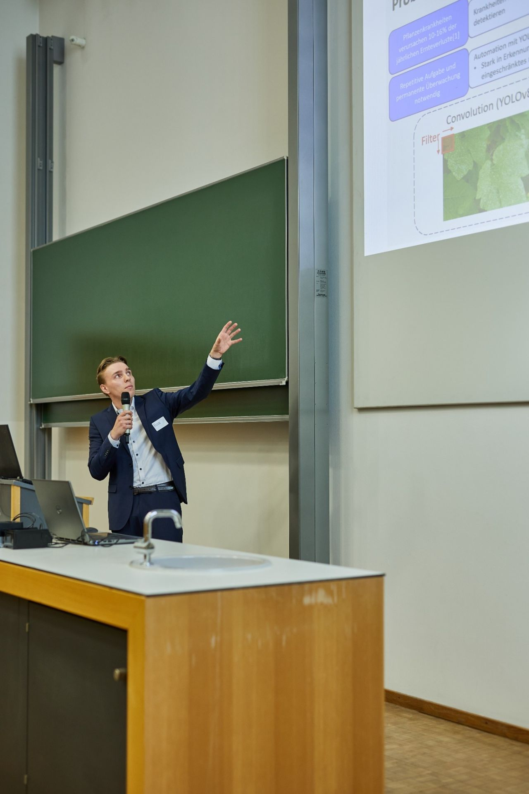
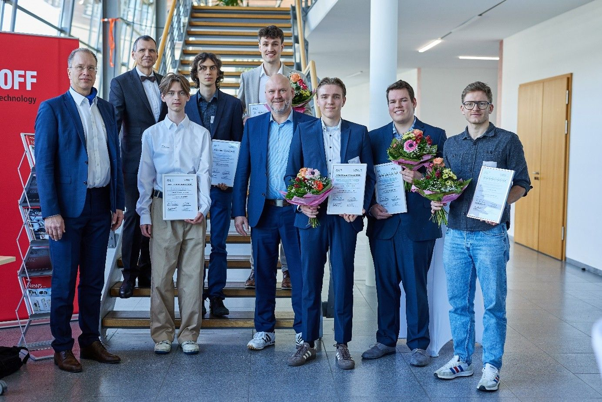

# AALE Student Award 2026: Marc Schneider für herausragende Masterarbeit ausgezeichnet

`16. April 2026`

Marc Schneider, Absolvent des Studiengangs Mechanical Engineering an der TH Köln, wurde im Rahmen der AALE-Konferenz 2026 in Rosenheim als einer von drei Nominierten für den AALE Student Award ausgezeichnet. Mit dem Award würdigt der VFAALE Verein für Angewandte Automatisierungstechnik in Lehre und Entwicklung e.V. herausragende Abschlussarbeiten im Bereich der Automatisierungstechnik.

Schneider verfasste seine Masterarbeit am Cologne Lab for Artificial Intelligence and Smart Automation (CAISA) unter Betreuung von Prof. Dr. Dr. Mohieddine Jelali. Unter dem Titel „A Comparative Study of Vision Transformer Integration in YOLOv8: Incorporating Pyramid Vision Transformer, Swin Transformer and BiFormer for Improved Plant Disease Detection" untersuchte er, wie sich die Erkennung von Pflanzenkrankheiten durch die Kombination moderner KI-Ansätze verbessern lässt. Er integrierte erstmals sogenannte Vision Transformer — insbesondere BiFormer — in die weltweit etablierte Objekterkennungsarchitektur YOLOv8 und verglich verschiedene Bildanalyse-Ansätze systematisch miteinander. Die Ergebnisse werden in Kürze in IEEE Access veröffentlicht.

„Die Arbeit von Herrn Schneider zeigt eindrucksvoll, wie sich durch die Kombination moderner KI-Ansätze nicht nur die Genauigkeit, sondern auch das Verständnis komplexer Bildinhalte verbessern lässt", sagt Prof. Dr. Dr. Mohieddine Jelali, Laborleiter des CAISA und Betreuer der Masterarbeit. „Solche Beiträge sind ein wichtiger Schritt, um KI-Lösungen praxisnah in Bereichen wie der Landwirtschaft einzusetzen."
