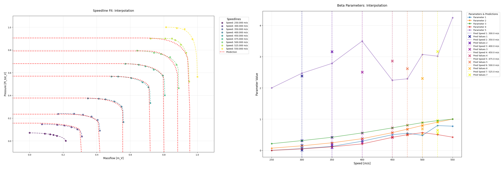
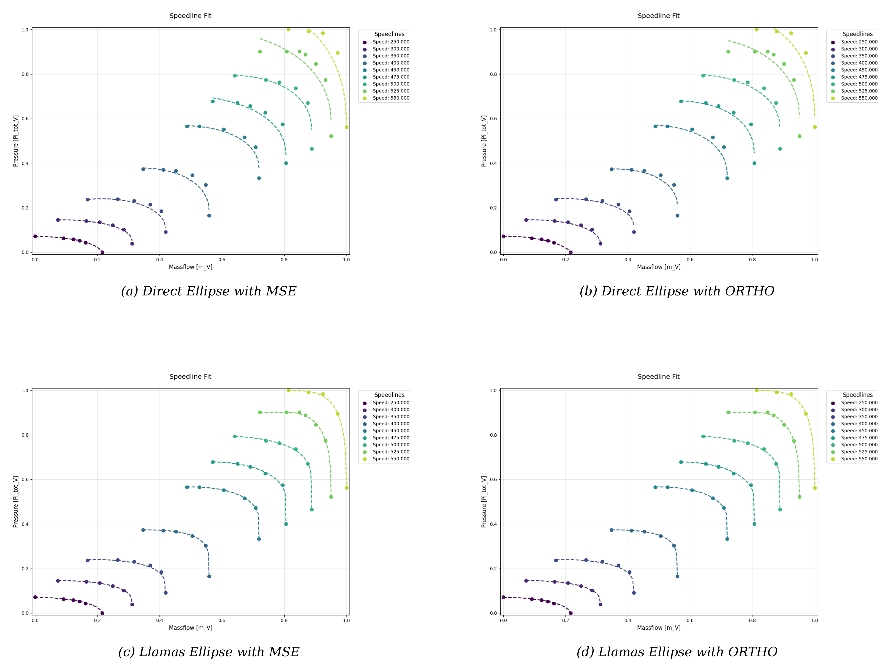
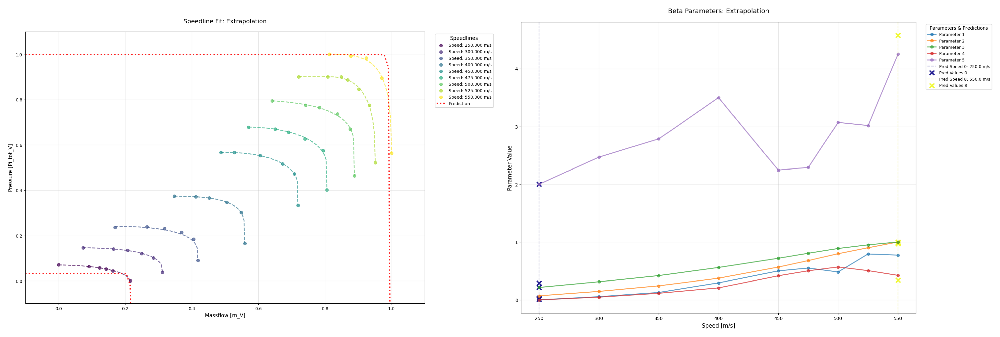

# Paper „Physics-based Approximation and Prediction of Speedlines in Compressor Performance Maps" auf arXiv erschienen

`16. April 2026`

Eine aktualisierte Version (v2) des THK-AI Research Report 1/2026 ist auf arXiv erschienen. Abdul-Malik Akiev, Danyal Ergür, Alexander Schirger, Matthias Müller (Everllence SE), Alexander Hinterleitner und Thomas Bartz-Beielstein untersuchen darin eine physikbasierte Methode zur Rekonstruktion von Compressor Performance Maps (CPMs) aus wenigen Messpunkten.

Der Ansatz modelliert jede Speedline als Superellipse und kodiert sie als kompakten, interpretierbaren Vektor aus Surge-, Choke-, Krümmungs- und Formparametern. Aufbauend auf der Formulierung von Llamas et al. wird eine robuste zweistufige Fitting-Pipeline entwickelt, die globale Suche mit lokaler Verfeinerung kombiniert. Die Methode wird an industriellen Datensätzen verschiedener Turboladertypen validiert.

Der Report diskutiert die Vorhersagequalität bei Inter- und Extrapolation, Metrik-Sensitivitäten und skizziert Möglichkeiten für physikalisch informierte Nebenbedingungen, alternative Funktionsfamilien und hybride Physik-ML-Abbildungen zur Verbesserung des Randverhaltens. Langfristiges Ziel ist die vollständige CPM-Rekonstruktion aus limitierten Daten.

Der Report ist verfügbar unter [arXiv:2603.11317](https://arxiv.org/abs/2603.11317).
