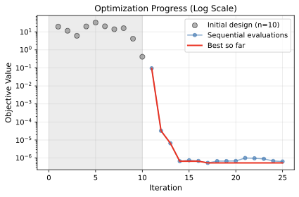
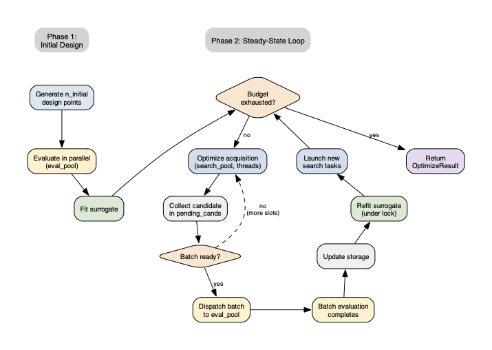
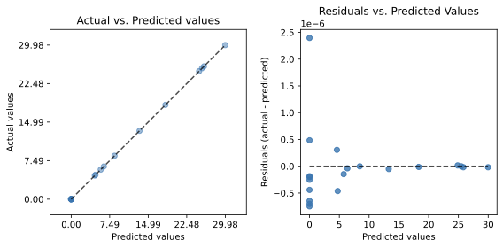

# Paper „Optimization with SpotOptim" auf arXiv erschienen

`16. April 2026`

{fig-alt="Surrogatmodell-Visualisierung aus dem SpotOptim-Paper"}

Das Python-Paket `spotoptim` implementiert surrogat-modellbasierte Optimierung teurer Black-Box-Funktionen und baut auf zwei Jahrzehnten Forschung zur Sequential Parameter Optimization (SPO) auf. Prof. Dr. Thomas Bartz-Beielstein beschreibt in diesem Report Architektur und Modulstruktur des Pakets, zeigt Anwendungsbeispiele einschließlich Hyperparameter-Tuning neuronaler Netze und vergleicht das Framework mit BoTorch, Optuna, Ray Tune, BOHB, SMAC und Hyperopt.

{fig-alt="Konvergenzverlauf der Optimierung"}

Zu den zentralen Funktionen gehören ein Kriging-basierter Optimierungskreislauf mit Expected Improvement, Unterstützung für kontinuierliche, ganzzahlige und kategoriale Variablen, rauschbewusste Auswertung mittels Optimal Computing Budget Allocation (OCBA) sowie Erweiterungen für Mehrzieloptimierung. Eine Steady-State-Parallelisierungsstrategie überlappt Surrogat-Suche mit Zielfunktionsauswertung auf Mehrkern-Hardware, und ein erfolgsratenbasierter Restart-Mechanismus erkennt Stagnation, ohne die bislang beste Lösung zu verlieren.

{fig-alt="Steady-State-Parallelisierungsstrategie"}

Das Paket liefert `scipy`-kompatible `OptimizeResult`-Objekte, akzeptiert beliebige `scikit-learn`-kompatible Surrogatmodelle und bietet über integriertes TensorBoard-Logging Echtzeitüberwachung von Konvergenz und Surrogatqualität.

{fig-alt="Vergleich tatsächlicher und vorhergesagter Werte"}

Das Paket ist Open Source. Der Report ist verfügbar unter [arXiv:2604.13672](https://arxiv.org/abs/2604.13672).
