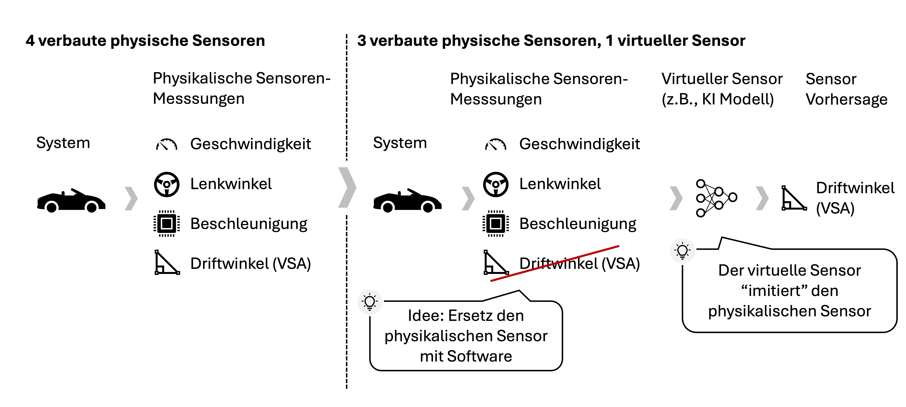
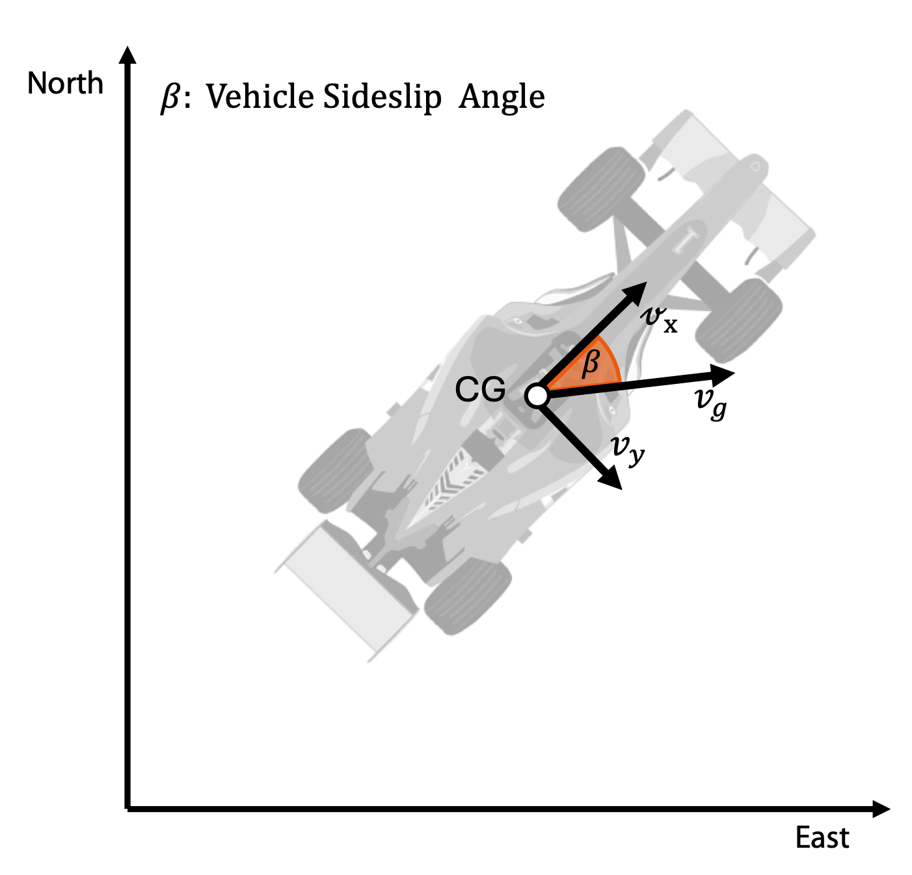

Im THK-AI Forschungscluster zeigt sich erneut, wie praxisnah KI-Forschung an der TH Köln sein kann: Unter der Betreuung von **Prof. Dr. Thomas Bartz-Beielstein** und seinem Doktoranden **Noah C. Pütz** arbeiteten Studierende des **Master-Studiengangs Automation & IT** und des **Master-Studiengangs Digital Sciences** in Kooperation mit **TOYOTA RACING** an einer realen Herausforderung: Wie trainiert man KI-Modelle, so dass sie besser in den wichtigsten Szenarien funktionieren ohne Qualität in den häufigsten Szenarien einzubüßen?

Das Besondere an dieser Case Study: Sie lief einerseits auf realen Daten und als wöchentliche, privat gehostete Kaggle-Challenge. Studierende-Teams traten auf einem Live-Leaderboard gegeneinander an, reichten jede Woche Vorhersagen für einen verdeckten Testsplit ein und sahen sofort, wie sich ihr Ansatz im Vergleich schlug. Begleitend gab es wöchentliche Meetings mit kurzen technischen Mini-Lectures und Fortschrittsberichten aller Teams.

## Die Aufgabe: Driftwinkel in Echtzeit vorhersagen

Kern der Case Study war ein virtueller Sensor: Die Teams sollten den Vehicle Sideslip Angle (VSA) vorhersagen (also wie stark ein Fahrzeug driftet) und zwar in Echtzeit, ausschließlich auf Basis von Onboard-Sensordaten. Das ML-Modell ersetzt demnach physische Sensorik dort, wo sie teuer, komplex oder schwer integrierbar ist.

Advanced Driver-Assistance Systems wie die Elektronische Stabilitätskontrolle (ESC) nutzen den VSA zum Beispiel, um zu entscheiden, wann und an welchem Rad Bremskraft angelegt wird. Präzise Schätzungen sind daher sicherheitskritisch. Optische oder inertiale Sensoren, die den Driftwinkel direkt messen, kosten allerdings ein Vielfaches des Standard-Sensorpakets für Serienfahrzeuge schlicht nicht tragbar.

Gerade in kritischen Fahrsituationen wird das besonders anspruchsvoll: Reale Fahrdaten werden von alltäglichen, ereignislosen Szenarien dominiert. Die seltenen, sicherheitskritischen Driftsituationen, die am meisten zählen, tauchen nur vereinzelt auf. Ohne Gegenmaßnahmen verzerrt diese Daten-Imbalance das Modell: es versagt genau dann, wenn das Fahrzeug die meiste Hilfe braucht. Diese ungleiche Verteilung auszugleichen ist keine Option, sondern eine Voraussetzung für vertrauenswürdige KI in jeder cyber-physischen Anwendung.

## Warum das für Automation- und AI-Studierende spannend ist

Diese Art von Problem zeigt, worauf es in modernen cyber-physischen Systemen ankommt:

- Entscheidungen in Millisekunden
- Robustheit unter realen physikalischen Randbedingungen
- Data-Driven Modelling statt reinem Paper-Benchmarking
- Safety-Kriterien und technische Nachvollziehbarkeit

Die zentrale Erkenntnis aus der Arbeit: Methoden, die in allgemeinen AI-Benchmarks stark abschneiden, lassen sich nicht automatisch auf den reale Datensets übertragen. In dem Case Study Beispiel hat die Fahrzeugdynamik eigene Gesetzmäßigkeiten, eigene Fehlerbilder und harte Echtzeit-Constraints.

## Vom Hörsaal in die Racing Facility

Alle Teams testeten State-of-the-Art-Verfahren und entwickelten im Lauf der Fallstudie eigene, neuartige Ansätze. Als besonderes Highlight hatten die Studierenden die Gelegenheit, die TOYOTA RACING Facility zu besuchen, ihre Ergebnisse vor Industrieexperten zu präsentieren und anschließend einen Blick hinter die Kulissen bei einer Führung durch die Anlage zu werfen.

## THK-AI Perspektive

Dieser Case verdeutlicht, wie Studierende der TH Köln in anspruchsvolle Projekte mit unmittelbarer Relevanz für Industrie und Mobilität einsteigen können. Wer sich für Automation, Embedded AI, ADAS oder industrielle KI interessiert, findet im THK-AI Research Cluster ein exzellentes Lernfeld: von virtueller Sensorik und Deep Learning bis zu valider Systemintegration unter realen Bedingungen.

Solche Arbeiten stehen für den THK-AI Anspruch: technisch tief, wissenschaftlich fundiert, und mit direktem Real-World-Impact.
