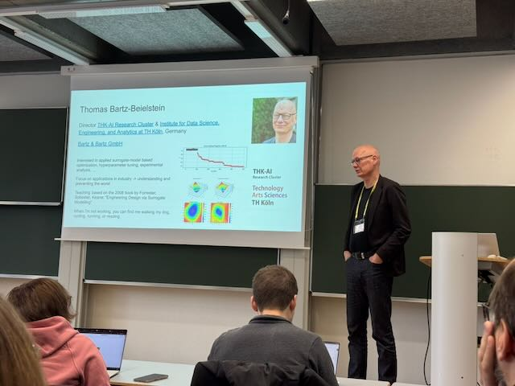
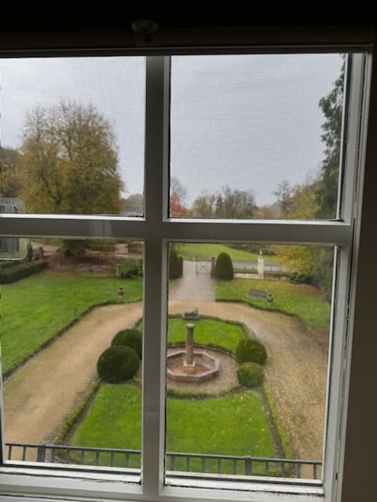

Prof. Dr. Thomas Bartz-Beielstein from TH Köln (THK-AI Research Cluster)
is deeply honored to have been invited to participate in the prestigious
[Dagstuhl Seminar 25451 on Bayesian
Optimisation](https://www.dagstuhl.de/25451). He expresses his sincere
appreciation for the opportunity to engage with the leading experts and
top researchers in the field. Prof. Bartz-Beielstein found the
discussions to be exceptionally deep and inspiring, and is delighted to
have met his colleagues in person at the wonderful Dagstuhl castle. The
seminar provided a unique and memorable setting for fruitful scientific
exchange and collaboration.

### Organisers

- Jürgen Branke (University of Warwick, GB)
- Frank Hutter (Prior Labs – Freiburg, DE & ELLIS Institute Tübingen, DE
  & Universität Freiburg, DE)
- Giulia Pedrielli (Arizona State University – Tempe, US)
- Matthias Poloczek (Amazon.com, Inc. – Palo Alto, US)

### Participants

- Steven Adriaensen,
  Universität Freiburg, DE
- Cedric Archambeau, Helsing – Berlin, DE
- Raul Astudillo, California Institute of
  Technology – Pasadena, US
- Maximilian Balandat, Meta – Menlo Park, US
- Nathalie Bartoli, ONERA – Toulouse, FR
- Thomas Bartz-Beielstein,
  TH Köln, DE
- Mickaël Binois, Inria
  Center at Université Côte d’Azur – Sophia Antipolis, FR
- Jürgen Branke,
  University of Warwick, GB
- Jack Buckingham,
  University of Warwick – Coventry, GB
- Antonio Candelieri, University of
  Milano-Bicocca, IT
- Ivo Couckuyt, Ghent
  University, BE
- Gautam Dasarathy, Arizona State
  University – Tempe, US
- Carola Doerr, Sorbonne University –
  Paris, FR
- Katharina Eggensperger, TU Dortmund, DE
- Matthias Feurer, TU Dortmund, DE
- Jonathan Fieldsend,
  University of Exeter, GB
- Peter Frazier, Cornell University –
  Ithaca, US
- Jacob Gardner, University of
  Pennsylvania, US
- Roman Garnett, Washington University –
  St. Louis, US
- Robert Gramacy, Virginia Polytechnic
  Institute – Blacksburg, US
- Daniel Hernández-Lobato, Autonomous
  University of Madrid, ES
- Daolang Huang, Aalto University, FI
- Frank Hutter, Prior Labs
  – Freiburg, DE & ELLIS Institute Tübingen, DE & Universität Freiburg,
  DE
- Aaron Klein, ScaDS.AI – Leipzig, DE
- Rodolphe Le Riche, CNRS – Aubière, FR
- Bryan Kian Hsiang Low, National
  University of Singapore, SG
- Neeratyoy Mallik,
  Universität Freiburg, DE
- Mike McCourt, Distributional – Toronto,
  CA
- Ruth Misener, Imperial College London,
  GB
- Szu Hui Ng, National University of
  Singapore, SG
- Leonard Papenmeier, Universität Münster,
  DE
- Giulia Pedrielli, Arizona State
  University – Tempe, US
- Matthias Poloczek, Amazon.com, Inc. – Palo Alto, US
- Jixiang Qing, Imperial College London,
  GB
- Elena Raponi, Leiden
  University, NL
- Sebastian Rojas Gonzalez,
  Ghent University, BE
- Alexander Terenin, Cornell University –
  Ithaca, US
- Juan Ungredda, ESTECO SpA – Trieste, IT
- Inneke Van Nieuwenhuyse,
  Hasselt University – Diepenbeek, BE
- Mauricio A Álvarez, University of
  Manchester, GB

### Impressions from Dagstuhl

