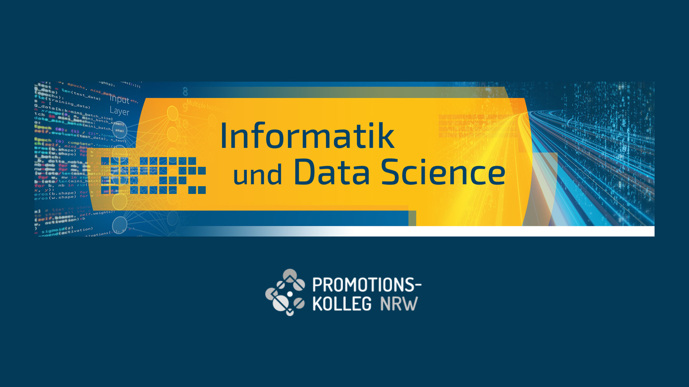

# Doktorandenkolloquium am IDE+A: Nadir Nadirov zur KI-gestützten Optimierung von Blisks

{fig-alt="Banner der Abteilung Informatik und Data Science des Promotionskollegs NRW mit dem Logo des Promotionskollegs"}

`23. Juli 2026`

Im [Doktorandenkolloquium](https://www.th-koeln.de/informatik-und-ingenieurwissenschaften/doktorandenkolloquium_97598.php) des [Instituts für Data Science, Engineering, and Analytics (IDE+A)](https://www.th-koeln.de/informatik-und-ingenieurwissenschaften/institut-fuer-data-science-engineering-and-analytics_54523.php) der TH Köln hat Nadir Nadirov am 23. Juli 2026 von 10:30 bis 12:00 Uhr Ergebnisse aus seiner Promotion vorgestellt. Der Vortrag trug den Titel „An AI-Assisted Computational Framework for Intentional Mistuning and Aeroelastic Optimization of Blisks".

Blisks sind integral gefertigte Laufräder in Turbomaschinen, bei denen Schaufeln und Scheibe ein einziges Bauteil bilden. Kleine fertigungs- und materialbedingte Abweichungen zwischen den Schaufeln, das sogenannte Mistuning, brechen die zyklische Symmetrie und können die Schwingungsamplituden einzelner Schaufeln erheblich verstärken. Intentional Mistuning kehrt diesen Effekt um: gezielt entworfene Abweichungsmuster begrenzen die erzwungene Antwort und verbessern die aeroelastische Stabilität. Der Entwurfsraum solcher Muster ist jedoch groß, und jede Bewertung erfordert aufwendige strukturmechanische und aeroelastische Simulationen. Genau hier setzt Nadirovs Arbeit an, die diese Simulationen mit Methoden der Künstlichen Intelligenz zu einem durchgängigen Optimierungsrahmen verbindet.

Das Doktorandenkolloquium ist ein Kernelement des Promotionsprogramms KI und Data Science am IDE+A. Es findet während der Vorlesungszeit wöchentlich statt und richtet sich an die am Institut betreuten Promovierenden; im Mittelpunkt steht der fachliche Austausch über laufende Arbeiten. Getragen wird es gemeinsam mit der Abteilung Informatik und Data Science des [Promotionskollegs NRW (PK NRW)](https://www.pknrw.de/abteilungen/informatik-und-data-science) und dem [Graduiertenzentrum der TH Köln](https://www.th-koeln.de/forschung/graduiertenzentrum_82734.php).
