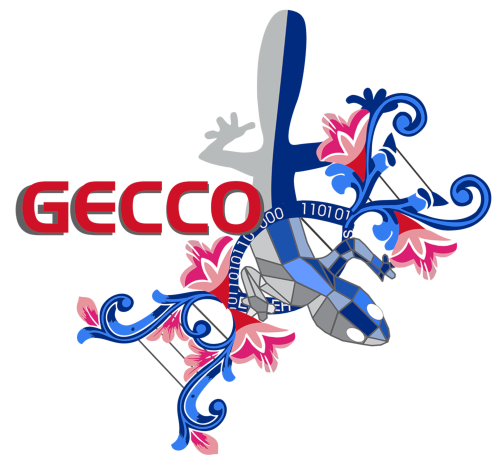
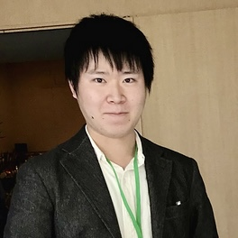
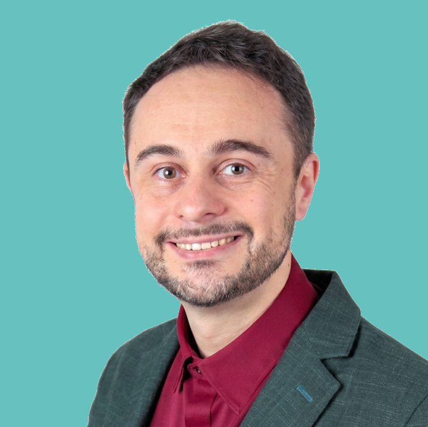

# ECiP @ GECCO 2026: Program complete – three international speakers from industrial practice

{fig-alt="GECCO 2026 logo"}

`2026-07-03`

The program of the *Evolutionary Computation in Practice* (ECiP) track at this year's Genetic and Evolutionary Computation Conference (GECCO 2026) is complete: three speakers from Spain, Japan, and France will show how evolutionary optimization is applied in industrial practice. [Prof. Dr. Thomas Bartz-Beielstein](https://www.th-koeln.de/personen/thomas.bartz-beielstein/) (IDE+A, TH Köln) organizes the track together with Daniel Hernández (Tecnológico Nacional de México / IT Tijuana, Mexico) and Francisco Fernandez de Vega (Universidad de Extremadura, Spain).

GECCO, presented by the ACM Special Interest Group on Genetic and Evolutionary Computation (SIGEVO), is among the top-ranked international conferences in the field (CORE Rank A). It takes place from 13 to 17 July 2026 in San Antonio de Belén near Alajuela, Costa Rica; the ECiP session closes the conference day on Thursday, 16 July 2026, 17:00–18:00.

::: {layout-ncol=3}
{fig-alt="Portrait of Nicolás Álvarez Gil"}

{fig-alt="Portrait of Ryoki Hamano"}

{fig-alt="Portrait of Alberto Tonda"}
:::

Nicolás Álvarez Gil, Senior Researcher in the Mathematical Optimization team at ArcelorMittal Global R&D (Spain), speaks on "Applying Evolutionary Computation to Real-World Steel Problems: Challenges Beyond Theory". His talk follows the full lifecycle of optimization projects in the steel industry: from handling complex, dynamic constraints and conflicting objectives to integrating robust solutions into user-friendly decision-support tools.

Ryoki Hamano, Research Scientist at CyberAgent AI Lab (Japan), presents "Evolutionary Computation in an Industrial AI Lab: Applications, Research, and Open Tools", showing how evolutionary optimization is practiced in an industrial AI lab: from a real-world combinatorial optimization problem in game-balance tuning, through research on CMA-ES, to open-source tools such as the cmaes Python library.

Alberto Tonda, Senior Researcher (Directeur de Recherche) at INRAE and Université Paris-Saclay (France), shows in "Evolutionary Computation for Food and Biomass Transformation Processes" how evolutionary techniques help characterize and control the transformation of food and biomass: industrial processes whose co-occurring physical, chemical, and biological phenomena push traditional modeling approaches to their limits.

Since 2002, ECiP has connected academic research with industrial practice and is a fixture of the GECCO program. Talk details with abstracts and biographies are available on the [ECiP website](https://sequential-parameter-optimization.github.io/evolutionary-computation-in-practice/), and conference information on the [official GECCO 2026 website](https://gecco-2026.sigevo.org/). The first announcement of the track can be found in the [news item of 18 June 2026](../ecip-gecco-2026/ecip-gecco-2026-en.md).
