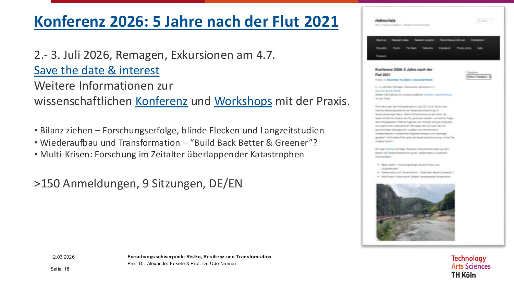
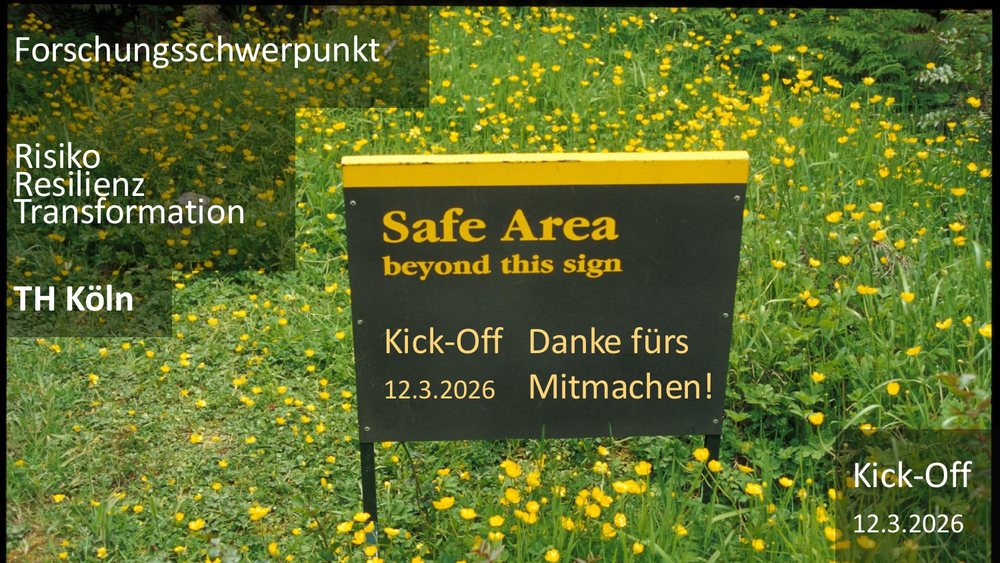

Am 12. März 2026 fand der offizielle Kick-Off des neuen **Forschungsschwerpunkts (FSP) Risiko, Resilienz und Transformation** an der TH Köln statt – ein interdisziplinärer Zusammenschluss, der Forschende aus elf Fakultäten und über 35 Professorinnen und Professoren vereint.
Prof. Dr. Thomas Bartz-Beielstein war als Sprecher des THK-AI Forschungsclusters an dem Kick-Offs beteiligt.

{fig-alt="Titelfolie des FSP Risiko – Erdkugel vor schwarzem Hintergrund"}

## Warum jetzt – und warum dieser FSP?

Krisen wie das verheerende Hochwasser 2021 im Ahrtal haben deutlich gemacht: Gesellschaft, Umwelt und Technologie befinden sich in einem permanenten Wandel, der wissenschaftliche Begleitung erfordert. Risiken müssen analysiert, Resilienz gestärkt und Transformationsprozesse über lange Zeiträume hinweg beobachtet werden.

Genau hier setzt der neue FSP an: „**Krisen wie das Hochwasser 2021 erfordern Forschung, um über Risiken zu informieren und die Gesellschaft resilienter zu machen**", fassten die Koordinatoren Prof. Dr. Alexander Fekete (F09/IRG, Institut für Rettungsingenieurwesen und Gefahrenabwehr) und Prof. Dr. Udo Nehren (F12/ITT) das Gesamtziel zusammen.

## Relevanz für KI und Datenforschung

Der FSP ist ausdrücklich offen für digitale Methoden und datenwissenschaftliche Ansätze. Unter den Schwerpunktthemen finden sich **Datenresilienz**, **digitale Technologien** und **Informationsversorgung** – Felder, in denen KI-gestützte Risikoanalyse, Machine-Learning-basierte Frühwarnsysteme und Big-Data-Methoden eine Schlüsselrolle übernehmen können.

Für Professorinnen und Professoren aus dem THK-AI Forschungscluster ergeben sich damit konkrete Anknüpfungspunkte:

* **Simulation und Modellierung** von kritischen Infrastrukturen und Systemen
* **Räumliche Risikoanalyse** mit Data-Science-Methoden (GIS, Remote Sensing, ML)
* **Digitale Infrastrukturresilienz** – Systemausfälle, Blackouts, Cybersecurity
* **KI-gestützte Risikokommunikation** und Frühwarnsysteme

## Thematische Schwerpunkte im Überblick

Der FSP deckt fünf übergeordnete Themenfelder ab, die bewusst interdisziplinär und anwendungsoffen formuliert sind:

**Digitalität**

* Datenresilienz, digitale Technologien, Informationsversorgung

**Gesellschaft und Urbanität**

* Bevölkerungs- und Katastrophenschutz, Risikowahrnehmung und -kommunikation, soziale Verwundbarkeit

**Infrastruktur**

* Kritische Infrastruktur und Versorgungssicherheit, Klimafolgenresilienz von Gebäuden, grün-blaue Infrastruktur

**Ökologie & Umwelt**

* Ökologische Vulnerabilität, Nachhaltigkeitstransformation, naturbasierte Lösungen

**Wirtschaft**

* Ökonomische Vulnerabilität, kritische Handelsabhängigkeiten im geopolitischen Kontext

## Konferenz 2026: Fünf Jahre nach der Flut

Ein konkretes Highlight steht bereits im Kalender: Am **2.–3. Juli 2026 in Remagen** findet eine wissenschaftliche Konferenz statt – genau fünf Jahre nach der Ahrtal-Flut von 2021. Mit Exkursionen ins Ahrtal am 4. Juli und bereits über 150 Anmeldungen wird die Konferenz ein bedeutender Treffpunkt für Forschende aus dem gesamten Risikobereich.

{fig-alt="Folie zur Konferenz 2026 in Remagen, 5 Jahre nach der Ahrtal-Flut"}

Schwerpunkte der Konferenz:

* **Bilanz ziehen** – Forschungserfolge, blinde Flecken und Langzeitstudien
* **Wiederaufbau und Transformation** – „Build Back Better & Greener"?
* **Multi-Krisen** – Forschung im Zeitalter überlappender Katastrophen

Neun Sitzungen, bilingual (DE/EN), und die Möglichkeit zur Einreichung für einen Sammelband sowie Special Issues in internationalen Journals (u.a. IJDRR, Natural Hazards, PDISAS).

## Mitmachen und Vernetzen

Der FSP setzt auf **Offenheit als Haltung**: Alle an der TH Köln, die forschen – auch in Transfer, Weiterbildung und Verwaltung –, sind eingeladen mitzumachen. Geplant sind mindestens ein Hybrid-Treffen pro Jahr, ein jährlicher Workshop mit Außenwirkung sowie gemeinsame Publikationen und Drittmittelanträge.

Interessierte finden weitere Informationen auf der Website:
[https://bigwa.web.th-koeln.de/wordpress/](https://bigwa.web.th-koeln.de/wordpress/)

{fig-alt="Abschlussfolie mit Safe-Area-Schild in gelb-grüner Natur und Dankesgruß"}

---

**Koordinatoren:**

* Prof. Dr. Alexander Fekete – Institut für Rettungsingenieurwesen und Gefahrenabwehr (F09/IRG) · [alexander.fekete@th-koeln.de](mailto:alexander.fekete@th-koeln.de)
* Prof. Dr. Udo Nehren – Institut für Technologie und Ressourcenmanagement in den Tropen und Subtropen (F12/ITT)
