After attending the Dagstuhl Research Meeting 25444 “[Better
Benchmarking Setups for Optimisation](https://www.dagstuhl.de/25444),”
Prof. Dr. Bartz-Beielstein was lucky to spend the weekend at the castle
and then join the Dagstuhl Seminar 25451 “[Bayesian
Optimisation](https://www.dagstuhl.de/25451).” Inspiring discussions in
a unique setting—thank you, Dagstuhl! Here are some impression from the
stay at the castle.

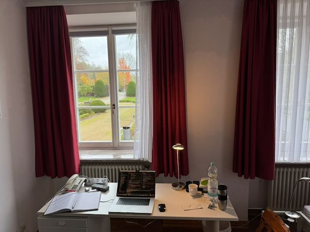

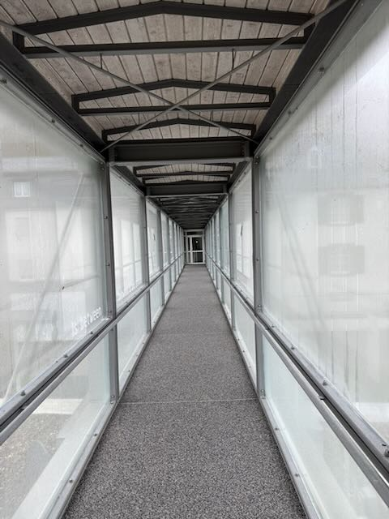

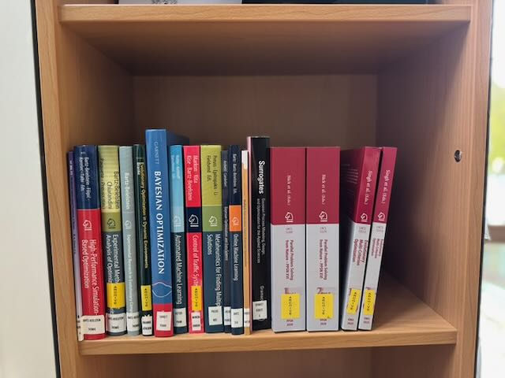

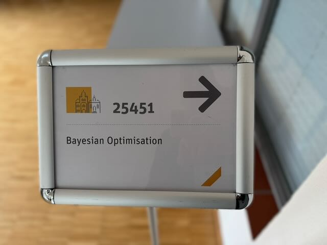

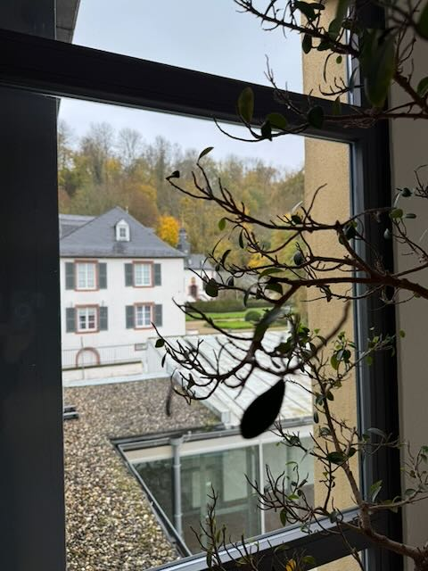

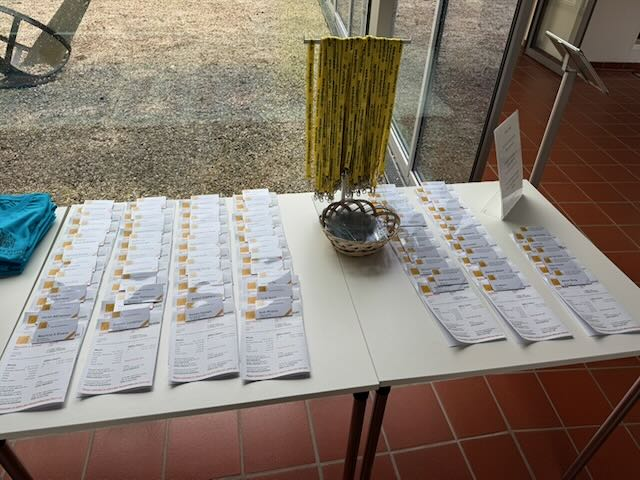

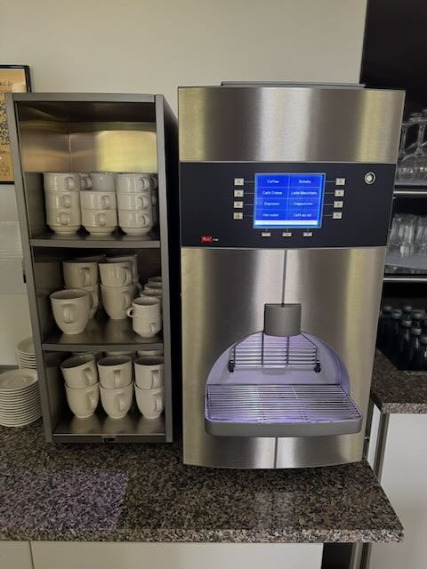

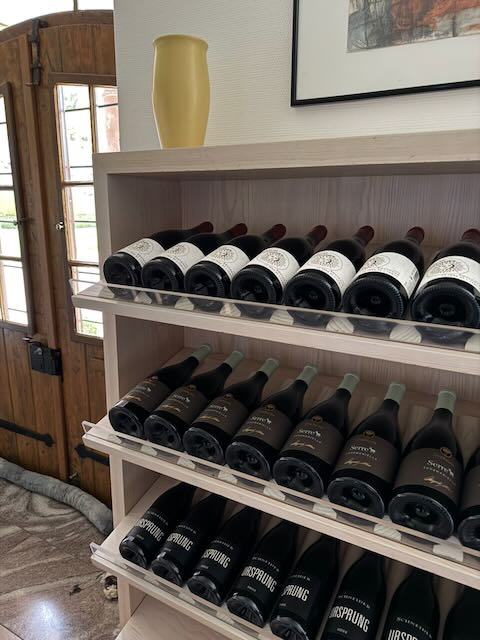

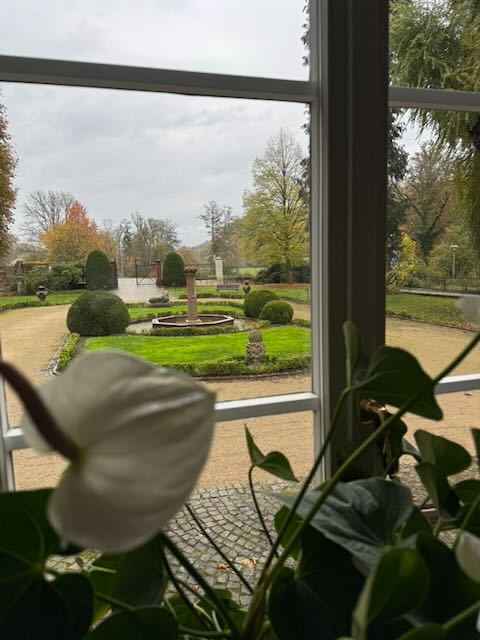

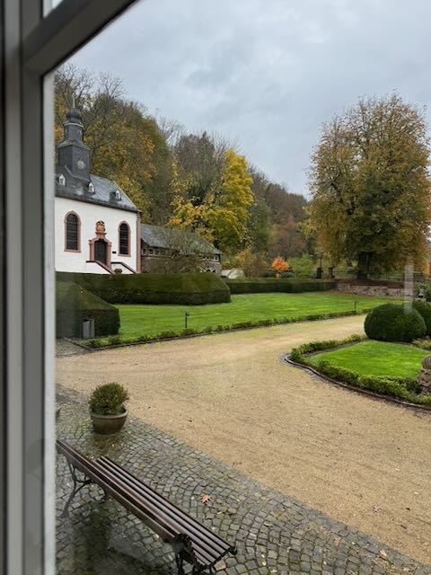

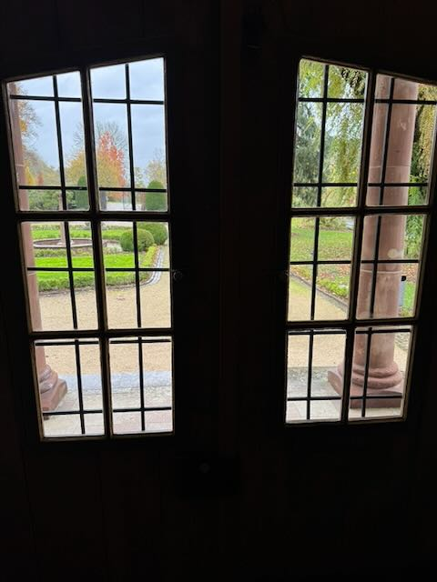

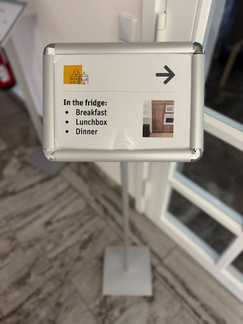

