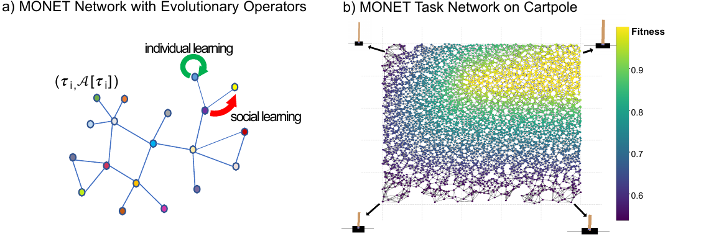

# Paper „Multi-Task Optimization over Networks of Tasks" auf arXiv erschienen

{fig-alt="Schematische Darstellung des MONET-Tasknetzwerks mit individuellem und sozialem Lernen"}

`28. April 2026`

Das Paper *Multi-Task Optimization over Networks of Tasks* ist auf arXiv veröffentlicht: [arXiv:2604.21991](https://arxiv.org/abs/2604.21991). Autoren sind Julian Hatzky (Vrije Universiteit Amsterdam), [Prof. Dr. Thomas Bartz-Beielstein](https://www.th-koeln.de/personen/thomas.bartz-beielstein/) (TH Köln), A. E. Eiben und Anil Yaman (beide Vrije Universiteit Amsterdam).

## Hintergrund

Die Arbeit entstand in einer Kooperation zwischen der Vrije Universiteit Amsterdam und dem THK-AI Forschungscluster der TH Köln. Multi-Task-Optimierung zielt darauf ab, hochwertige Lösungen für eine große Zahl verwandter Aufgaben gleichzeitig zu finden – etwa Steuerstrategien für Roboter mit unterschiedlichen Morphologien, die nach einem Schaden weiterarbeiten müssen, ohne von Grund auf neu zu lernen.

## Fragestellung

Bestehende Verfahren stoßen bei großen Aufgabenmengen an Grenzen. Populationsbasierte Ansätze skalieren schlecht über mehrere Tausend Tasks hinaus, während skalierbare Verfahren überwiegend Varianten von MAP-Elites sind und mit einem festen, diskretisierten Archiv arbeiten, das die Topologie des Aufgabenraums ignoriert. Damit bleibt eine zentrale Strukturinformation ungenutzt: Welche Tasks sind einander ähnlich, und wie kann ein guter Lösungsentwurf zwischen ihnen wandern?

## Vorgehen

Die Autoren stellen MONET (*Multi-Task Optimization over Networks of Tasks*) vor, einen Algorithmus, der den Aufgabenraum als Graph modelliert: Knoten sind Tasks, Kanten verbinden Tasks mit ähnlichen Parametern. Diese Repräsentation bleibt auch in hochdimensionalen Aufgabenräumen handhabbar und macht die Topologie zur ersten strukturellen Größe der Suche. MONET kombiniert *soziales Lernen* – Kandidaten werden durch Crossover aus benachbarten Knoten erzeugt – mit *individuellem Lernen*, das die eigene Lösung eines Knotens mittels Mutation verbessert. Diese Trennung ist von der kulturellen Evolution inspiriert, in der individuelle Innovation und sozialer Wissensaustausch gemeinsam Anpassung tragen.

## Ergebnisse

MONET wurde auf vier Domänen evaluiert: Bogenschießen, Roboterarm und Cartpole mit jeweils 5.000 Tasks sowie Hexapod mit 2.000 Tasks. In allen vier Domänen erreicht oder übertrifft MONET die Leistung der etablierten MAP-Elites-Varianten Multi-Task MAP-Elites (MT-ME) und Parametric-Task MAP-Elites (PT-ME). Eine systematische Hyperparameterstudie zu Nachbarschaftstyp, Nachbarschaftsgröße und der Balance zwischen sozialem und individuellem Lernen zeigt zudem, dass eine einzige Konfiguration über alle Domänen hinweg robust funktioniert. Die Ergebnisse belegen, dass die Topologie des Aufgabenraums eine wertvolle und bisher unzureichend genutzte Informationsquelle für die Multi-Task-Optimierung ist.

Zitation: Hatzky, J., Bartz-Beielstein, T., Eiben, A. E., Yaman, A. (2026). Multi-Task Optimization over Networks of Tasks. [arXiv:2604.21991](https://arxiv.org/abs/2604.21991).
