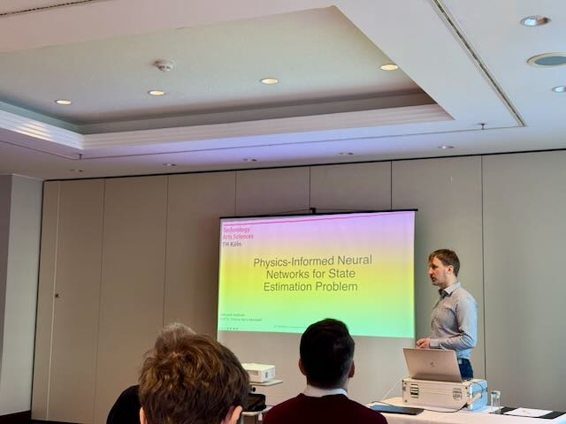
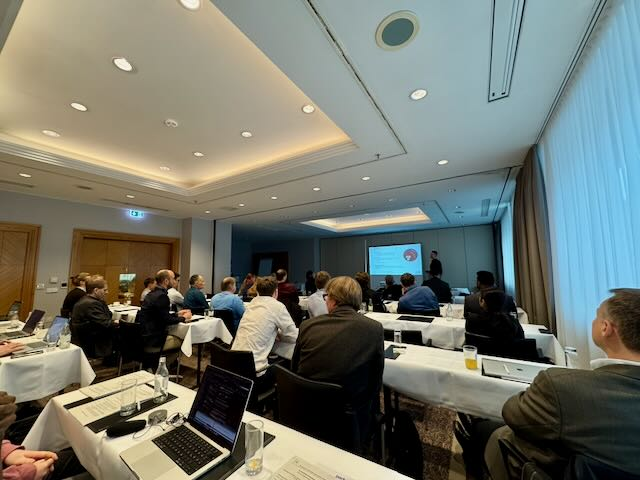
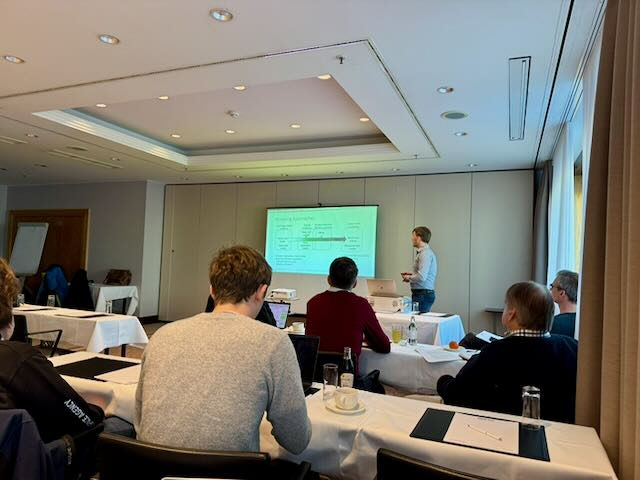
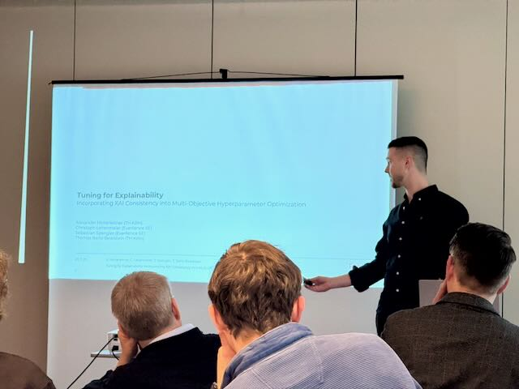

[Alexander
Hinterleitner](https://www.linkedin.com/in/alexander-hinterleitner-4769a62a2/?lipi=urn%3Ali%3Apage%3Ad_flagship3_profile_view_base_contact_details%3BuLI6AatLTWqAesj1M%2FUTHA%3D%3D),
a doctoral candidate at the institute, presented the paper *„Tuning for
Explainability: Incorporating XAI Consistency into Multi-Objective
Hyperparameter Optimization“*. This work was conducted in collaboration
with industry partner [Everllence SE](https://www.everllence.com).
Additionally, [Aleksandr
Subbotin](https://www.linkedin.com/in/alexsubbotin/?lipi=urn%3Ali%3Apage%3Ad_flagship3_profile_view_base_contact_details%3BqLImxyeRQv6aPAfUqSAXfw%3D%3D) presented
the paper *„Physics-Informed Neural Networks for State Estimation
Problem“*. This study proposes a method integrating Physics-Informed
Neural Networks (PINNs) with the Unscented Kalman Filter (UKF) to
address state estimation in nonlinear dynamical systems. Here are some
impressions from their talks.\
The proceedings are Open Access and can be downloaded here:
<https://publikationen.bibliothek.kit.edu/1000186052>

