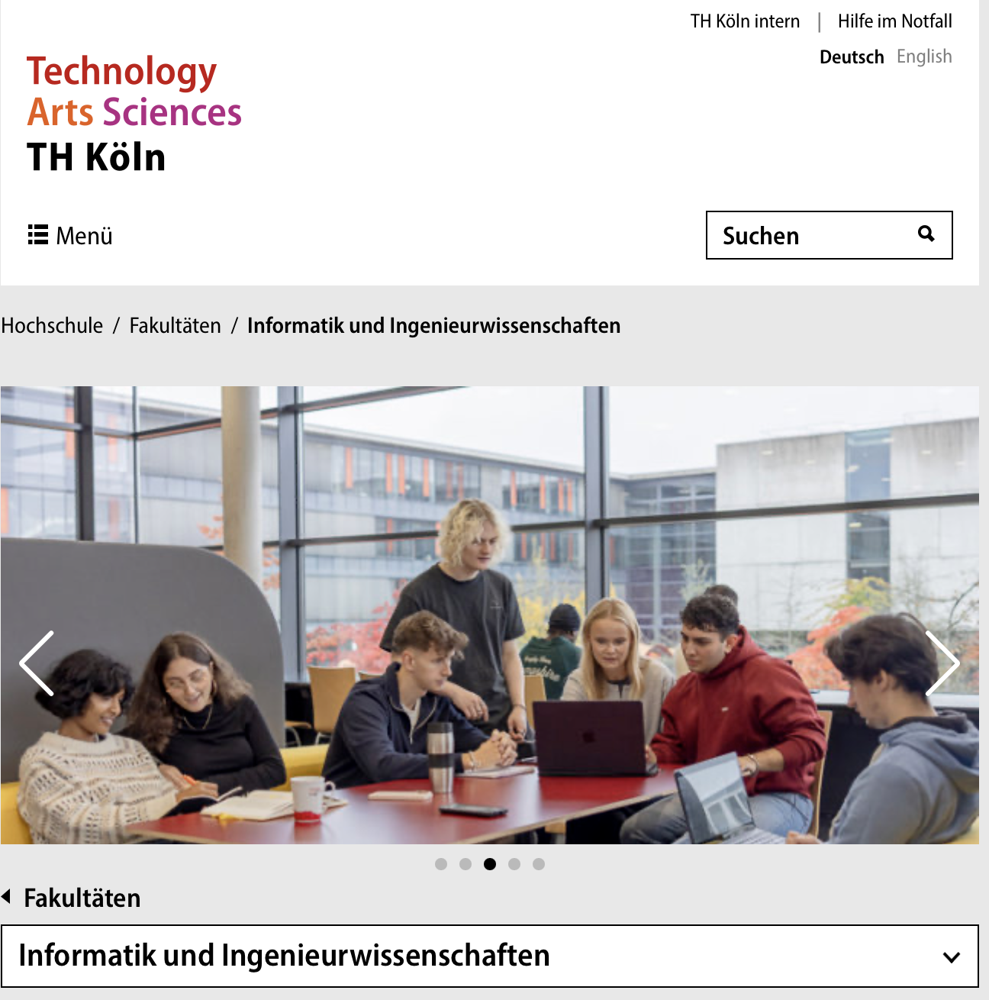

# Kölnische Rundschau: New article series on AI in Oberberg

{fig-alt="TH Köln Gummersbach campus"}

`2026-04-18`

Torsten Sülzer has launched a new article series in the Kölnische Rundschau on artificial intelligence in the Oberbergisch region. The series explores how well the region is positioned for the next industrial revolution, given its many innovation-driven companies and "hidden champions" alongside the research-strong TH Köln in engineering and computer science.

The author introduces the series in his [LinkedIn post](https://www.linkedin.com/posts/torsten-s%C3%BClzer-b4488a237_neue-serie-wie-ki-oberbergs-unternehmen-activity-7448314561847472128-4MDb):

> Today marks the start of a new article series by Torsten Sülzer (Kölnische Rundschau). It asks how well the #Oberbergisch region — with its many innovation-driven #companies and "hidden champions" and with the research-strong TH Köln in #engineering and #computerscience — is positioned for the next industrial revolution.

The first article of the series is available on rundschau-online.de: [Neue Serie: Wie KI Oberbergs Unternehmen beflügelt](https://www.rundschau-online.de/region/oberberg/wiehl/neue-serie-wie-ki-oberbergs-unternehmen-befluegelt-1260645).
