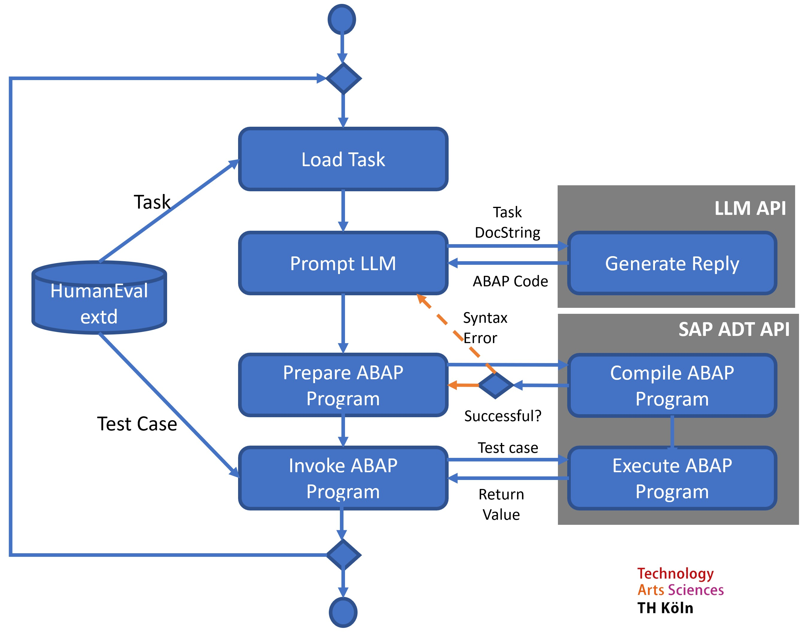
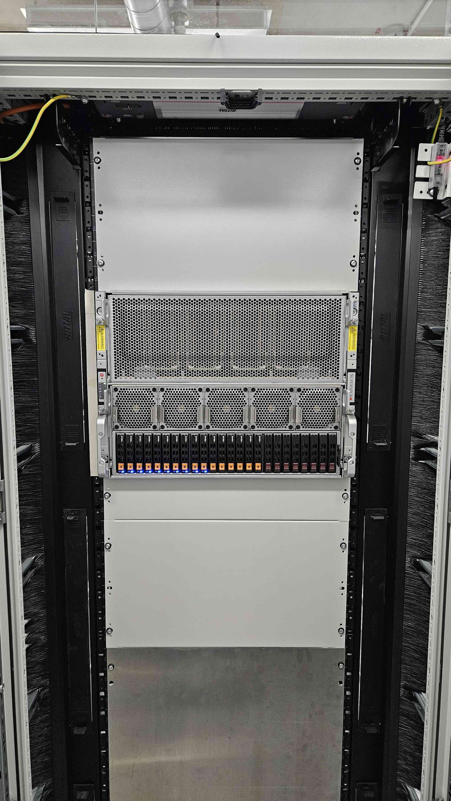

Ein Team um [Prof. Dr. Hartmut
Westenberger](https://www.th-koeln.de/personen/hartmut.westenberger/),
Mitglied des THK-AI Research Clusters an der
Technischen Hochschule Köln, untersucht gemeinsam mit einem
Industriepartner, wie Künstliche Intelligenz Programmcode für
Unternehmenssoftware generieren kann. Im Mittelpunkt steht ABAP, die von
SAP entwickelte Programmiersprache, die weltweit zur Automatisierung und
Steuerung von Geschäftsprozessen in SAP-Systemen eingesetzt wird.

\
Large Language Models (LLMs) – leistungsfähige KI-Systeme wie ChatGPT –
versprechen, Programmierer bei ihrer Arbeit zu unterstützen, indem sie
automatisch Code generieren. Doch wie gut funktioniert das in der Praxis
bei einer spezialisierten Sprache wie ABAP? \
Das Team begann vor zwei Jahren damit, verschiedene KI-Modelle auf ihre
Fähigkeit zu testen, funktionsfähigen ABAP-Code zu schreiben. In der
zweiten Phase des Projekts erweitern die Forschenden den international
etablierten HumanEval-Testdatensatz um praxisnahe Szenarien aus dem
ABAP-Umfeld, um die KI-Systeme noch realitätsnäher bewerten zu können. 

THK-AI Rechencluster

\
Für den umfangreichen Benchmark-Test nutzte das Team unter anderem die
Recheninfrastruktur des THK-AI Research Clusters. Zum Einsatz kam dabei
eine von
[Pascal Cerfontaine](https://www.th-koeln.de/personen/pascal.cerfontaine/) (ebenfalls
Mitglied des THK-AI Research Clusters) bereitgestellte Schnittstelle zu
verschiedenen KI-Modellen. Über 10.000 Code-Generierungen wurden
durchgeführt und systematisch ausgewertet.

 **LinkedIn-Post zum Projekt:**

https://www.linkedin.com/posts/hartmut-westenberger-8b2a21102_llm-codegeneration-benchmarking-activity-7331350438849495041-muEd 

**Kontakt:**

[Prof. Dr. Hartmut
Westenberger](https://www.th-koeln.de/personen/hartmut.westenberger/) 
