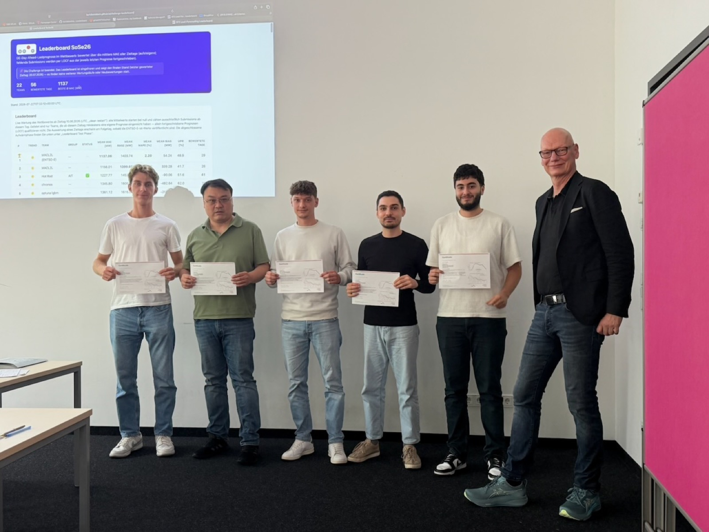
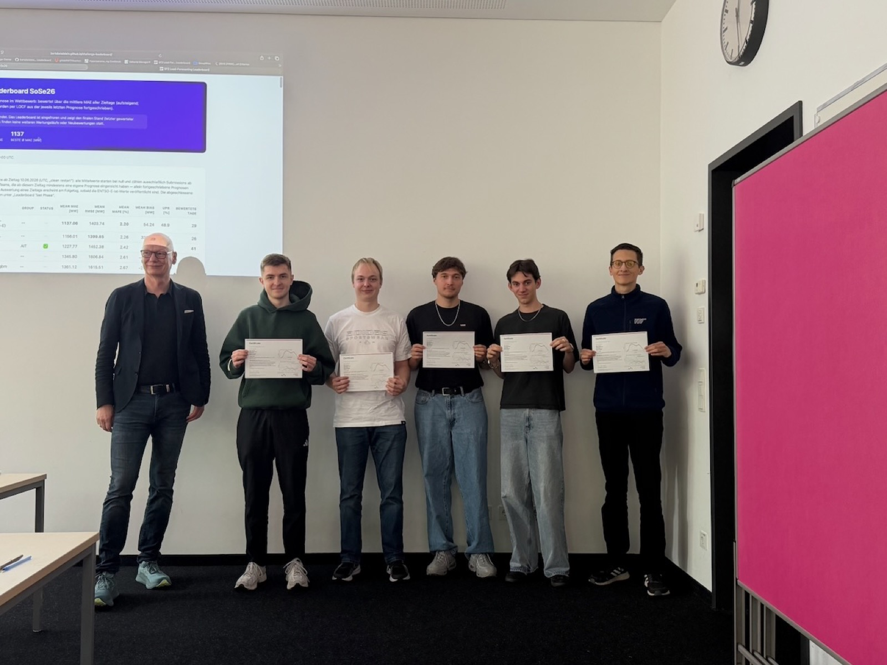
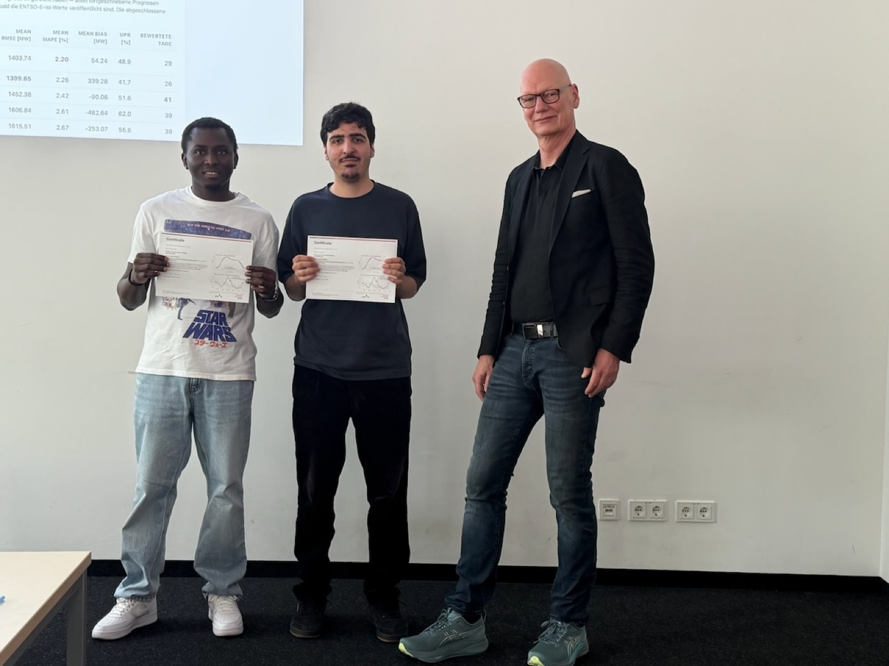
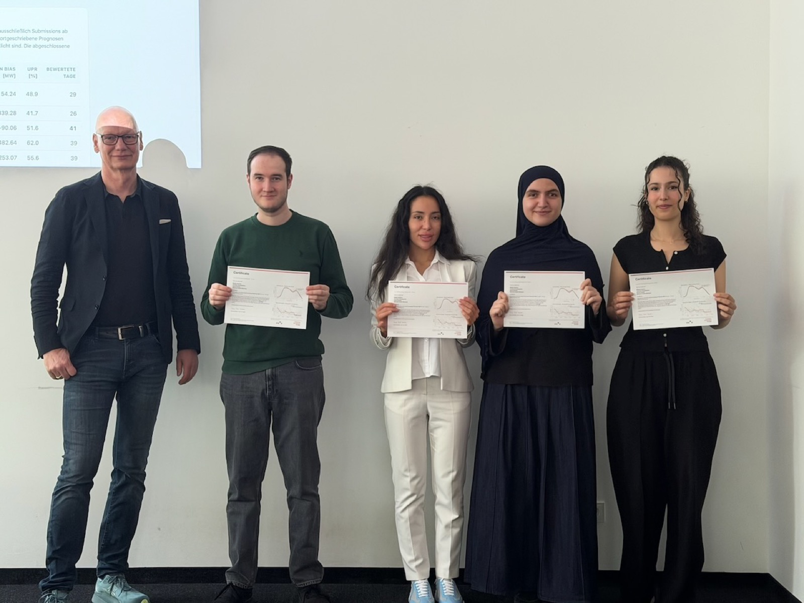
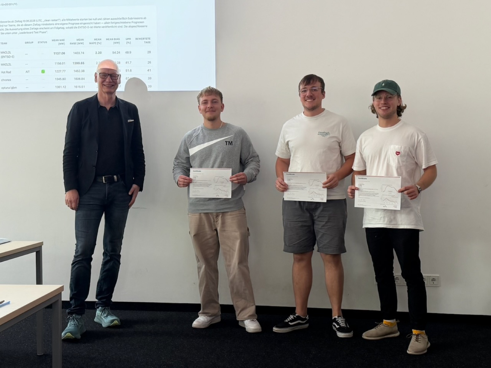
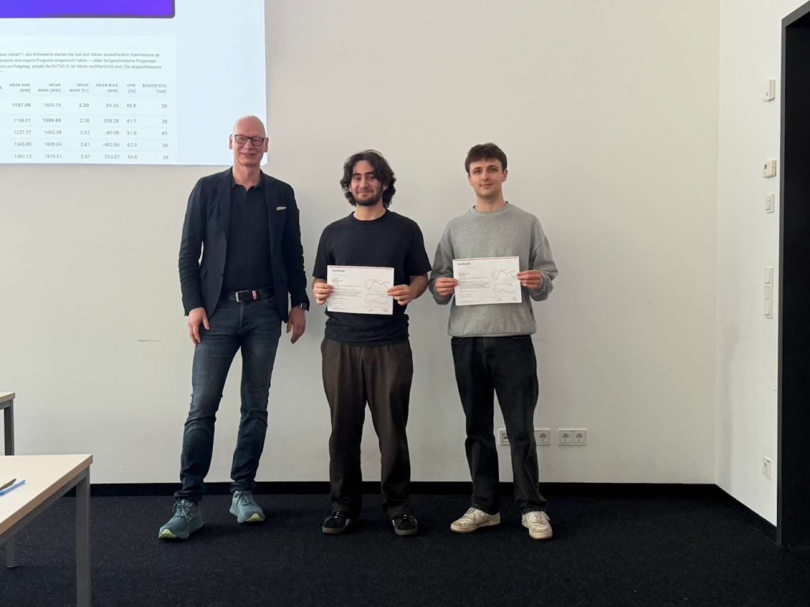
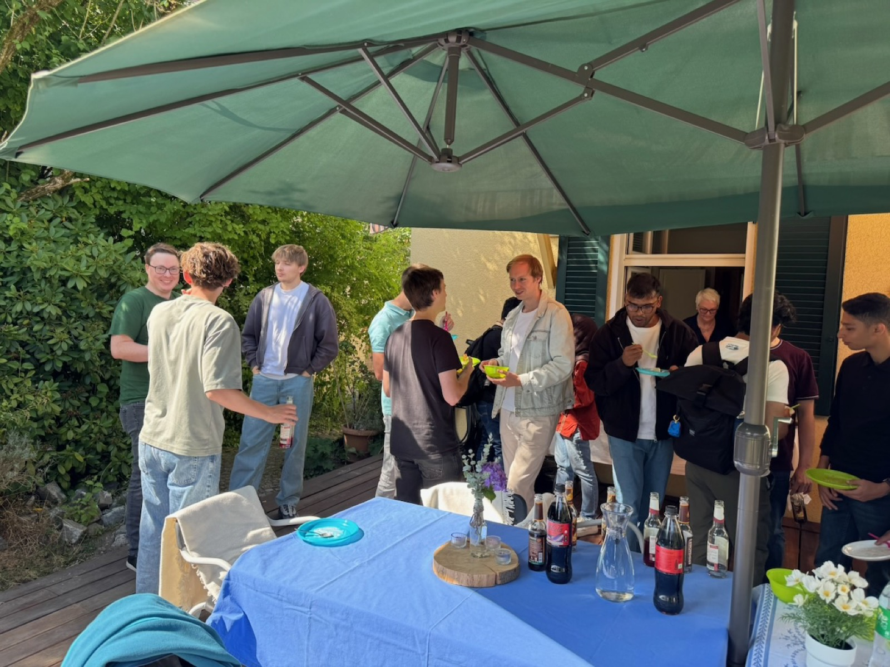
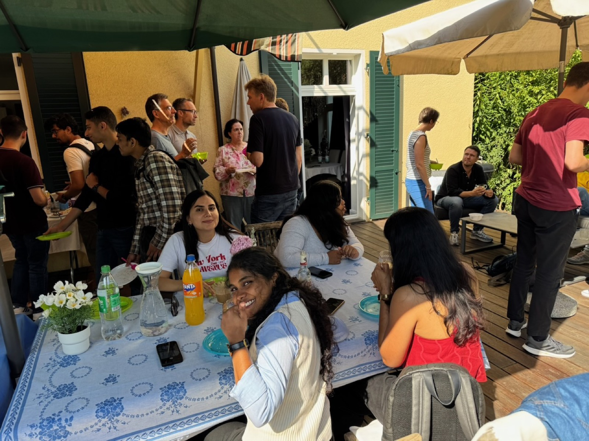

# Load-Forecasting Challenge 2026: certificate ceremony and top-tier forecasts

{fig-alt="Students with their certificates and Prof. Bartz-Beielstein in front of the projected leaderboard of the Load-Forecasting Challenge 2026"}

`2026-07-27`

With the presentation of certificates to the teams of both courses on 27 July 2026, the Live Load-Forecasting Challenge 2026 at TH Köln has officially come to a close. Both "Numerische Mathematik" and "Data-Driven Modeling and Optimization" (DDMO) completed the challenge, presented their approaches, and received their certificates. It capped a semester in which eleven student teams forecast Germany's electricity demand day after day for six weeks. We already reported on the [final presentations](../lastprognose-challenge-2026/lastprognose-challenge-2026-en.md). The spotlight has now turned to the results and to the students themselves.

For six weeks, each team submitted a fresh 24-hour-ahead forecast of German grid load before midnight, scored automatically the next day against the actual load published by the [ENTSO-E Transparency Platform](https://transparency.entsoe.eu/). Ranking ran over 41 forecast days, measured by mean absolute error (MAE) in megawatts (MW).

The technical level was remarkably high. Ten of the eleven teams beat the official ENTSO-E day-ahead forecast, and every team beat the naive baselines by a clear margin. The best student team, Hot Rod, reached an MAE of about 1,230 MW at a mean absolute percentage error (MAPE) of roughly 2.4 percent. Das A Team led the "Numerische Mathematik" group, and Hot Rod the "DDMO" group.

{fig-alt="Six students with certificates next to Prof. Bartz-Beielstein in front of the projected leaderboard"}

The challenge also produced solid insights into forecasting German electricity demand, for instance how much calendar structure such as public holidays and bridge days, together with weather covariates, contributes to forecast quality, and how well carefully engineered gradient boosting holds up against modern foundation models for time series. Methodological rigor mattered just as much. Every team published Model Cards and OpenSSF security scorecards, and each team's results were independently reproduced by another team and certified in this way. In doing so, the teams put the requirements of the [EU AI Act](https://eur-lex.europa.eu/eli/reg/2024/1689/oj) for safety-critical infrastructure into practice. Learning these legal requirements was a central part of the project for both groups. Open, verifiable research was not an add-on but part of the assignment.

The students' engagement stood out. Week after week the teams reliably submitted their forecasts day by day, refined their models, and discussed their approaches in the final presentations. To round off the semester, Prof. Dr. Thomas Bartz-Beielstein hosted a garden party at his home to celebrate the successes together with the international master's students of the "Automation & IT" (AIT) programme, from which the DDMO teams came, and the colleagues involved. For him the challenge was a full success: "I am impressed by the persistence and care the teams brought to their work. That the students beat the official grid forecast under real-world conditions and reproduce one another's results is exactly the kind of open, verifiable research we want to teach. That the teams implemented the legal requirements for critical infrastructure on their own was a particular pleasure for me."

The challenge does not end with the semester but continues on a voluntary basis. Current results of the ongoing forecasts are available on the [live leaderboard](https://advm1.gm.fh-koeln.de/~bartz/sf2-forecast).

## Impressions from the certificate ceremony and garden party

The challenge was based on data from the [ENTSO-E Transparency Platform](https://transparency.entsoe.eu/). The challenge infrastructure was provided by the SpotSeven Lab at the [Institute for Data Science, Engineering, and Analytics (IDE+A)](https://www.th-koeln.de/informatik-und-ingenieurwissenschaften/institut-fuer-data-science-engineering-and-analytics_54523.php) at TH Köln. The full ranking is available on the [public leaderboard](https://bartzbeielstein.github.io/challenge-leaderboard/). Contact: [Prof. Dr. Thomas Bartz-Beielstein](https://www.th-koeln.de/personen/thomas.bartz-beielstein/).
