# Lastprognose-Challenge 2026: Sechs Wochen, elf Teams, jeden Tag eine Prognose

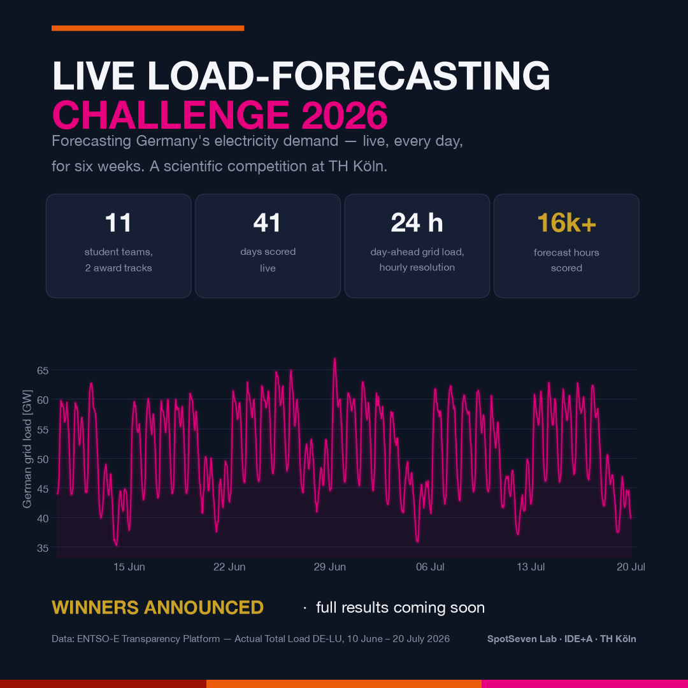{fig-alt="Grafik zur Live-Lastprognose-Challenge 2026 mit stilisierter Lastkurve"}

`20. Juli 2026`

Die Live-Lastprognose-Challenge 2026 an der TH Köln ist erfolgreich zu Ende gegangen. Seit Juni reichten elf studentische Teams jeden Tag vor Mitternacht eine neue 24-Stunden-Prognose des deutschen Strombedarfs ein. Bewertet wurde automatisch am Folgetag, gemessen an der tatsächlichen Netzlast, wie sie die [ENTSO-E Transparency Platform](https://transparency.entsoe.eu/) veröffentlicht. Kein Spielzeugdatensatz, keine zweite Chance: eine live laufende, vollständig reproduzierbare Prognose-Competition unter realen Bedingungen.

Die Challenge war Teil der Lehrveranstaltung „Numerische Mathematik" (Sommersemester 2026) von [Prof. Dr. Thomas Bartz-Beielstein](https://www.th-koeln.de/personen/thomas.bartz-beielstein/) an der Fakultät für Informatik und Ingenieurwissenschaften der TH Köln. In den Abschlusspräsentationen stellten die Teams ihre Ansätze vor, von sorgfältig konstruiertem Gradient Boosting bis zu modernen Foundation-Modellen für Zeitreihen. Die Siegerteams der beiden Award-Tracks werden in Kürze geehrt.

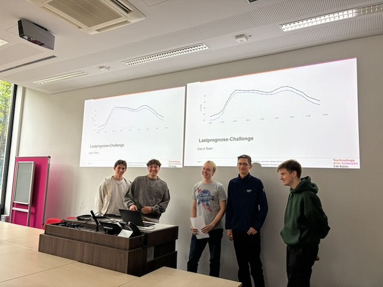{fig-alt="Fünf Studierende präsentieren vor zwei Leinwänden mit Lastprognose-Kurven"}

Die Challenge war zugleich eine Lektion in offener, überprüfbarer Forschung: Die Teams veröffentlichten Model Cards, prüften ihre Repositories mit OpenSSF-Security-Scorecards und zertifizierten die Ergebnisse der jeweils anderen Teams durch unabhängige Reproduktion.

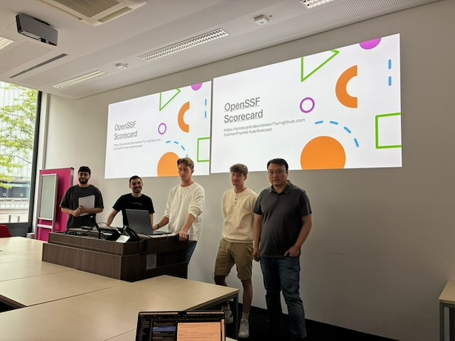{fig-alt="Team präsentiert die OpenSSF-Scorecard-Ergebnisse seines Repositories"}

Auch fachlich lieferte die Challenge wertvolle Einsichten in die Prognose des deutschen Strombedarfs: wie viel Kalenderstruktur — Feiertage, Brückentage, Tagestypen — und Wetterkovariaten tatsächlich beitragen und wie gut sorgfältig konstruiertes Gradient Boosting gegenüber modernen Foundation-Modellen besteht. Weitere Details, einschließlich der vollständigen Methodik und Ergebnisse, werden in Kürze veröffentlicht.

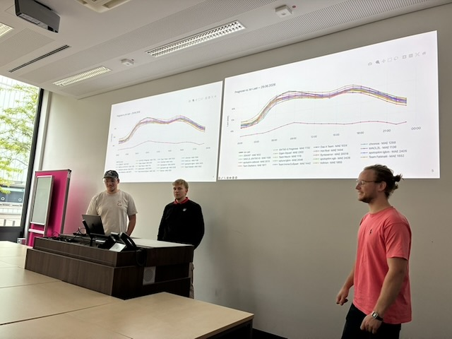{fig-alt="Drei Studierende vor Leinwänden mit Prognose- und Lastkurven"}

## Impressionen aus den Abschlusspräsentationen

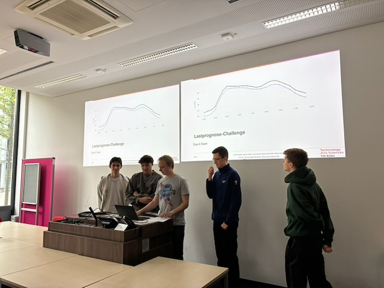

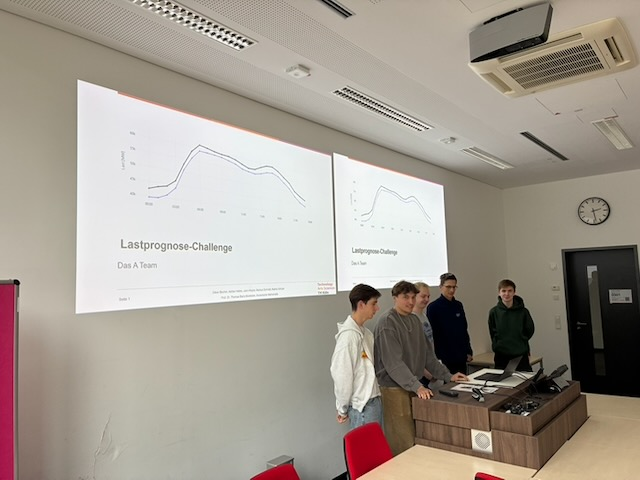

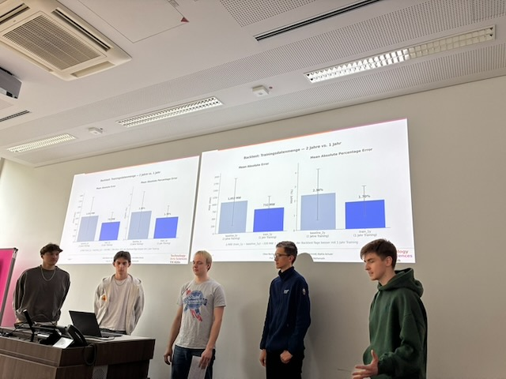

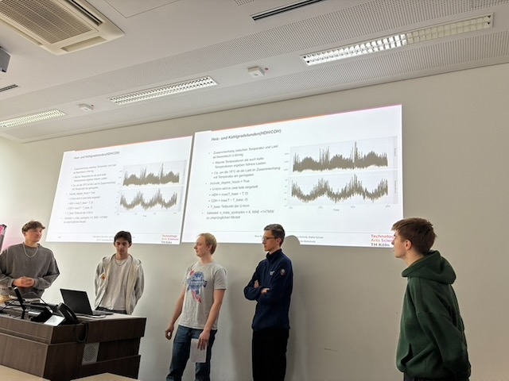

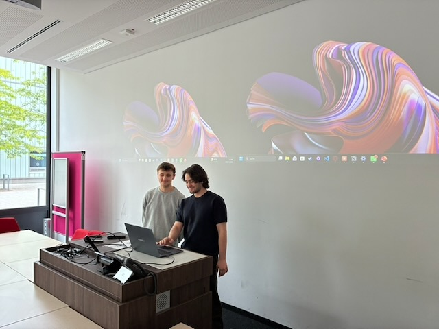

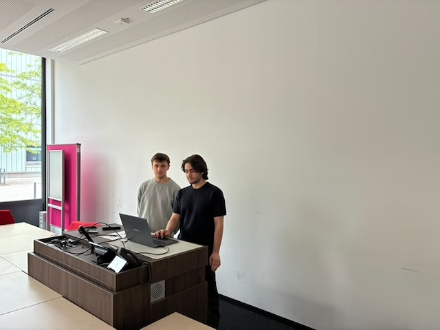

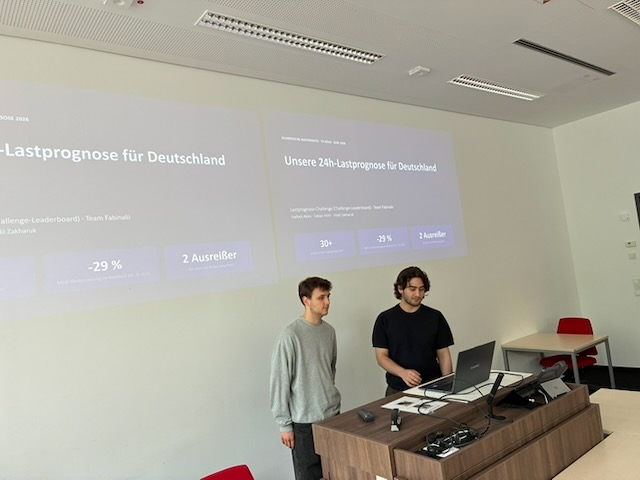

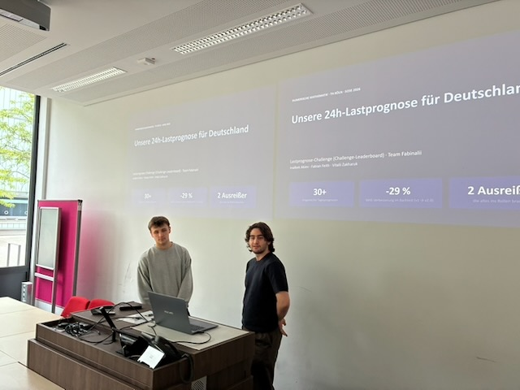

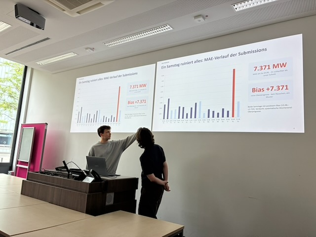

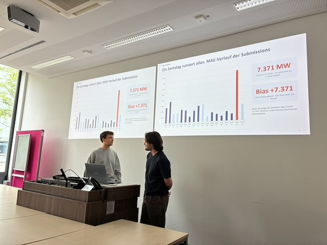

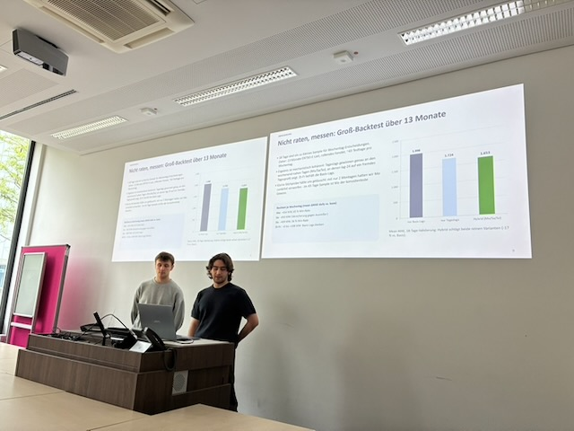

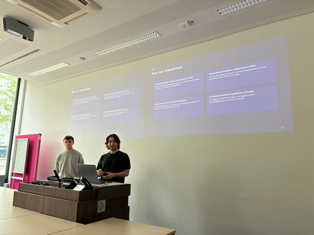

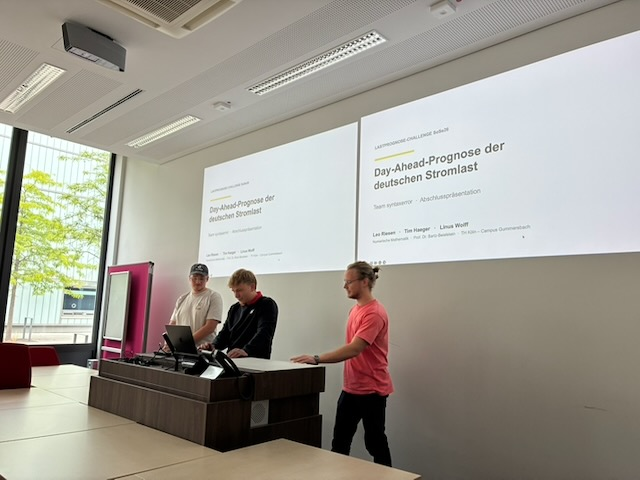

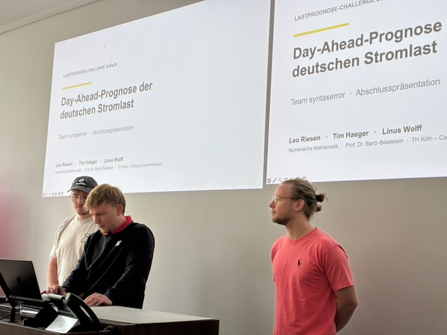

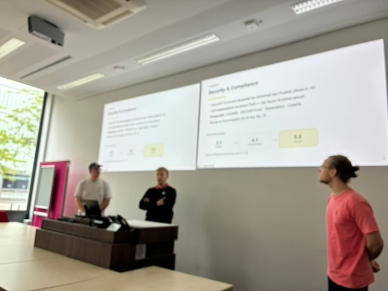

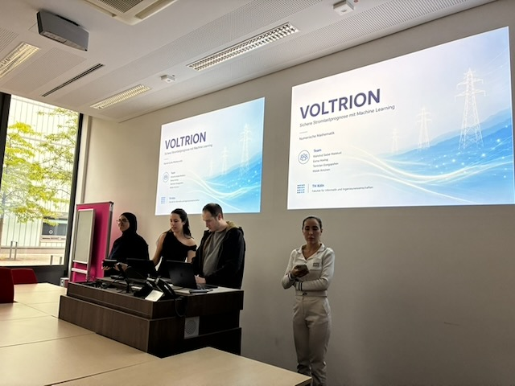

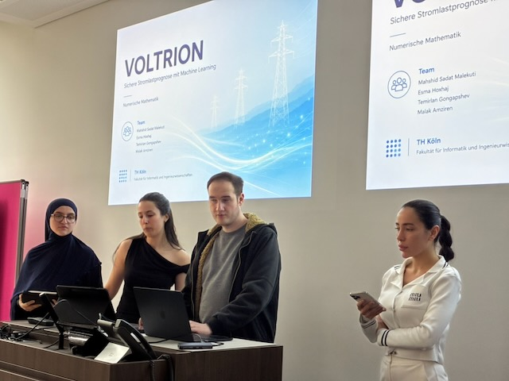

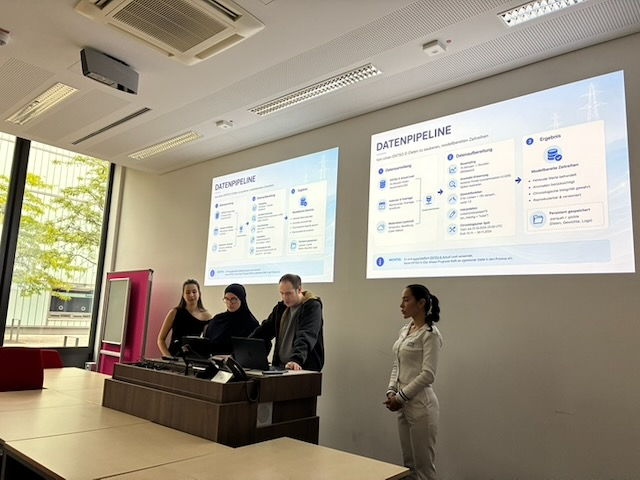

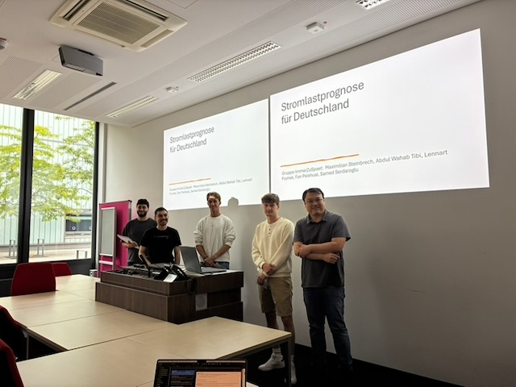

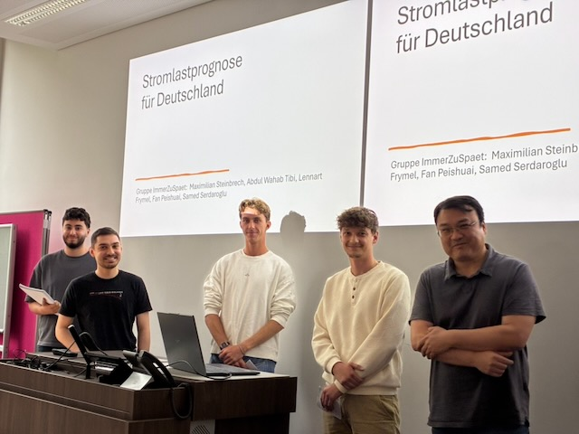

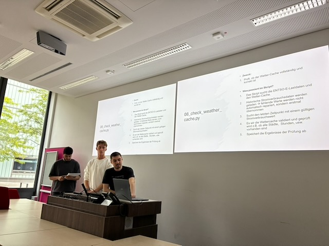

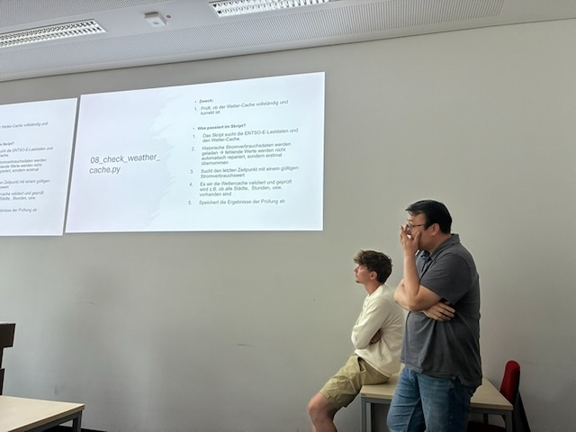

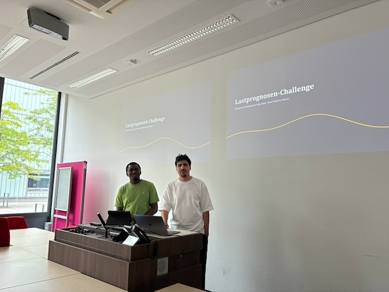

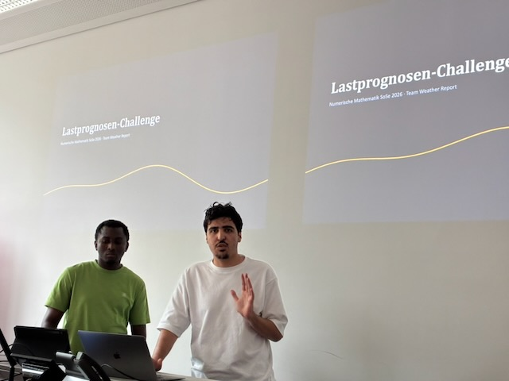

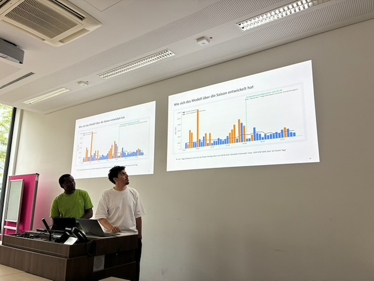

Datengrundlage der Challenge war die [ENTSO-E Transparency Platform](https://transparency.entsoe.eu/); die Challenge-Infrastruktur stellte das SpotSeven Lab am [Institut für Data Science, Engineering, and Analytics (IDE+A)](https://www.th-koeln.de/informatik-und-ingenieurwissenschaften/institut-fuer-data-science-engineering-and-analytics_54523.php) der TH Köln bereit. Ansprechpartner ist [Prof. Dr. Thomas Bartz-Beielstein](https://www.th-koeln.de/personen/thomas.bartz-beielstein/).
