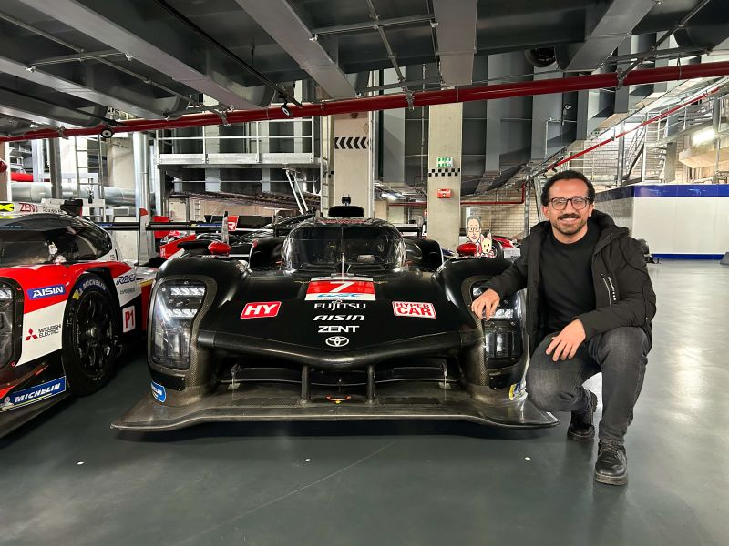
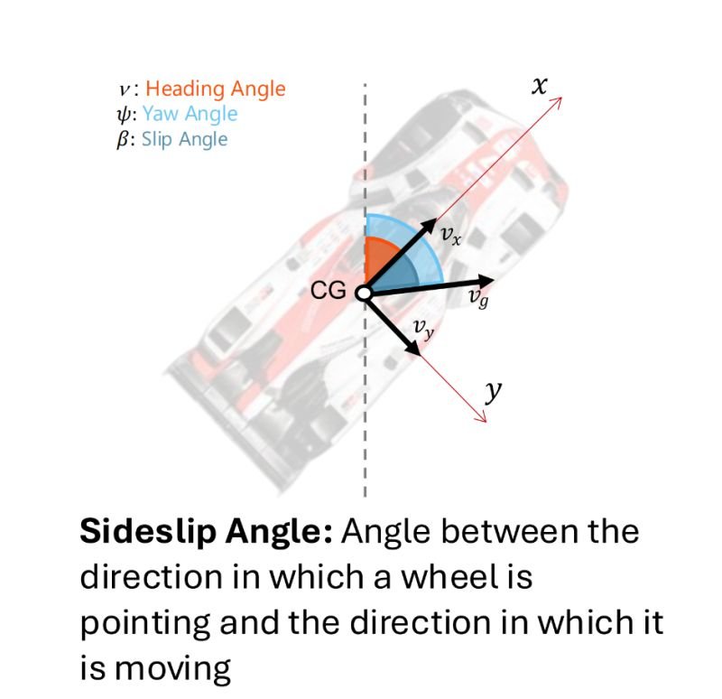
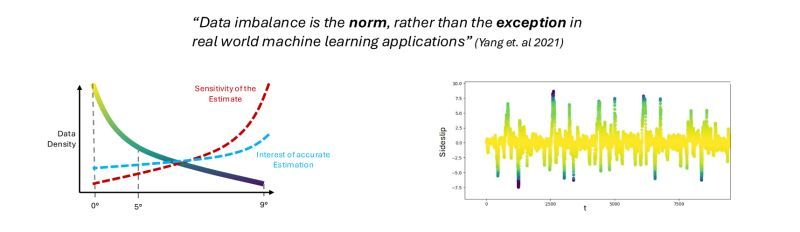

Im THK-AI Forschungscluster zeigt sich erneut, wie praxisnah KI-Forschung an der TH Kön sein kann: Mohamed Desouky, Student aus dem Master-Studiengang Automation and IT, berichtet in einem LinkedIn-Post ueber seine Masterarbeit an der Schnittstelle von Automotive AI und Motorsport.

Unter der Betreuung von Prof. Dr. Thomas Bartz-Beielstein und dessen Doktorand Noah C. Pütz arbeitete er an einer Herausforderung aus der realen Fahrzeugentwicklung in Kooperation mit TOYOTA RACING.

## Die Aufgabe: Driftwinkel in Echtzeit vorhersagen

Kern der Fallstudie war ein virtueller Sensor: Das Team sollte vorhersagen, wie stark ein Fahrzeug driftet - und zwar in Echtzeit, ausschliesslich auf Basis von Onboard-Sensordaten.
Ohne zusaetzliche teure Hardware. Ohne optische Spezialsensoren. Ohne separate IMU. Stattdessen ersetzt ein ML-Modell physische Sensorik dort, wo sie teuer, komplex oder schwer integrierbar ist.
Gerade in kritischen Fahrsituationen wird das anspruchsvoll: Modelle muessen besonders in seltenen, dynamischen Grenzfaellen stabil und praezise bleiben.

## Warum das fuer Automation und IT/AI-Studierende spannend ist

Diese Art von Problem zeigt, worauf es in modernen cyber-physischen Systemen ankommt:

* Entscheidungen in Millisekunden
* Robustheit unter realen physikalischen Randbedingungen
* Data-Driven Modelling statt reinem Paper-Benchmarking
* Safety-Kriterien und technische Nachvollziehbarkeit

Die zentrale Lernkurve aus der Arbeit: Methoden, die in allgemeinen AI-Benchmarks stark sind, lassen sich nicht automatisch auf den Automotive-Kontext uebertragen. Fahrzeugdynamik hat eigene Gesetzmaessigkeiten, eigene Fehlerbilder und harte Echtzeit-Constraints.

Wer sich fuer Automation, Embedded AI, ADAS oder industrielle KI interessiert, findet im THK-AI Research Cluster ein exzellentes Lernfeld: von virtueller Sensorik und Deep Learning bis zu valider Systemintegration unter realen Bedingungen.

## THK-AI Perspektive

Der Case verdeutlicht, wie Studierende der TH Köln in anspruchsvolle Projekte mit unmittelbarer Relevanz fuer Industrie und Mobilitaet einsteigen koennen. Solche Arbeiten stehen fuer den THK-AI Anspruch: technisch tief, wissenschaftlich fundiert, und mit direktem Real-World-Impact.

Weiterführender Link:

* LinkedIn-Post von Mohamed Desouky: <https://www.linkedin.com/posts/mohamed-desouky-558b90217_automotiveai-motorsport-toyotaracing-activity-7437144797523644417-T7E3>

