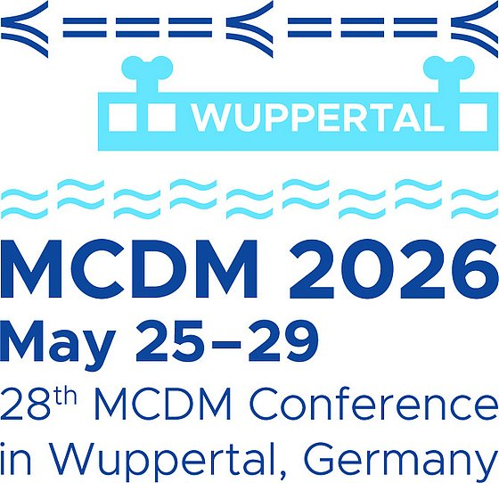
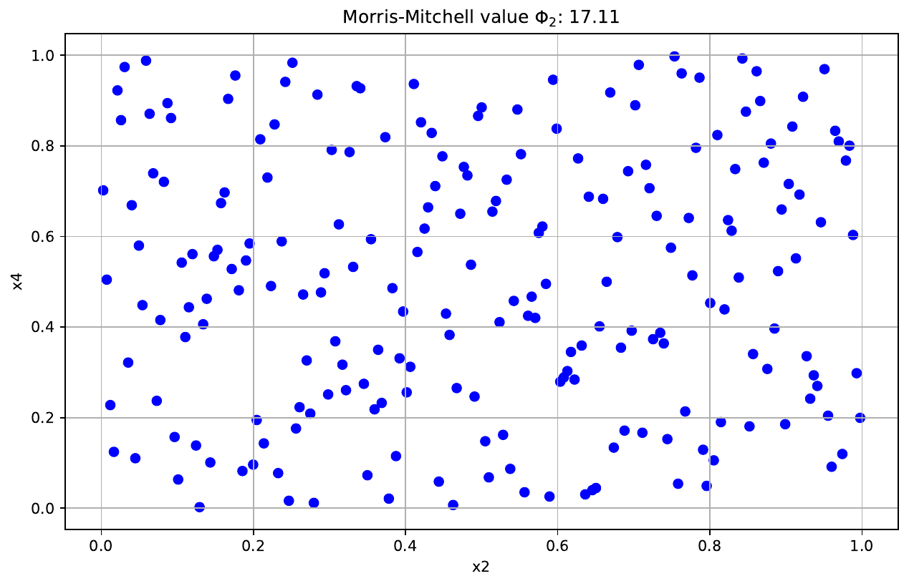

# Contribution "Multi-Objective Optimization with Desirability and Morris-Mitchell Criterion" accepted at MCDM 2026

{fig-alt="Pareto front of two objectives z1 and z8 from the compressor case study with original data, predicted front, and best point"}

`2026-04-28`

The Programme Committee of [MCDM 2026](https://mcdm2026.uni-wuppertal.de/en/welcome/) has accepted the contribution *Multi-Objective Optimization with Desirability and Morris-Mitchell Criterion* for presentation. The authors are [Prof. Dr. Thomas Bartz-Beielstein](https://www.th-koeln.de/personen/thomas.bartz-beielstein/) (TH Köln, THK-AI Research Cluster), Eva Bartz and Alexander Hinterleitner (Bartz & Bartz GmbH, Gummersbach), and Christoph Leitenmeier and Ihab Abd El Hussein (Everllence SE, Engineering Turbocharger, Augsburg).

## Background

The work emerged from a collaboration between the THK-AI Research Cluster at TH Köln, Bartz & Bartz GmbH, and [Everllence SE](https://www.everllence.com/en). Everllence is the new name of the former MAN Energy Solutions, headquartered in Augsburg; the company develops propulsion, decarbonisation, and efficiency solutions for shipping, the energy sector, and industry, and employs around 16,200 people worldwide. Within its portfolio, the *Engineering Turbocharger* unit in Augsburg covers the development of large turbochargers for marine, energy, and industrial applications. The study is motivated by an industrial application from exactly this area of compressor development, in which existing experimental data must be reused, with no opportunity to plan a new experimental campaign from scratch.

[{fig-alt="MCDM 2026 conference logo featuring the Wuppertal suspension railway" width=240}](https://mcdm2026.uni-wuppertal.de/en/welcome/)

[MCDM 2026](https://mcdm2026.uni-wuppertal.de/en/welcome/) is the *28th International Conference on Multiple Criteria Decision Making* and will be held from 25 to 29 May 2026 at the University of Wuppertal, Germany. It is organised by the Optimization Group at the University of Wuppertal, with Kathrin Klamroth and Michael Stiglmayr as conference chairs. Under the motto *Better Decisions for a Better Tomorrow*, the conference brings together research on multi-criteria decision support, multi-objective optimisation, and related software, with an explicit focus on social, ecological, and economic impacts.

## Research question

In industrial experimental designs, sample points are often distributed unevenly across the input space and meet the requirements of classical space-filling designs only approximately. As a consequence, the underlying sample is not representative of the full parameter space, which degrades the quality of surrogate models and the optimisation decisions built on top of them. The central question is therefore how existing designs can be refined retroactively without losing sight of the actual performance objectives. At the same time, the limits of the Morris-Mitchell criterion as a measure of design quality need to be made explicit.

## Approach

The contribution analyses variants of the Morris-Mitchell criterion within the framework of potential theory and characterises their monotonicity properties and limitations. On this basis, the authors develop a multi-objective optimisation procedure that uses desirability functions to fuse surrogate-model predictions and space-filling improvements into a unified score. The implementation builds on the open-source Python packages [`spotdesirability`](https://sequential-parameter-optimization.github.io/spotdesirability/) and [`spotoptim`](https://sequential-parameter-optimization.github.io/spotoptim/docs/index.html). The approach is complemented by novel infill-point diagnostics that make the sequential selection of new design points visually traceable.

{fig-alt="Point cloud of a two-dimensional design with Morris-Mitchell value"}

## Findings

The methodology is demonstrated on a compressor-development case study with Everllence SE. Two industry-relevant objectives are optimised jointly while the spatial coverage of the design is improved in a controlled manner. The procedure brings performance optimisation and design quality into a single evaluation, transferring results from the theory of space-filling designs into engineering practice. The infill-point diagnostics make the exploration-exploitation trade-off transparent and support the stepwise extension of existing experimental series.

Citation: Bartz-Beielstein, T., Bartz, E., Hinterleitner, A., Leitenmeier, C., Abd El Hussein, I. (2026). *Multi-Objective Optimization with Desirability and Morris-Mitchell Criterion.* Contribution accepted at MCDM 2026.
