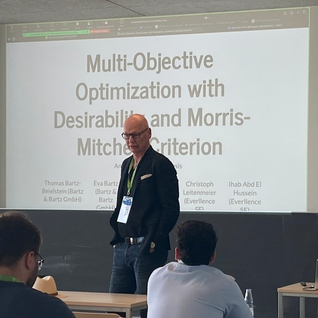
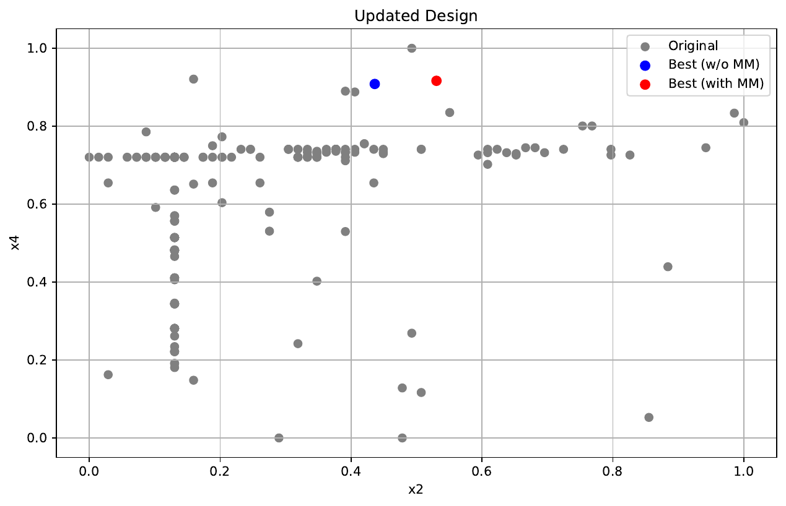
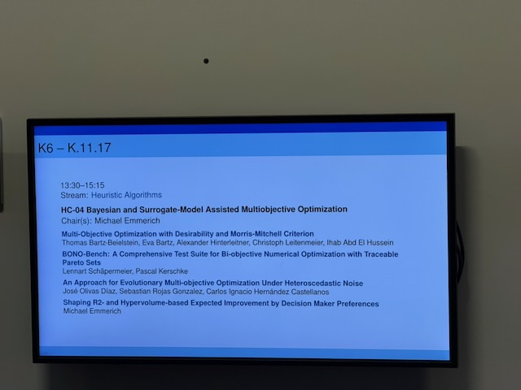

# MCDM 2026 in Wuppertal: Bartz-Beielstein präsentiert Ergebnisse der Everllence-Kooperation

{fig-alt="Thomas Bartz-Beielstein vor der Titelfolie seines Vortrags Multi-Objective Optimization with Desirability and Morris-Mitchell Criterion"}

`18. Juni 2026`

Auf der [MCDM 2026](https://mcdm2026.uni-wuppertal.de/en/welcome/), der *28th International Conference on Multiple Criteria Decision Making* (25.–29. Mai 2026 an der Bergischen Universität Wuppertal), hat [Prof. Dr. Thomas Bartz-Beielstein](https://www.th-koeln.de/personen/thomas.bartz-beielstein/) Ergebnisse aus einer langjährigen Kooperation mit der [Everllence SE](https://www.everllence.com/en) (vormals MAN Energy Solutions, Augsburg) vorgestellt. Sein Vortrag am 28. Mai war Teil der Session *Bayesian and Surrogate-Model Assisted Multiobjective Optimization* (Stream *Heuristic Algorithms*) unter dem Vorsitz von Michael Emmerich.

Im Mittelpunkt stand der gemeinsam mit Everllence und der Bartz & Bartz GmbH entwickelte Ansatz *Multi-Objective Optimization with Desirability and Morris-Mitchell Criterion*. Das zugehörige Paper ist inzwischen auf [arXiv](https://arxiv.org/abs/2512.21989) verfügbar und der Abstract wurde zur Präsentation auf der MCDM 2026 angenommen. Hintergrund und Methodik sind ausführlich in der [Ankündigung des Beitrags](../mcdm/bart26c-mcdm.md) beschrieben: Das Verfahren kombiniert Desirability-Funktionen mit dem Morris-Mitchell-Kriterium, um Vorhersagen eines Surrogatmodells und die raumfüllende Qualität bestehender Versuchspläne in einem gemeinsamen Bewertungsmaß zu vereinen. Die Implementierung stützt sich auf die quelloffenen Python-Pakete `spotdesirability` und `spotoptim` und wird an einer Fallstudie aus der Verdichterentwicklung demonstriert.

{fig-alt="Aktualisierte Punktwolke eines Designs mit Morris-Mitchell-Bewertung aus der Everllence-Fallstudie"}

Die enge Verbindung von methodischer Forschung und industrieller Anwendung stieß in der MCDM-Community auf großes Interesse. Prof. Bartz-Beielstein erhielt wertvolles Feedback und führte anregende Diskussionen mit führenden Forscherinnen und Forschern der multikriteriellen Optimierung. Der Austausch unterstützt die Weiterentwicklung der Methoden als auch die Kooperation mit Everllence unmittelbar.

{fig-alt="Anzeigetafel der MCDM 2026 mit der Session Bayesian and Surrogate-Model Assisted Multiobjective Optimization und dem Vortrag von Bartz-Beielstein und Kolleginnen und Kollegen"}

Paper: Bartz-Beielstein, T., Bartz, E., Hinterleitner, A., Leitenmeier, C., Abd El Hussein, I. (2026). *Multi-Objective Optimization with Desirability and Morris-Mitchell Criterion.* [arXiv:2512.21989](https://arxiv.org/abs/2512.21989).
