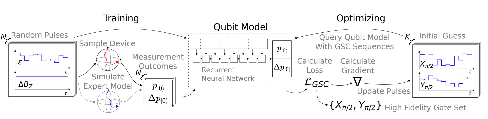

Eine Kollaboration zwischen der Quantum Technology Group der RWTH Aachen
und der AI4Science Group von Prof. Dr. Pascal Cerfontaine an der TH Köln
stellt einen datengetriebenen Ansatz zur Charakterisierung und optimalen
Steuerung von Qubits, den Grundbausteinen von Quantencomputern, vor.

Das Paper befasst sich mit der Herausforderung, hochgenaue
Quantenoperationen zu realisieren, ohne auf ein detailliertes
physikalisches Modell des Quantensystems angewiesen zu sein. Stattdessen
wird ein Deep-Learning-basierter Ansatz verwendet, bei dem ein
rekurrentes neuronales Netz (RNN) das dynamische Verhalten eines Qubits
direkt aus gemessenen Systemantworten erlernt.

Hierzu werden zunächst zufällige Steuerpulse (zeitabhängige elektrische
oder elektromagnetische Signale, mit denen der Zustand eines Qubits
gezielt verändert wird) mit nur schwachen Vorannahmen über das System
eingesetzt, um die Qubit-Dynamik zu sampeln. Auf Basis dieser Messdaten
wird das RNN trainiert, die Systemdynamik vorherzusagen. Das gelernte
Modell ermöglicht anschließend eine effiziente gradientenbasierte
Optimierung von Steuerpulsen, ohne explizite Systemgleichungen oder
analytische Gradienten berechnen zu müssen.

Simulationen an einem Qubit zeigen, dass der Ansatz zuverlässig
hochgenaue Quanten-Gates erzeugt. Die Arbeit demonstriert damit das
Potenzial von modellfreier, datengetriebener Quantenkontrolle,
insbesondere für komplexe Quantensysteme, deren Dynamik nur schwer exakt
modellierbar ist.

Hier ist der Link zum Paper: <https://arxiv.org/abs/2601.18704>
