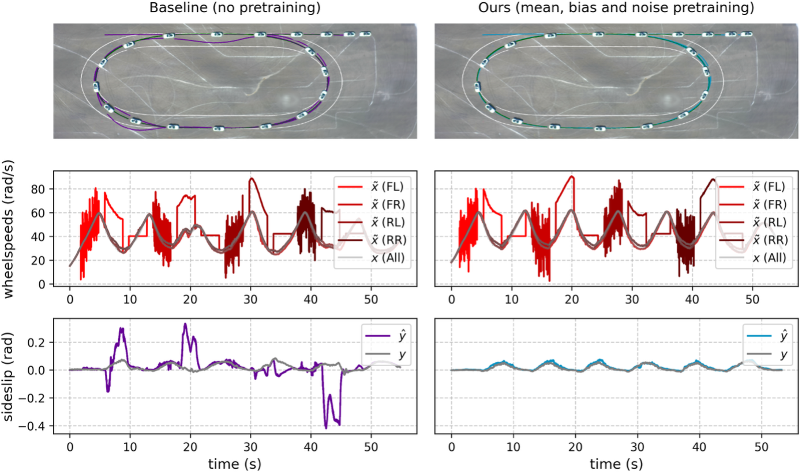

[Jens Brandt](https://www.th-koeln.de/personen/jens_uwe.brandt/), PhD
student at the THK-AI Research Cluster (<https://thk-ai.de>) at
Technische Hochschule Köln, has published a research paper that will be
presented at NeurIPS 2025 (<https://neurips.cc>), one of the most
prestigious conferences in the field of artificial intelligence and
machine learning. The conference takes place in December 2025 in San
Diego.


Jens Brandt

The paper, titled „From Faults to Features: Pretraining to Learn Robust
Representations against Sensor Failures,“ addresses a critical challenge
in safety-critical applications such as autonomous vehicles. The
research demonstrates how machine learning models can be made more
robust against sensor failures through innovative pretraining
techniques.


*Robust virtual sensing in closed-loop control. Top: full
driven trajectory (car image illustrative,*

*indicating driving direction). Middle: perturbed (˜x) vs. true (x)
wheelspeed measurements.*

*Bottom: sideslip estimate (ˆy) under corruptions vs. true VSA
(y).*

This work is the result of a collaboration between Technische Hochschule
Köln, [The Leiden Institute of Advanced Computer Science
(LIACS)](https://liacs.leidenuniv.nl) at Leiden University (NL), [Toyota
Gazoo Racing](https://toyotagazooracing.com), and the [Toyota Research
Institute](https://www.tri.global/). Jens Brandt’s PhD thesis is
supervised by [Prof. Dr. Thomas
Bartz-Beielstein](https://www.th-koeln.de/personen/thomas.bartz-beielstein/)
(THK-AI Research Cluster), [Prof. Dr. Thomas
Bäck](https://www.universiteitleiden.nl/en/staffmembers/thomas-back#tab-1)
(Leiden University, Netherlands), and [Dr. Marc
Hilbert](https://www.linkedin.com/in/marc-hilbert-engineering/)
(Toyota).

The paper and accompanying poster are available on the official NeurIPS
website: <https://neurips.cc/virtual/2025/loc/san-diego/poster/119529>

### **About the Research**

Machine learning models play a key role in safety-critical applications,
where their robustness during inference is essential to ensure reliable
operation. The research proposes a self-supervised masking scheme that
simulates common sensor failures and explicitly trains models to recover
the original signal. As a practical application, the method was deployed
on a modified Lexus LC 500, demonstrating that the pretrained model
successfully operates as a substitute for a physical sensor in a
closed-loop control system for autonomous racing.

### **About THK-AI Research Cluster**

The THK-AI Research Cluster at Technische Hochschule Köln
(<https://thk-ai.de)> focuses on advancing artificial intelligence
research and its practical applications, with particular emphasis on
developing safe and reliable AI systems.

### BibTeX

``` wp-block-code
@inproceedings{bran25a,
    author = {Brandt, Jens U. and P{\"u}tz, Noah C. and Greiff, Marcus and Lew, Thomas Jonathan and Subosits, John and Hilbert, Marc and Bartz-Beielstein, Thomas},
    booktitle = {Advances in Neural Information Processing Systems},
    date-modified = {2025-11-13 18:21:11 +0100},
    note = {NeurIPS 2025 poster},
    title = {From Faults to Features: Pretraining to Learn Robust Representations against Sensor Failures},
    url = {https://openreview.net/pdf/f4af094c04a58154e07f3b45207fa5fc4a27b0e6.pdf},
    year = {2025},
    }
```
