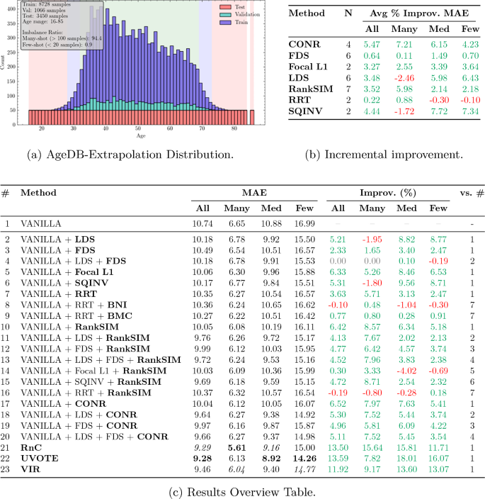
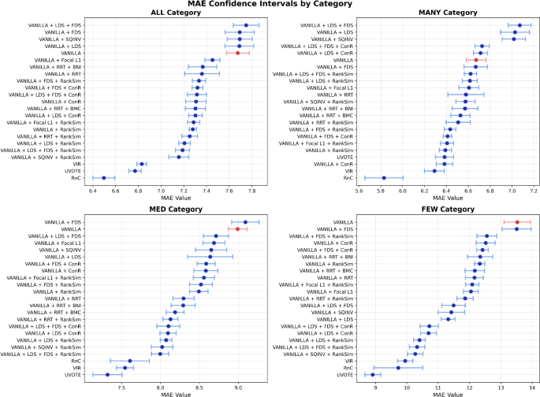

# Paper "Deconstructing Deep Imbalance Regression" published in Artificial Intelligence Review

{fig-alt="AgeDB training distribution with extrapolation and interpolation regimes and overlaid model error"}

`2026-04-28`

The paper *Deconstructing deep imbalance regression: a comprehensive review and experimental evaluation* has been published in *Artificial Intelligence Review* (Springer): [10.1007/s10462-026-11570-1](https://doi.org/10.1007/s10462-026-11570-1). The authors are Noah C. Puetz, Jens U. Brandt, Marc Hilbert, Elena Raponi, Thomas Bäck, and [Prof. Dr. Thomas Bartz-Beielstein](https://www.th-koeln.de/personen/thomas.bartz-beielstein/). The work is a collaboration between the THK-AI Research Cluster at TH Köln, LIACS at Leiden University, and Toyota Racing in Cologne.

## Background

In many real-world regression problems the most rare target values are exactly those that matter most for prediction and risk assessment: anomalies, peak-load events, extreme cases. Deep learning is routinely deployed for such tasks, yet data-driven models systematically fail in underrepresented regions of the target space. This phenomenon is termed *Deep Imbalanced Regression* (DIR) in the literature, and it differs from classical imbalanced classification through the continuity of the target space, which renders many established classification-based remedies inapplicable.

## Research question

Despite growing interest, two pieces have been missing: a systematic conceptual map of the methodological landscape and a fair empirical re-evaluation under controlled conditions. The authors therefore pursue two leading questions: can the DIR problem be structured so that data-side and model-side effects can be analysed separately, and which of the published methods actually deliver on their claims when trained and evaluated under identical conditions?

{fig-alt="Diagram of the two-axis DIR taxonomy with Data Axis and Deep Learning Axis"}

## Approach

At the core of the work is a two-axis taxonomy. The *Data Axis* captures three properties of the target space that go beyond plain class imbalance in regression: target distribution shift between training and evaluation distributions, target continuity, and local target density. The *Deep-Learning Axis* describes how these data properties trigger a cascading failure inside the model: shared model capacity is dominated by frequent regions, which produces gradient disparity between frequent and rare regions and culminates in feature collapse, where rare target values collapse onto the majority manifold in representation space. Within this framework, 19 state-of-the-art methods are systematically classified, and twelve of them with publicly available implementations are re-evaluated under an identical ResNet-50 pipeline.

To make the evaluation informative beyond the standard benchmark, the authors propose three new evaluation protocols: *Balanced Extrapolation* (testing on a balanced target range outside the training support), *Bimodal Interpolation* (balanced testing in a gap between two training modes), and *Blind-Spot Isolation* (a contiguous target interval is held out from training). These protocols expose failure modes that remain hidden in the conventional AgeDB benchmark.

{fig-alt="Balanced Extrapolation protocol showing distribution diagram and results table"}

## Findings

The re-evaluation shows that many DIR methods deliver measurable gains on the standard benchmark, but their advantage over a plain Vanilla baseline shrinks or vanishes under the new protocols. The failure patterns predicted by the cascade hypothesis become particularly visible in the few-shot range of extrapolated targets and in isolated blind-spot regions. An accompanying stability and runtime analysis across eleven seeds and four data regimes ranks the methods by predictive stability and computational cost, making the practical trade-offs explicit.

{fig-alt="MAE confidence intervals for twelve re-evaluated DIR methods across data regimes"}

In an additional controlled experiment on the UCI Wine Quality dataset, all three stages of the cascade hypothesis are jointly quantified for the first time: relieving the shared-capacity bottleneck through a multi-head architecture measurably reduces gradient disparity and weakens feature collapse. The findings support reading DIR less as a loose collection of tricks and more as a directed failure pattern in which interventions at the earliest cascade stage are particularly effective.

Code, protocols, and evaluation scripts are available at [github.com/noah-puetz/deconstructing_deep_imbalanced_regression](https://github.com/noah-puetz/deconstructing_deep_imbalanced_regression).

## Funding

This work was funded by the European Commission Key Digital Technologies Joint Undertaking (HORIZON-KDT-JU-2023-2-RIA, grant agreement No 101139996, project *ShapeFuture – Shaping the Future of EU Electronic Components and Systems for Automotive Applications*) and by the German Federal Ministry of Education and Research (Bundesministerium für Bildung und Forschung, BMBF) within the funding measure *Forschung an Fachhochschulen – KI-Nachwuchs@FH 2-2021* under the project *TH Köln – Künstliche Intelligenz plus (THK-KIplus)*, funding code 13FH007KI2. Views and opinions expressed are however those of the authors only and do not necessarily reflect those of the European Union or the granting authority. Neither the European Union nor the granting authority can be held responsible for them.

Citation: Puetz, N. C., Brandt, J. U., Hilbert, M., Raponi, E., Bäck, T., Bartz-Beielstein, T. (2026). Deconstructing deep imbalance regression: a comprehensive review and experimental evaluation. *Artificial Intelligence Review*. [https://doi.org/10.1007/s10462-026-11570-1](https://doi.org/10.1007/s10462-026-11570-1).
