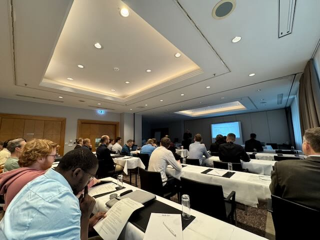

The Institute for Data Science, Engineering, and Analytics (IDE+A),
which is part of the THK-AI Research Cluster at TH Köln participated in
the [35th Workshop Computational Intelligence (CI
Workshop)](https://publikationen.bibliothek.kit.edu/1000186052) held in
Berlin. The workshop serves as a forum for academic research and
industrial applications, focusing on the integration of AI methods into
engineering, control systems, and material science.

Two contributions from the research group led by Prof. Dr. Thomas
Bartz-Beielstein were accepted into the program and presented at the
event.

### Research on Explainability and Hybrid Modeling

[Alexander
Hinterleitner](https://www.linkedin.com/in/alexander-hinterleitner-4769a62a2/?lipi=urn%3Ali%3Apage%3Ad_flagship3_profile_view_base_contact_details%3BuLI6AatLTWqAesj1M%2FUTHA%3D%3D),
a doctoral candidate at the institute, presented the paper *„Tuning for
Explainability: Incorporating XAI Consistency into Multi-Objective
Hyperparameter Optimization“*. This work was conducted in collaboration
with industry partner [Everllence SE](https://www.everllence.com). The
research focuses on treating interpretability as a design objective by
quantifying agreement among diverse feature attribution methods.
Alexander’s doctoral research is supervised in cooperation with [Prof.
Dr. Oliver
Niggemann](https://www.linkedin.com/in/oliver-niggemann-0440b5136/) from
the Helmut-Schmidt-University (HSU) Hamburg. This cooperative
supervision is based on a long-standing research cooperation between
Prof. Dr. Bartz-Beielstein and Prof. Niggemann.

Additionally, Aleksandr
Subbotin presented the paper *„Physics-Informed Neural Networks for
State Estimation Problem“*. This study proposes a method integrating
Physics-Informed Neural Networks (PINNs) with the Unscented Kalman
Filter (UKF) to address state estimation in nonlinear dynamical systems.
This doctoral project is being carried out within the framework of the
Promotionskolleg NRW (PK NRW). Prof. Dr. Bartz-Beielstein served as a
founding co-director of the PK NRW, which was established to confer
independent doctoral degrees at universities of applied sciences in
North Rhine-Westphalia.

### Workshop Participants and Scope

The 35th CI Workshop was chaired by Prof. [Horst Schulte (HTW
Berlin).](https://www.linkedin.com/in/horst-schulte-26749b20/?lipi=urn%3Ali%3Apage%3Ad_flagship3_profile_view_base_contact_details%3BnjEKSYheS4akzVux5Z3LVw%3D%3D)
The program included keynote lectures on safety in learning control
systems by Daniel Görges (TU Kaiserslautern-Landau) and on machine
learning in material science by [Michael Möckel (TH
Aschaffenburg)](https://www.linkedin.com/in/michael-möckel-79666037/?lipi=urn%3Ali%3Apage%3Ad_flagship3_profile_view_base_contact_details%3ByRrKSP8jRuCMRRyMX5b4OQ%3D%3D).

Contributions were presented by representatives from various
institutions, including:

- Karlsruhe Institute of Technology (KIT),
- University of Kassel,
- HTW Berlin,
- Hochschule Fulda,
- Hochschule Bielefeld,
- TU Dortmund,
- Ruhr-Universität Bochum,
- Universität Siegen,
- FH Vorarlberg,
- University of Ljubljana, and the
- Bundesanstalt für Materialforschung und -prüfung (BAM), as well as
  from several industrial partners such as Robert Bosch GmbH and
  [Everllence SE](https://www.everllence.com).

„The presented papers illustrate the application of AI methods within
engineering contexts,“ stated Prof. Dr. Thomas Bartz-Beielstein. „The
cooperative doctoral procedures, facilitated through the PK NRW and the
cooperation with HSU Hamburg, enable the combination of academic
research with specific industrial requirements.“

## Contact:

Prof. Dr. Thomas Bartz-Beielstein, Research Cluster THK-AI, Institute
for Data Science, Engineering, and Analytics (IDE+A), TH Köln,
Steinmüllerallee 1, 51643 Gummersbach.
