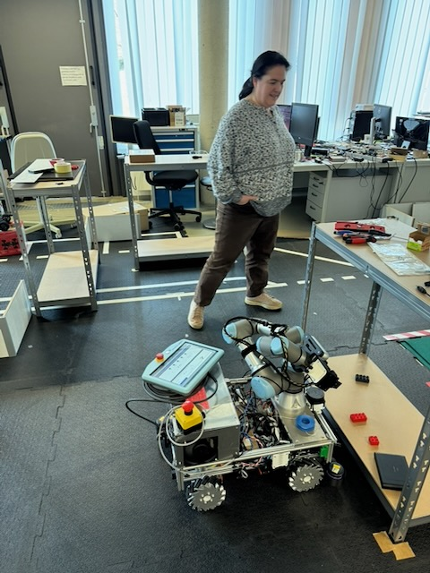
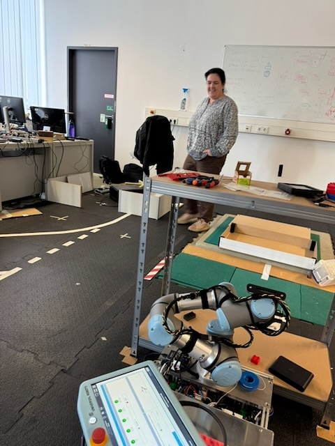

Prof. Dr. Maria Elena Algorri Guzman (TH Koln, THK-AI Forschungscluster) und ihr Team bereiten sich aktuell auf die Teilnahme an der diesjaehrigen RoboCup Challenge vor.

Die finalen Tests laufen: Systemintegration, robuste Software-Pipelines und die Abstimmung zwischen Wahrnehmung, Entscheidungslogik und Aktorik stehen kurz vor dem Wettbewerb im Fokus.

## Was ist der RoboCup?

Der RoboCup gilt als einer der weltweit bekanntesten Wettbewerbe fuer intelligente Robotik-Systeme. Auf `robocup.de` wird der Wettbewerb als internationale Plattform beschrieben, auf der Teams aus vielen Laendern ihre neuesten Entwicklungen in Robotik und KI praesentieren. Die German Open 2026 finden in Koeln statt, die Weltmeisterschaft 2027 in Nuernberg.

Fuer Studierende in Automation, IT und KI ist der RoboCup besonders spannend, weil hier reale interdisziplinaere Herausforderungen zusammenkommen:

- Machine Learning und Computer Vision unter Echtzeitbedingungen
- Software Engineering fuer autonome Agenten
- Robotik-Integration (Sensorik, Regelung, Sicherheit)
- Teamarbeit zwischen Informatik, Elektrotechnik und Maschinenbau

## Hintergrund zu Prof. Algorri und THK-AI

Laut Profilseite der TH Koln ist Prof. Dr. Maria Elena Algorri Guzman am Institut fuer Automation & Industrial IT (AIT) in der Fakultät fuer Informatik und Ingenieurwissenschaften taetig.

Als Lehr- und Forschungsfelder sind dort unter anderem genannt:

- Robotik und Softwaretechnik
- Autonomes Fahren und kollaborative Robotik
- Maschinelles Sehen
- KI fuer visuelle Erkennung, Klassifizierung und Segmentierung

Damit passt die RoboCup-Teilnahme perfekt zum Kompetenzprofil des THK-AI Forschungsclusters: anwendungsnahe KI, robuste technische Umsetzung und Transfer in reale Systeme.

## Warum das fuer Studierende wichtig ist

RoboCup ist mehr als ein Wettbewerb. Fuer Nachwuchs in Automation und AI ist er ein realistischer "Stresstest" fuer Methoden aus Vorlesung und Labor. Wer in solchen Umgebungen arbeitet, sammelt Erfahrung in genau den Faehigkeiten, die auch in Industrieprojekten und Forschungslaboren entscheidend sind: schnelles Iterieren, reproduzierbare Experimente, Teamkommunikation und belastbare technische Entscheidungen.

THK-AI wuenscht Prof. Algorri und dem gesamten Team viel Erfolg fuer die Challenge.

Weiterfuehrende Informationen:

- RoboCup Deutschland: <https://robocup.de>
- Ueber den RoboCup: <https://robocup.de/ueber-uns/ueber-den-robocup>
- Profil Prof. Dr. Maria Elena Algorri Guzman: <https://www.th-koeln.de/personen/elena.algorri/>
