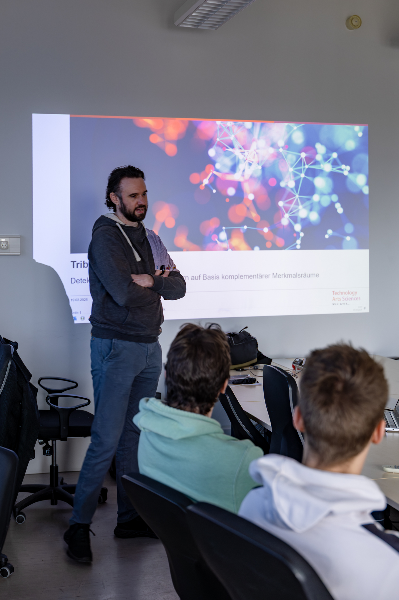
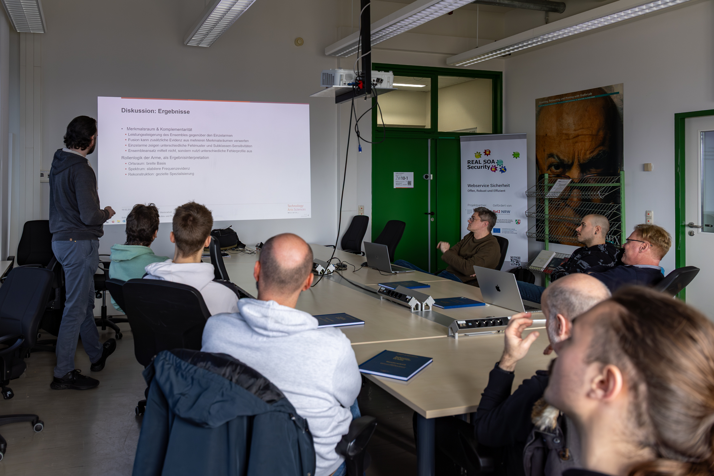

# Masterarbeit „Tribraide": Kai Altwicker entwickelt fusionsbasiertes Verfahren zur Erkennung KI-generierter Bilder

{fig-alt="Vortragender vor der Titelfolie der Masterarbeit Tribraide"}

`29. April 2026`

Mit „Tribraide" hat Kai Altwicker im Rahmen seiner Masterarbeit am [Institut für Medien- und Phototechnik](https://www.th-koeln.de/informations-medien-und-elektrotechnik/institut-fuer-medien--und-phototechnik_3338.php) der TH Köln ein System zur Erkennung KI-generierter Bilder entwickelt, das über klassische Einzelmodelle hinausgeht. Die Arbeit kombiniert Ortsraum-, Frequenz- und Rekonstruktionsanalysen und nutzt die Komplementarität dieser Merkmalsräume zur Detektion synthetischer Inhalte. Betreut wurde die Arbeit von [Prof. Dr. Jan Salmen](https://www.th-koeln.de/personen/jan.salmen/) und [Prof. Dr. Gregor Fischer](https://www.th-koeln.de/personen/gregor.fischer/).

## Ansatz

Statt sich auf einen einzelnen Detektor zu verlassen, fusioniert Tribraide drei komplementäre Sichten auf das Bild: eine Analyse im Ortsraum, eine im Frequenzspektrum und eine über Rekonstruktionsfehler. Jede dieser Sichten reagiert auf andere Spuren generativer Verfahren — strukturelle Auffälligkeiten, charakteristische Frequenzmuster und Inkonsistenzen bei der Rückprojektion. Die Zusammenführung der Merkmalsräume ermöglicht eine Klassifikation, die einzelne Modelle in Robustheit und Trefferquote übertrifft.

{fig-alt="Vortragsfolie zum Datensatz-Sampling mit Bucketing-Strategie"}

## Robustheit unter realistischen Bildveränderungen

Ein zentraler Befund der Arbeit betrifft die Stabilität des Verfahrens unter typischen Bildverarbeitungsschritten wie Kompression und Rauschen. Während viele Detektoren bereits bei moderater JPEG-Kompression deutlich an Trennschärfe verlieren, bleibt Tribraide durch die Fusion der drei Merkmalsräume zuverlässig — ein Eigenschaftsprofil, das für den praktischen Einsatz in Medienforensik und Bildauthentifizierung entscheidend ist.

{fig-alt="Kolloquiumsraum mit Vortragendem und Zuhörern bei der Ergebnisdiskussion"}

## Weiterführung an der TH Köln

Kai Altwicker bleibt der TH Köln erhalten und ist nun als Doktorand in der Arbeitsgruppe von [Prof. Dr. Pascal Cerfontaine](https://www.th-koeln.de/personen/pascal.cerfontaine/) (AI4Science) tätig. Ein ausführlicher Artikel zur Masterarbeit ist über [diesen Link](https://lnkd.in/d2VfGjX9) verfügbar.
