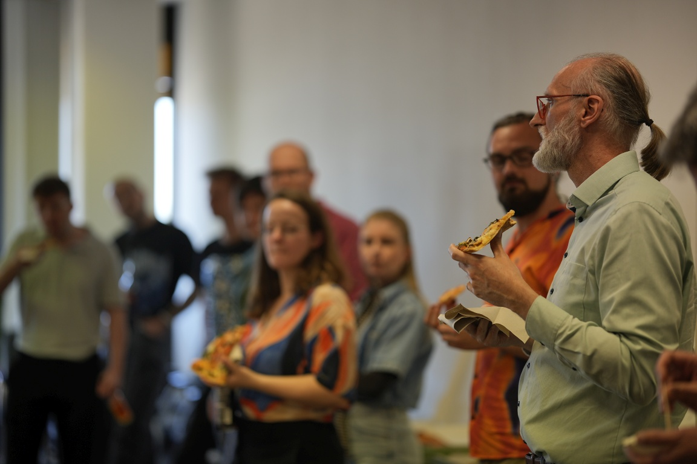
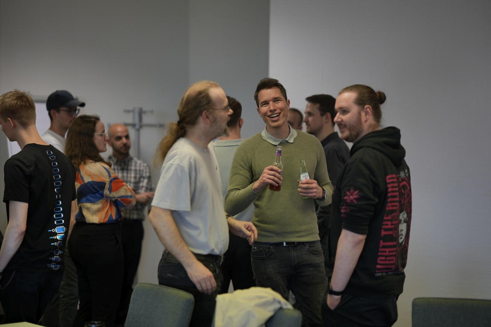
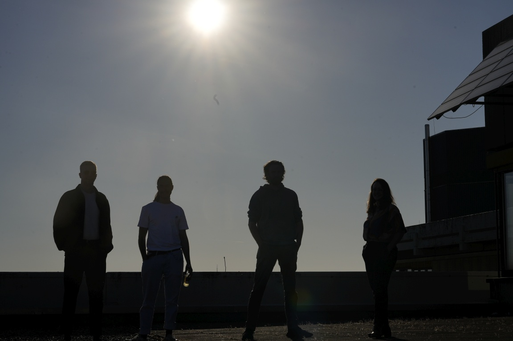

# 4. KI-Forum an der TH Köln

{fig-alt="Teilnehmende des 4. KI-Forums beim Austausch am Campus Deutz"}

`29. April 2026`

Bereits zum vierten Mal hat das *KI-Forum* an der TH Köln in Deutz stattgefunden und erneut auf eine sehr hohe Resonanz gestoßen. Vertreten waren Studierende, Mitglieder des THK-AI Forschungsclusters, externe Gäste, Alumni sowie dieses Mal auffällig viele Doktorandinnen und Doktoranden — ein Zeichen dafür, wie nachhaltig sich die KI-Aktivitäten an der TH Köln verfestigen und wie stark der wissenschaftliche Nachwuchs in diesem Feld vertreten ist.

{fig-alt="Teilnehmende beim Networking mit Imbiss und Getränken"}

Das Forum versteht sich als niederschwelliges Austauschformat des THK-AI Forschungsclusters am Campus Deutz und hat sich seit 2024 zu einem festen Treffpunkt der KI-Community an der TH Köln entwickelt. Inhaltlich deckt es die Bandbreite der KI-Aktivitäten der Hochschule ab, von echtzeitfähiger Bildverarbeitung über große Sprachmodelle bis zu Prozessautomatisierung, autonomen Systemen, IT-Forensik und 3D-Modellierung.

{fig-alt="Lebhafte Gesprächsrunde mit lachenden Teilnehmenden"}

{fig-alt="Silhouetten von Personen vor Abendsonne auf einer Dachterrasse"}

{fig-alt="Nahaufnahme einer Currywurst-Portion in der Hand eines Teilnehmenden"}

Ansprechpartner für das KI-Forum ist [Prof. Dr.-Ing. Jan Salmen](https://www.th-koeln.de/personen/jan.salmen/) ([Institut für Medien- und Phototechnik](https://www.th-koeln.de/informations-medien-und-elektrotechnik/institut-fuer-medien--und-phototechnik-imp_14807.php), Mitglied des THK-AI Forschungsclusters).
