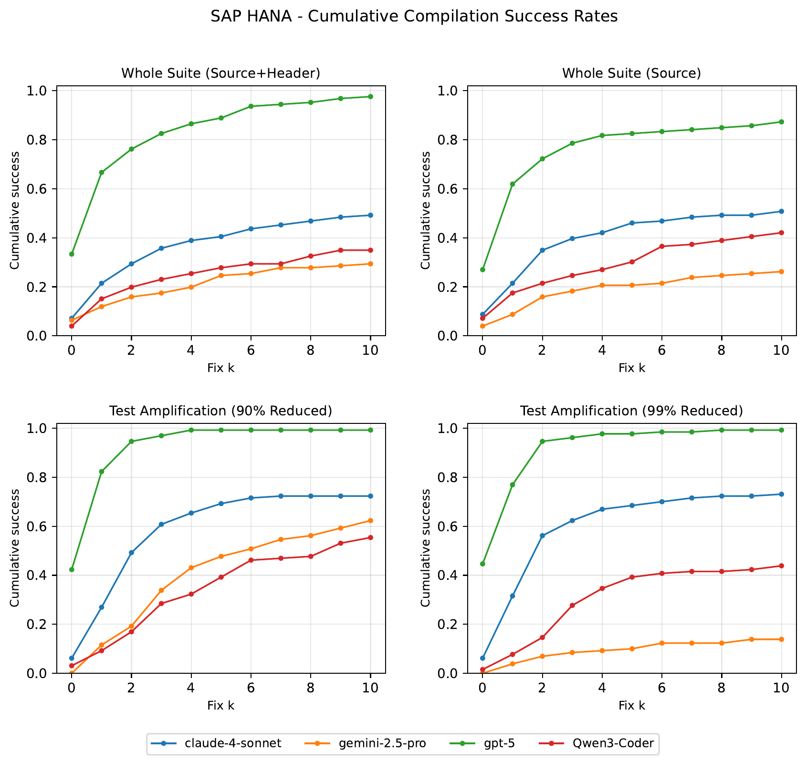

# Paper „LLMs taking shortcuts in test generation: A study with SAP HANA and LevelDB" auf arXiv erschienen

{fig-alt="Kumulative Fix-Kurve aus der SAP-HANA-Studie"}

`17. April 2026`

Der THK-AI Research Report 2/2026 ist als Paper auf arXiv veröffentlicht: [arXiv:2604.14437](https://arxiv.org/abs/2604.14437). Autoren sind Vekil Bekmyradov, Noah C. Pütz und [Prof. Dr. Thomas Bartz-Beielstein](https://www.th-koeln.de/personen/thomas.bartz-beielstein/).

## Hintergrund

Vekil Bekmyradov war Masterstudent am THK-AI Forschungscluster der TH Köln. Betreut wurde seine Arbeit von Prof. Dr. Thomas Bartz-Beielstein und Noah C. Pütz. Aus dieser Betreuung ist in Zusammenarbeit mit SAP das vorliegende Paper entstanden.

## Fragestellung

Große Sprachmodelle erzielen auf öffentlichen Benchmarks eindrucksvolle Ergebnisse, was häufig als Hinweis auf tiefergehende Schlussfolgerungs- und Verstehensfähigkeiten gedeutet wird. Jüngere Arbeiten aus den Kognitionswissenschaften zeigen jedoch, dass diese Modelle oft auf flache Heuristiken und Memorisierung zurückgreifen und damit Abkürzungen nehmen, statt tatsächlich kognitive Leistungen zu erbringen. Das Paper prüft dieses Muster empirisch im Bereich der automatisierten Testgenerierung für Software.

## Vorgehen

Untersucht wird das Verhalten von LLMs bei der Generierung von Software-Tests auf zwei Systemen: dem quelloffenen LevelDB und dem kommerziellen Datenbanksystem SAP HANA. SAP HANA ist in öffentlichen Trainingsdaten garantiert nicht enthalten, wodurch sich Memorisierung von echter Generalisierung trennen lässt. Methodisch werden kognitive Bewertungsprinzipien nach Mitchells mechanismusorientierter Evaluierung mit empirischem Software-Testing verbunden. Die Bewertung stützt sich auf den Mutation Score und auf iterative Compiler-Feedback-Reparaturschleifen.

## Ergebnisse

Die Modelle erzielen gute Ergebnisse auf vertrauten, quelloffenen Benchmarks, scheitern aber auf ungesehenen, komplexen Domänen und priorisieren häufig Kompilierbarkeit gegenüber semantischer Wirksamkeit. Die Ergebnisse liefern aus softwaretechnischer Sicht unabhängige Evidenz für die verbreitete Beobachtung, dass aktuelle LLMs keine robusten Schlussfolgerungsfähigkeiten aufweisen. Die Arbeit spricht sich für Evaluierungsrahmen aus, die triviale Abkürzungen bestrafen und echte Generalisierung belohnen.

Zitation: Bekmyradov, V., Pütz, N. C., Bartz-Beielstein, T. (2026). LLMs taking shortcuts in test generation: A study with SAP HANA and LevelDB. THK-AI Research Report 2/2026. [arXiv:2604.14437](https://arxiv.org/abs/2604.14437).
