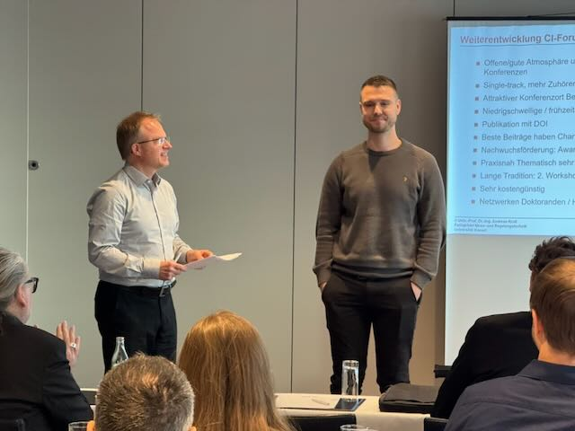
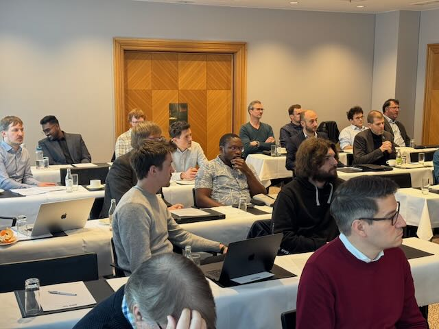
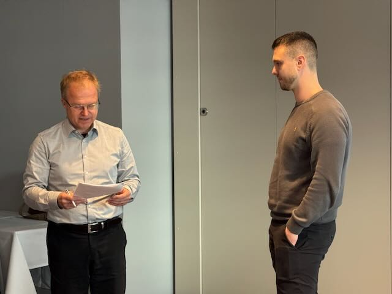
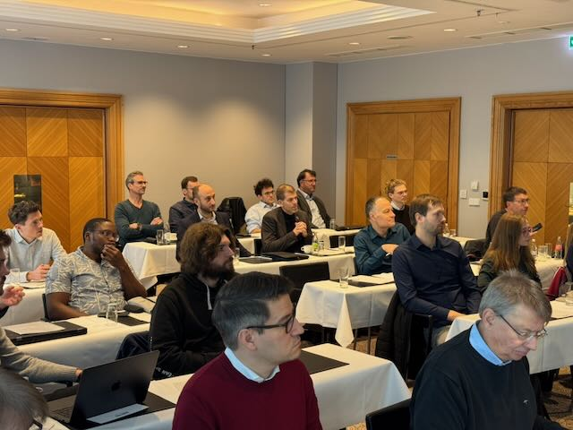
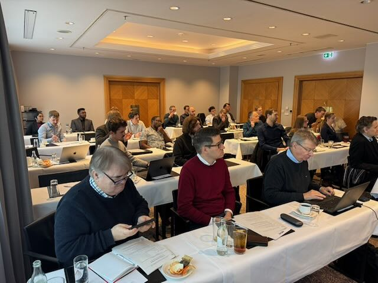
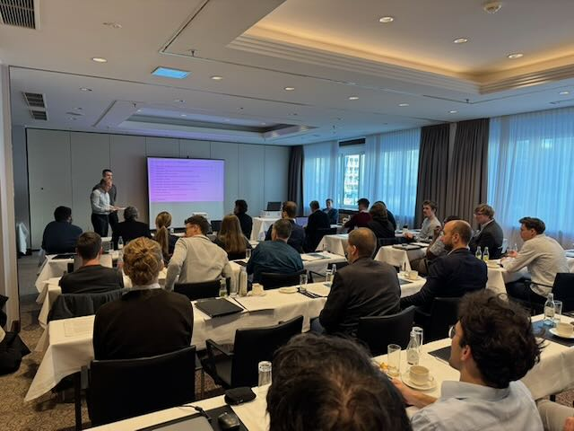
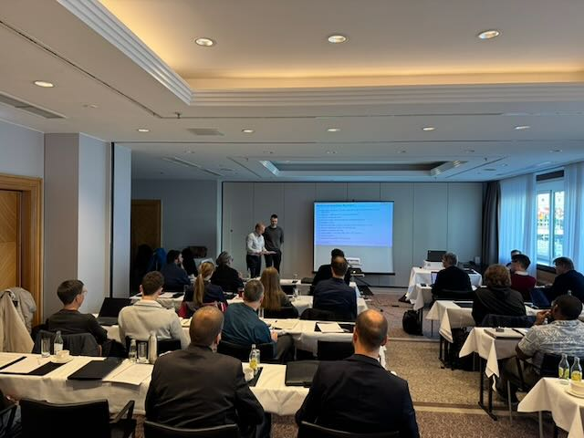
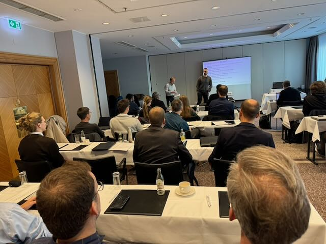
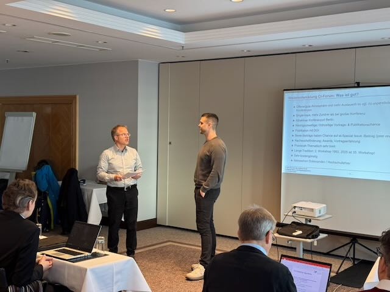
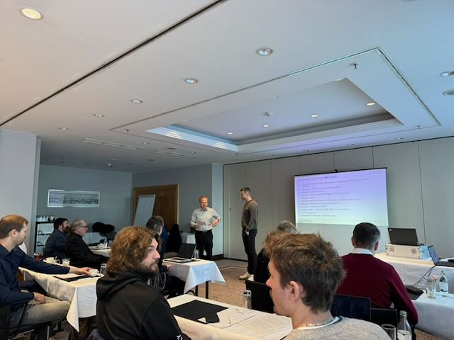

[Alexander Hinterleitner](https://orcid.org/0009-0002-7615-6952),
doctoral candidate at the Institute for Data Science, Engineering, and
Analytics (IDE+A) of the THK-AI Research Cluster at TH Köln, has been
awarded the prestigious Young Author Award at the 35th Workshop
Computational Intelligence in Berlin. The award recognizes his
outstanding contribution titled „Tuning for Explainability:
Incorporating XAI Consistency into Multi-Objective Hyperparameter
Optimization“. The workshop proceedings (Open Access) can be downloaded
from the Karlsruher Institut für Technologie (KIT) Bibliothek:
<https://publikationen.bibliothek.kit.edu/1000186052>. The BibTeX entry
reads as follows:

``` wp-block-code

@inproceedings{hint25b,
author = {Hinterleitner, Alexander and Leitenmeier, Christoph and Spengler, Sebastian and Bartz-Beielstein, Thomas},
booktitle = {Proceedings - 35. Workshop Computational Intelligence: Berlin, 20. - 21. November 2025},
doi = {10.5445/IR/1000186052},
editor = {Schulte, Horst and Hoffmann, Frank and Mikut, Ralf},
pages = {121-130},
publisher = {{KIT Scientific Publishing}},
series = {{AIA Proceedings}},
title = {Tuning for Explainability: Incorporating XAI Consistency into Multi-Objective Hyperparameter Optimization},
year = {2025}}
```

The Young Author Award is presented annually by the Computational
Intelligence Forum to promote young researchers in the field. It honors
creativity and originality in methodological approaches as well as
particularly successful applications. This year’s award committee
selected Hinterleitner’s work for its innovative approach to treating
explainability as a quantifiable design objective in machine learning
systems.































Hinterleitner’s research addresses a critical challenge in applied
artificial intelligence: ensuring that machine learning models are not
only accurate but also interpretable and trustworthy. His work proposes
a novel framework for incorporating consistency among diverse
explainability methods directly into the hyperparameter optimization
process. This research was conducted in collaboration with industry
partner [Everllence SE](https://www.everllence.com), demonstrating the
practical relevance of the approach.

The doctoral research is jointly supervised by [Prof. Dr. Thomas
Bartz-Beielstein](https://orcid.org/0000-0002-5938-5158) from the THK-AI
Research Cluster at TH Köln and [Prof. Dr. Oliver
Niggemann](https://orcid.org/0000-0001-8747-3596) from the
Helmut-Schmidt-University (HSU) Hamburg. This cooperative supervision
structure builds on a long-standing research collaboration between both
institutions.

„This award represents a significant success for the THK-AI Research
Cluster and demonstrates the excellence of our doctoral training
programs,“ stated Prof. Dr. Thomas Bartz-Beielstein. „Alexander’s work
exemplifies how fundamental research in explainable AI can be
effectively combined with industrial requirements to create practical
solutions for trustworthy machine learning systems.“

The recognition at the CI Workshop Berlin underscores the research
cluster’s commitment to advancing the state of the art in AI methods
while maintaining strong ties to industrial applications. The THK-AI
Research Cluster at TH Köln continues to focus on developing AI
solutions that meet both scientific rigor and practical applicability
standards.

The award was presented during the 35th Workshop Computational
Intelligence, chaired by [Prof. Horst
Schulte](https://orcid.org/0000-0001-5851-3616) (HTW Berlin), which
brought together leading researchers and practitioners from academia and
industry to discuss recent advances in computational intelligence and
its applications in engineering and automation.

Contact:\
Prof. Dr. Thomas Bartz-Beielstein\
THK-AI Research Cluster\
Institute for Data Science, Engineering, and Analytics (IDE+A)\
TH Köln\
Steinmüllerallee 1\
51643 Gummersbach
