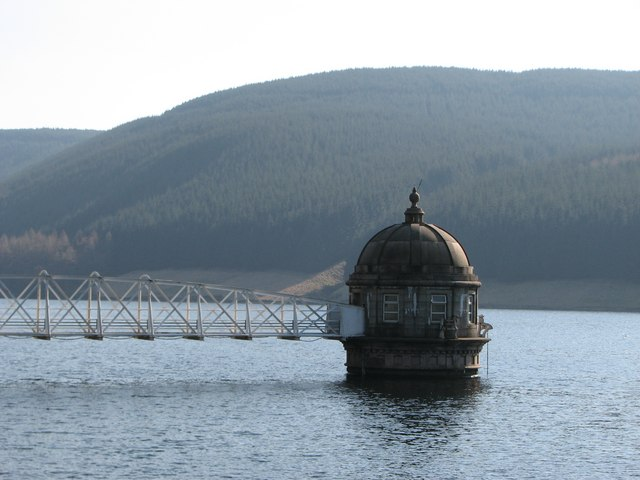

Quelle: [Water intake tower at Talla Reservoir](https://commons.wikimedia.org/wiki/File:Water_intake_tower_at_Talla_Reservoir_-_geograph.org.uk_-_1193384.jpg)

## Forschungsprojekte im Forschungscluster THK-AI

| Projekt | Beteiligte | Literatur, Datensätze |
|---|---|---|
| [IMProvt-II](https://www.th-koeln.de/informatik-und-ingenieurwissenschaften/improvt-ii_119592.php) Entwicklung einer digitalen Plattform für die Wasserwirtschaft, um die Bereitstellung und Verteilung von Trinkwasser energieeffizienter zu gestalten. Eine zentrale Datenplattform sammelt Informationen auf deren Basis eine Betriebsstrategie berechnet wird. Durch künstliche Intelligenz wird die Analyse optimiert und das System lernt sich selbst zu verbessern | TH Köln, Gelsenwasser AG, Endress+Hauser Conducta, fuseki GmbH | Groß, M., & Hans, L. (2024). Leveraging Potentials of Local and Global Models for Water Demand Forecasting. *Engineering Proceedings*, *69*(1), 129. [https://doi.org/10.3390/engproc2024069129](https://doi.org/10.3390/engproc2024069129)  Alvisi, S. et al, Battle of water demand forecasting. Journal of Water Resources Planning and Management 151, 10 (2025), [https://doi.org/10.1061/JWRMD5.WRENG-6887](https://doi.org/10.1061/JWRMD5.WRENG-6887) |
| [IMProvT](https://www.th-koeln.de/informatik-und-ingenieurwissenschaften/_56166.php) Gewinnung und Nutzung mehrdimensionaler Prozessdaten zur energie- und ressourceneffizienten Optimierung und Prozesssteuerung bei der Trinkwasseraufbereitung | TH Köln, DVGW-Technologiezentrum Wasser Dresden, IWW, Thüringer Fernwasserversorgung, Landeswasserversorgung Stuttgart, Endress+Hauser Conducta, Aggerverband | Ribeiro, Victor H. A. & Reynoso-Meza, Gilberto (2029). Monitoring of Drinking-water Quality by Means of a Multi-objective Ensemble Learning Approach. In Proceedings of the Genetic and Evolutionary Computation Conference Companion (New York, NY, USA, 2019), GECCO '19, Association for Computing Machinery, pp. 1-2. [https://doi.org/10.1145/3319619.3326745](https://doi.org/10.1145/3319619.3326745) |
| KANNST Modellierung und Prognose von Füllstandshöhen in Regenüberlaufbecken auf Basis einzelner Regenmessungen | TH Köln, Aggerverband | Bartz-Beielstein, et al. Datenanalyse und Prozessoptimierung für Kanalnetze und Kläranlagen mit CI-Methoden. In Proc. 17th Workshop Computational Intelligence (2007), R. Mikut and M. Reischl, Eds., Universitätsverlag, Karlsruhe, pp. 132-138. [https://www.gm.th-koeln.de/~bartz/Papers.d/bbkw07a.pdf](https://www.gm.th-koeln.de/~bartz/Papers.d/bbkw07a.pdf)  Bartz-Beielstein, T., and Konen, W. Datenanalyse und Prozessoptimierung am Beispiel Kläranlagen. Tech. rep., FH Köln, 2008. [https://www.gm.th-koeln.de/~bartz/Papers.d/Bart08h.pdf](https://www.gm.th-koeln.de/~bartz/Papers.d/Bart08h.pdf)  Konen, W., Zimmer, T., and Bartz-Beielstein, T. Optimierte Modellierung von Füllständen in Regenüberlaufbecken mittels CI-basierter Parameterselektion Optimized Modelling of Fill Levels in Stormwater Tanks Using CI-based Parameter Selection Schemes. at - Automatisierungstechnik 57, 3 (2009), 155-166. [https://doi.org/10.1524/auto.2009.0756](https://doi.org/10.1524/auto.2009.0756) |

## Weitere Forschungsprojekte

| Projekt | Beteiligte | Literatur, Datansätze |
|---|---|---|
| [TwinOpt-Pro](https://www.iosb.fraunhofer.de/de/projekte-produkte/TwinOpt-Pro-digitale-technologien-und-plattform.html) Entwicklung einer Plattform zur robusten Echtzeit-Trinkwasser-Betriebsoptimierung, basierend auf einem digitalen Zwilling des Trinkwassernetzes, einer Prognose-Tooolbox und Optimierungstools. | 3S Consult GmbH (Koordination), Fraunhofer IOSB, geoSYS, Stadtwerke Bühl, Fernwasser Thüringen | Bernard, T., et al. TwinOptPRO-Digital Platform for Online Pump Scheduling Optimization. *Engineering Proceedings*, *69*(1), 94. [https://doi.org/10.3390/engproc2024069094](https://doi.org/10.3390/engproc2024069094) |

